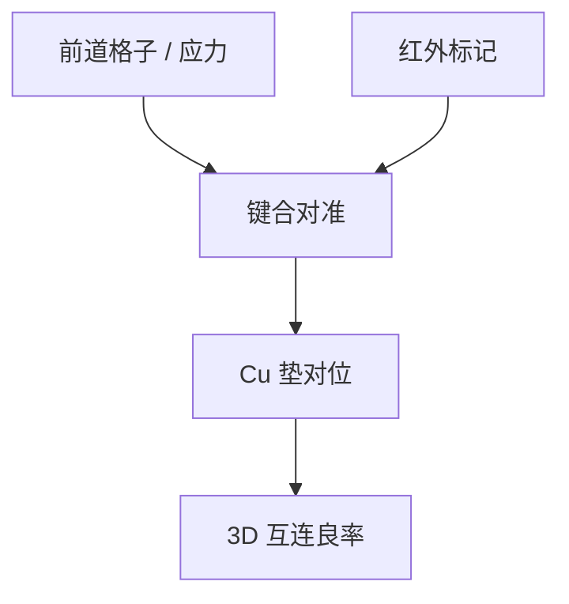

# 混合键合的对准

Cu–Cu 混合键合把两张已图形化的晶圆在三维叠起来；对准误差直接变成 via 错位，量级向着前道套刻靠拢。

<footer>—— 对照 hybrid bonding overlay（SoIC / Foveros Direct 一类公开叙事）与红外对准</footer>

[上一课](/litho/packaging-steppers)的微米场对 RDL 够用。缺口是混合键合要求 nm–十 nm 量级的键合对准。本课钉混合键合的对准。光子学波导对侧壁另一套敏感，留给[下一课](/litho/photonics-patterning）。

## 问题

混合键合：介质键合 + 铜垫对铜垫，互连密度远高于凸点。对准：两片晶圆的格子在键合机里对齐，常用红外透过硅看标记，或事先量形变再补偿。误差源：膨胀、键合波、夹持、前道光刻留下的格子（应力课）。这不是投影曝光，但是光刻课程必须收：前道套刻预算与键合预算是一条 3D 链。

缺口是**键合对准 ≠ 扫描机套刻**，但量级开始同阶。把键手当封装步进器微米问题，会在 CFET/3D 逻辑上翻车。

### 与背面电源

[背面电源](/litho/backside-power) 把另一面引进前道。键合对准是实现手段之一。DTCO 要同时给前道 overlay 与键合 overlay 留预算。

标记必须在键合波长（IR）下可见，且经得起 CMP。关键层对准课的「标记要活过工艺」在此再适用。

## 方法

预算：铜垫尺寸 − via 尺寸 − 键合 overlay − 前道 overlay。计量：键合后红外或切片 FA。补偿：预畸变曝光（在扫描机上按预测应变反印）。与 APC：键合机也有自己的匹配与指纹。

## 机制

键合波从接触点推进，可能引入局部滑移。热循环使 CTE 差变成位移。硅–硅相对均匀，异质键合更差。前道光刻若已把格子写成应力场，键合机无法单独「对准掉」高频项。

## 边界

不给某厂 nm 键合规格当常数。不把所有 3D 封装当混合键合。本课不讲键合表面化学。

后课默认：3D 对准有独立预算；下一课回到平面，但对象换成光子波导——关心的是损耗不是晶体管密度。

## 小结

- 混合键合对准量级向着前道套刻靠拢，用红外标记与形变补偿。
- 前道应力格子进入键合良率，不能只在键合机上修。
- 与背面电源、CFET 的 3D 链是同一张预算。
- 出处：hybrid bonding overlay 公开叙事。
