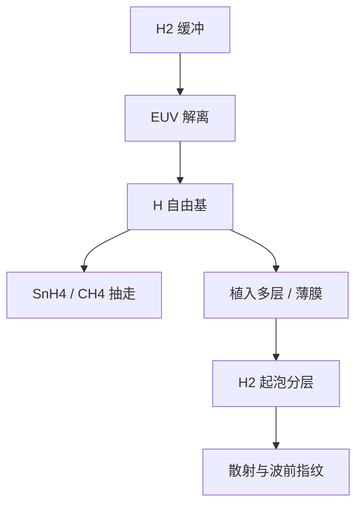

# 氢起泡

氢自由基能把锡变成可抽走的氢化物，也能钻进多层膜和薄膜，聚成气泡把界面掀开。

<footer>—— 对照 EUV 多层膜与 pellicle 在氢环境中起泡、分层的公开讨论；氢化学接口见 ASML DGL 叙述</footer>

[上一课](/litho/euv-hydrogen-dgl)把氢写成缓冲气体兼原位清洗剂：EUV 解离 H₂，H 与 Sn、C 生成 SnH₄、CH₄。缺口是同一套自由基对 [Mo/Si 多层](/litho/euv-multilayer-mirror) 和 [pellicle](/litho/euv-pellicle) 并不只做好事。本课钉氢起泡（blistering）。镀上的锡如何与起泡叠加，留给[下一课](/litho/tin-on-mirrors)。

## 问题

DGL 课已经说明惰性气体不把锡清走，量产必须用氢。氢原子半径小，能沿晶界、针孔和帽层缺陷植入 Mo/Si，在界面或周期膜里复合成 H₂。气泡一旦成核，局部应力把钌帽或硅层掀起，反射率掉、散射升、波前出指纹。清洗流量越大、EUV 越亮，自由基产量越高，这条损伤通道越醒。

Pellicle 更薄。公开讨论里，膜要在氢与 EUV 同时存在时保持透过率与机械完整；氢致起泡、脆化和针孔会把「挡颗粒」的膜变成二次污染源。缺口是：清洗化学与光学寿命必须写在同一张材料表上，不能默认「开氢就净」。

### 起泡不是普通腐蚀

氧化和水汽攻击帽层，是化学腐蚀加周期漂移。起泡是气体聚集体的力学失效：局部鼓包、分层、甚至剥落。氢刻蚀锡的反应在表面；起泡发生在膜内。把两者都叫做「氢损伤」，会把可逆清洗和不可逆分层混成一条维护工单。

投影 POB 的氢分压远低于光源舱，起泡风险主要在收集镜、光源侧多层和 pellicle。不要把收集镜氢洗的流量外推到蔡司投影镜腔。

## 方法

材料侧：帽层（公开讨论常见 Ru 一类）要挡植入又要让表面锡能被 H 抽走；周期膜的应力与界面要耐 H₂ 成核。工艺侧：氢流量、压力、温度和 EUV 开/关占空比构成窗口——流量过低锡累积，过高植入和起泡加速。停光时自由基少，有时要辅助解离，有时只能接受清洗暂停。

Pellicle 的公开规格同时写透过率、热和氢兼容。换膜材料等于重做氢窗口，不能把 DUV 有机膜的氢稳定性搬过来。量产叙述把氢兼容当成光学子系统资格认证的一部分，而不是后加的气氛。

### 检测看鼓包与散射，不只看平均 R

平均反射率下降可能是均匀镀锡；起泡往往先出散射和局部相位。光化或高灵敏形貌才能把鼓包与均匀吸收分开。只盯 IF 瓦数，会把起泡误判成「再加点氢就会好」。

## 机制

EUV 光子与等离子体电子都解离 H₂。H 在表面复合放热、与 Sn 反应，也向体内扩散。捕获位点（空位、界面、辐照缺陷）把 H 留下，浓度一过饱和就成泡。多层是现成的弱界面：Mo/Si 本身应力就高，再加氢，分层沿周期走。 pellicle 的多晶硅或后继膜种同样提供晶界通道。

起泡与剂量相关：亮场、高功率、长曝光日历累积。这和锡沉积的空间指纹不同——锡跟碎屑方向走，氢跟自由基通量和材料捕获走。

氢致损伤的公开文献覆盖多层帽层与 pellicle，不覆盖未公布的蔡司膜堆配方。本课只引用机制与工程取舍，不写某代 POB 的氢分压表。

## 边界

本课不重写气锁缝几何，也不把 pellicle 热预算展开。不要把实验室离子束氢辐照的起泡照片直接标成 NXE 投影镜的失效模式。后课默认：说到氢清洗，先问帽层和薄膜是否还在起泡窗口内侧。

未公开的抗氢镀膜工艺不要发明。引用停在 ASML 氢环境叙述与多层/pellicle 氢损伤的公开讨论。

起泡一旦分层，氢刻蚀抽不回周期结构。那是换件或报废，不是加大流量能洗掉的污染。

## 小结

- 清洗用的氢自由基也能植入 Mo/Si 与 pellicle，复合成泡并分层。
- 起泡是膜内力学失效，与表面锡的可逆氢刻蚀不是同一条工单。
- 流量窗口夹在「锡清不掉」和「植入起泡」之间。
- 平均反射率掩盖鼓包；要看散射与形貌。
- 出处：ASML 氢 / DGL 公开材料；EUV 多层与 pellicle 氢损伤公开讨论。
