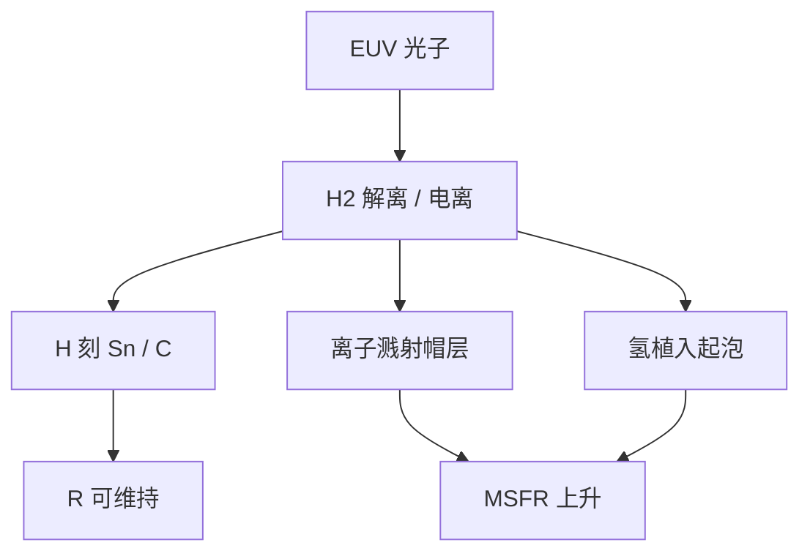

# 氢等离子体与镜面

EUV 把氢气解离成自由基和离子。它们刻锡、也溅射帽层。镜面活在等离子体边缘，不是活在中性缓冲里。

<footer>—— 据 Bakshi 污染与氢化学；ASML 对氢环境光学的公开讨论</footer>

[上一课](/litho/euv-illumination-settings)把光瞳足迹铺到镜子上。缺口是足迹所在的气体：氢不只是 DGL 的窗帘，在 EUV 照射下就是低密度等离子体。真空分区如何把碳和水挡在合同外，留给[下一课](/litho/euv-vacuum-contamination)。

## 问题

[DGL](/litho/euv-hydrogen-dgl) 写的是差压气帘和 SnH₄ 通道。进阶缺口是等离子体–表面：光子、二次电子把 H₂ 解离、电离，镜面同时承受 H 自由基化学、H⁺ 溅射和紫外辅助解吸。钌帽要在「允许刻锡」和「自身不被剥蚀、不起泡」之间工作。照明设置改变局部功率密度，等离子体密度和帽层温度跟着走，同一张膜在极子热点上先坏。

缺口不是再画气锁缝，而是把镜面当成等离子体壁。只谈中性氢流量，会低估离子溅射和氢植入导致的起泡（blistering）。

这不是刻蚀机里的高密度氢等离子体。分压低、电离度低，但 EUV 光子能量高，表面反应仍然快。不要用 ICP 刻蚀速率外推。

## 方法

材料：帽层选 Ru 等，因为对氢相对惰、对锡可被下游化学清。基底和多层硅仍怕氧化和互扩散，帽必须连续。工艺：控氢分压、电子温度代理量（功率、辅助解离）和镜温。计量：反射率、应力、氢含量、表面形貌（起泡、粗化）。收集镜处于更浓的等离子体，策略是可洗可换；投影镜等离子体更稀，策略是材料清单和放气控制，避免把扫描腔变成第二光源舱。

与照明耦合：高 PFR 边缘极子把功率堆在镜子特定环带，局部氢化学加速。换设置等于换损伤地图，资格认证要带功率和气体，不能只做可见光外观。

### 帽层是等离子体壁材料

钌的资格不是「镀得上」，而是在目标氢分压、离子通量和温度下溅射率与起泡潜伏期可接受。换帽材料等于换清洗终点：更抗氢的帽可能更难刻锡。收集镜与投影镜、掩模的帽配方可以不同，因为等离子体密度差一个量级。不能用投影镜的氢窗口去规定光源舱流量。

## 机制

自由基刻蚀是希望的通道。离子把动量交给表面，溅射产额随能量和入射角变，正入射多层的帽层会被慢慢减薄，周期和应力漂移。氢原子扩散进膜，在缺陷处复合成 H₂，气泡把多层顶起——这是不可逆 MSFR。Madey、Bajt 等对 EUV 光学表面化学的工作，把碳生长、氧化和氢损伤写成竞争反应：缺氢则碳化，氢过则溅射/起泡。

「开氢就能洗」只覆盖化学可逆项。等离子体壁效应把清洗课的不可逆清单具体化到离子和起泡。

## 边界

本课不把整机真空材料清单写完，下一课才谈碳氢放气、水汽和分区泵。不重写收集镜更换流程。出处：Bakshi 氢与表面；Bajt / Madey EUV 表面化学；ASML 氢环境光学；DGL 与清洗课。

## 小结

- EUV + H₂ 在镜面附近是等离子体，自由基、离子和植入同时存在。
- 照明足迹决定损伤地图；帽层化学必须兼容刻锡与抗起泡。
- 下一课把视角拉到整机真空与污染物种。
- 出处：Bakshi；Bajt、Madey；ASML。
