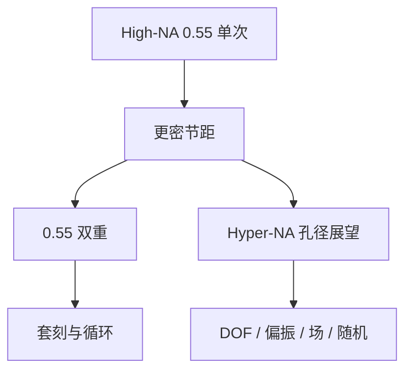

# Hyper-NA

0.55 之后若还要靠抬孔径换单次节距，孔径讨论会进入 Hyper-NA；那是公开展望与可行性研究，不是一张可以下单的量产规格书。

<footer>—— 对照 ASML / Zeiss 在路线图场合对 0.55 之后孔径的公开讨论</footer>

[上一课](/litho/euv-double-pattern)把 0.33 上「单次不够」收成 LELE/SADP 或等待 High-NA。缺口是：0.55 自己也会在更后面的节距上不够——那时是 High-NA 双重，还是再抬 NA？ASML 在 imec ITF 一类公开场合把 Hyper-NA 写进路线图展望，口径讨论落在 0.75 量级（亦有 0.85 的研究口吻），时间尺度说到 2030 前后；官方澄清过这是愿景与可行性研究。本课只钉孔径讨论里多出来的物理税，不当作 EXE 的下一款产品手册。

## 问题

分辨率仍按 $\lambda/\mathrm{NA}$。波长锁在 13.5 nm，再缩单次半节距只能加 NA 或再降 $k_1$。High-NA 已经用变形光学才把掩模侧角度从多层膜墙上救回来；再往上，主光线、偏振、焦深、胶厚、场尺寸会同时变本加厉。问题是：在「High-NA 双重」与「Hyper-NA 单次」之间，光学是否还存在一个可镀膜、可扫描、可涂胶的点。

公开能写的只有量级。van den Brink 等把高于约 0.7 的 NA 说成 2030 前后才更看得见的机会；Zeiss 被描述为开始透镜设计研究。没有公开的场尺寸、wph、镜面张数或量产导入年，可当合同用。缺口因此是机制税，不是规格表。

### 不要把路线图当采购项

把 Hyper-NA 写成「0.75 NA、某年、某 wph」会越权。ASML 对媒体的澄清是：可行性研究进行中。本课把 0.75 当作公开讨论过的目标量级，用来算 $\mathrm{NA}^2$ 税，而不是宣布一台尚未承诺的扫描机。

Hyper-NA 不是 High-NA 的改名。High-NA 专指已在建的 0.55 EXE 平台。把两者混称「更高 NA 的 EUV」，在展望课里会把已出货与未承诺焊在一起。

## 方法

展望里的光学逻辑与 EXE 同构，只是数字更狠。掩模侧 NA 随硅片 NA / 倍率涨，变形倍率可能还要再拆，场可能更小，拼接与套刻预算更紧。焦深再按 $\mathrm{NA}^2$ 掉，[胶厚预算](/litho/high-na-resist-budget)要从 0.55 的薄膜再往下，倒塌、吸收与随机三角一起收紧。边缘光线角大到偏振对比崩溃时，偏振器会挡掉光子，产率税与随机税同一方向。

另一条公开对照是：不抬 NA，而在 0.55 上双重，或继续用 0.33 双重加设计规则。Hyper-NA 只在「单次节距的经济性」赢过这些路径时才值得把蔡司镜子再做一代——那是系统经济，不是本课能算出来的净现值。

### 与 0.33 / 0.55 机队的并存

即使展望兑现，历史也是多代并存：干式与浸没、NXE 与 EXE。Hyper-NA 若出现，也只会吃最紧的层，而不是替换全部 EUV。讨论应落在「哪一层的单次截止」，而不是「哪一年全球切换」。

## 机制

NA 提高：截止频率上移，单次 $k_1$ 墙后移。同时 DOF $\propto 1/\mathrm{NA}^2$，膜更薄，光子体积更小，随机悬崖前移。矢量效应在更大孔径角上把 TM 对比打掉，可能逼出偏振控制，光源光子更贵。多层膜布拉格峰对角度更挑剔，掩模三维与阴影更重，SMO 与波前校正的负担上升。每一条都是 0.55 已经付过的税的加码，没有新的免费物理。

电子模糊、二次电子射程不随 NA 变。光学截止再往下走，会撞上胶与二次电子的模糊地板——公开讨论里这被当作「孔径不是无限可抬」的理由之一。那是材料与统计的墙，不是镜子没磨好。

不要用实验室显微镜的 0.75 NA 类比扫描机。EUV 投影是多层反射、真空、扫描同步与全芯片场；显微镜物镜的 NA 数字不能平移成 EXE 的下一档规格。

## 边界

本课不给出未公开的光学处方，不把 0.75 或 0.85 写成已冻结的产品 NA。时间点是展望，会随可行性研究移动。出口管制与镜子产能对 0.55 已经是瓶颈，下一代只会更稀缺。计算光刻、胶、掩模三维必须先在 EXE 上成熟，否则孔径讨论没有工艺落点。把实验室显微镜或掩模显微镜上的高 NA 演示写成扫描机视野，会把场尺寸与扫描同步两笔账漏掉。

后课默认：0.55 之后的孔径是展望项；量产决策仍在单次 High-NA、High-NA 双重与设计规则之间做，不以 Hyper-NA 为已交付工具。

计算光刻课程从下一单元的 OPC 开始，不再把未承诺的孔径当作已冻结的成像合同。

引用路线图时写「公开展望 / 可行性研究」，不要写成「ASML 已公布 Hyper-NA 量产机规格」。

## 小结

- Hyper-NA 是 0.55 之后再抬 EUV 孔径的公开展望，讨论量级约 0.75，不是量产规格。
- 物理税是更薄焦深、更薄胶、更重偏振与掩模三维，随机三角会更紧。
- 替代路径是 High-NA 双重与设计规则，不是只有抬 NA 一条路。
- 模糊与二次电子不随 NA 消失，孔径有材料地板。
- 出处：ASML / Zeiss 在路线图与 ITF 等场合对 High-NA 之后孔径的公开讨论。
