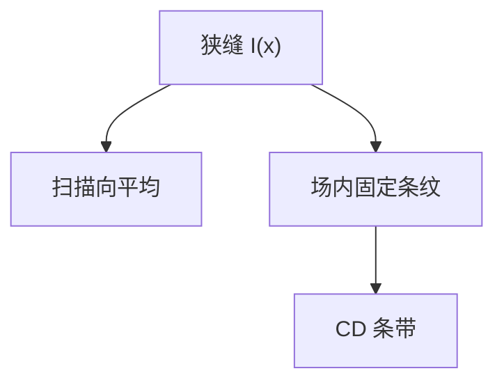

# 照明均匀性与狭缝

扫描把狭缝里的不均匀平均掉一部分；狭缝长度方向的不均匀会原样印进场。均匀性要沿狭缝报，不能只报中心点。

<footer>—— 对照 [狭缝与扫描平均](/litho/slit-scan-average)；剂量均匀性实践</footer>

[上一课](/litho/reticle-masking-blades)张开场。缺口是狭缝内强度 $I(x)$：扫描方向会被平均，垂直扫描的狭缝长轴不会。本课钉这件事，不重写双工件台。

## 问题

复眼之后仍有残纹和偏振相关透过。扫描平均降低扫描向高频，但狭缝两端若暗，整场对应位置永远欠剂量。CDU 地图呈「沿狭缝的条」时，先查照明，再查热板。

## 方法

用剂量传感器或晶圆上剂量垫沿狭缝采样。补偿：照明微调、扫描速度调制、光学元件操纵。规格用峰值–谷值或标准差相对平均剂量。换光瞳形状（偶极 vs 环）会改均匀性，要分别标定。

偏振照明下，复眼通道透过率可能随偏振变，均匀性与 [照明偏振](/litho/illuminator-polarization) 耦合。不要只在自然光下验光。

## 机制

扫描是时间积分。扫描向的 $I(y)$ 被狭缝宽度卷积；狭缝长向 $I(x)$ 没有这段卷积。所以「均光很好」必须声明沿哪一轴。

## 边界

下一课光瞳测量：均匀性是场，光瞳是角谱。两套计量。

## 小结

- 狭缝长向不均匀直接进场 CDU。
- 扫描只平均扫描向。换光瞳要重新测均匀性。
- 出处：狭缝课；剂量均匀性实践。
