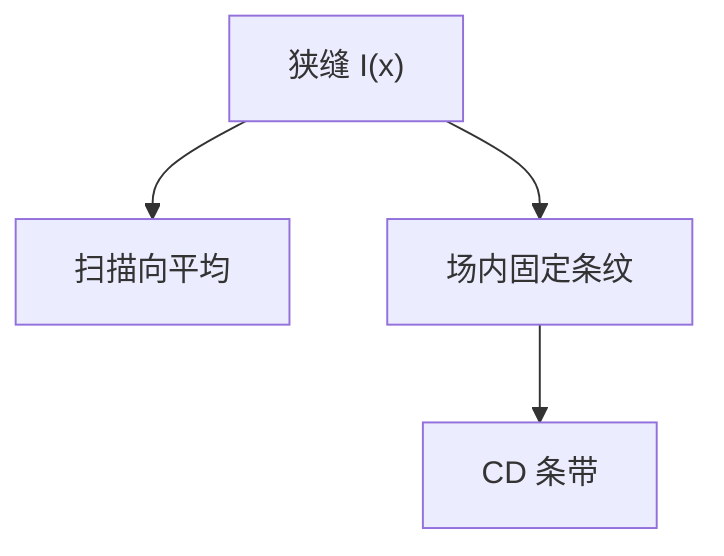
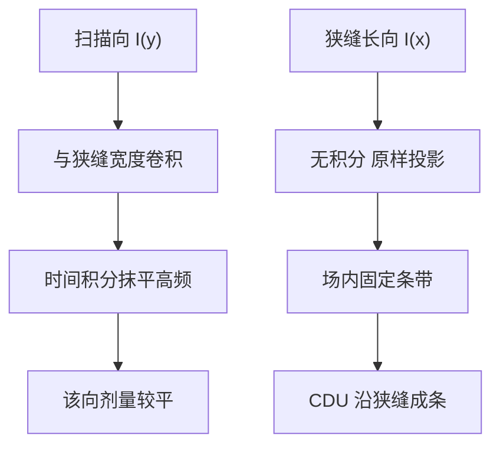

# 照明均匀性与狭缝

扫描把狭缝里的不均匀平均掉一部分；狭缝长度方向的不均匀会原样印进场。均匀性要沿狭缝报，不能只报中心点。

<footer>—— 对照 [狭缝与扫描平均](/litho/slit-scan-average)；剂量均匀性实践</footer>

[上一课](/litho/reticle-masking-blades)张开场。缺口是狭缝内强度 $I(x)$：扫描方向会被平均，垂直扫描的狭缝长轴不会。本课钉这件事，不重写双工件台。

## 问题

复眼之后仍有残纹和偏振相关透过。扫描平均降低扫描向高频，但狭缝两端若暗，整场对应位置永远欠剂量。CDU 地图呈「沿狭缝的条」时，先查照明，再查热板。

狭缝就是曝光时只点亮掩模上一条窄带的「光缝」，机器让硅片与掩模同步扫过它，像复印机扫纸一样把整场拼出来。所以狭缝内的亮度不均，只有扫描方向会被涂匀——垂直扫描的狭缝长轴方向，亮一块暗一块会原样印到晶圆上。

## 方法

用剂量传感器或晶圆上剂量垫沿狭缝采样。补偿：照明微调、扫描速度调制、光学元件操纵。规格用峰值–谷值或标准差相对平均剂量。换光瞳形状（偶极 vs 环）会改均匀性，要分别标定。

「峰值–谷值相对平均」代入数字：沿狭缝采样得到最亮 1.01、最暗 0.99、平均 1.00，PV 就是 $(1.01-0.99)/1.00 = 2\%$。别被小数麻痹——剂量每差 1%，CD 大约线性偏零点几纳米，整场 CDU 预算里这是大头。

```mermaid
flowchart TD
  SLIT["狭缝 I(x)"] --> SCAN["扫描向平均"]
  SLIT --> FIELD["场内固定条纹"]
  FIELD --> CDU["CD 条带"]
```

偏振照明下，复眼通道透过率可能随偏振变，均匀性与 [照明偏振](/litho/illuminator-polarization) 耦合。不要只在自然光下验光。

## 机制

扫描是时间积分。扫描向的 $I(y)$ 被狭缝宽度卷积；狭缝长向 $I(x)$ 没有这段卷积。所以「均光很好」必须声明沿哪一轴。

```mermaid
flowchart TD
  IY["扫描向 I(y)"] --> CONV["与狭缝宽度卷积"]
  CONV --> AVG["时间积分抹平高频"]
  AVG --> FLAT["该向剂量较平"]
  IX["狭缝长向 I(x)"] --> DIRECT["无积分 原样投影"]
  DIRECT --> STRIPE["场内固定条带"]
  STRIPE --> CDU["CDU 沿狭缝成条"]
```

这张图回答的问题是：同一个不均匀光源，为什么两个方向的待遇完全不同——一个被扫描积分涂匀，一个被原样印进场。

诊断时可以利用这个不对称：CDU 地图上「沿狭缝走向的条带」指向照明；热板与显影的问题通常呈场状渐变或随机点状，不会规规矩矩跟着狭缝方向走。

## 边界

下一课光瞳测量：均匀性是场，光瞳是角谱。两套计量。

## 小结

- 狭缝长向不均匀直接进场 CDU。
- 扫描只平均扫描向。换光瞳要重新测均匀性。
- 出处：狭缝课；剂量均匀性实践。
