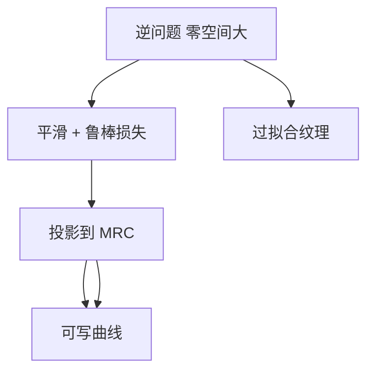

# ILT 正则化

逆问题的精确解有无穷多个掩模，都几乎给出同一张低通空中像；不正则，优化器就在像素噪声里打转，写出不可制造的纹理。

<footer>—— 对照逆光刻文献对病态逆问题与可制造约束的通称</footer>

[上一课](/litho/ilt-curvilinear)已经把 ILT 收成：对前向成像求逆，表示从多边形边换成像素或水平集，曲线是通带内梯度下降的自然几何。缺口是病态。许多掩模对应几乎相同的晶圆轮廓，噪声和模型误差会被放大成高频碎形。必须正则化——平滑、MRC、剂量/焦点鲁棒——解才稳定到能写、能检、能蚀。本课钉正则。掩模厂用哪些几何规则把正则落地，留给[下一课](/litho/mask-rule-check)。

## 问题

正向 $I=\mathcal{I}(M)$ 是低通的。逆「给定 $I$ 求 $M$」的解空间巨大：在截止频率以外加减任意纹理，空中像几乎不变，损失几乎不动。无约束梯度下降会把模型误差和数值噪声拟合进这些零空间，看起来 loss 很低，硅上却是新热区，掩模数据体积爆炸。

OPC 的曼哈顿碎片本身就是一种硬正则：边只能法向挪、拓扑锁定。ILT 丢掉这层约束之后，必须显式把可制造性写进目标或投影，否则「光学上更优」会变成「掩模厂拒收」。缺口因此是选哪些惩罚、何时投影，而不是再证明逆问题存在。

### 正则不是把曲线变回直角

常见误解是：正则化 = 强制曼哈顿。那只是正则族里的一种，而且通常抬高损失、缩小窗口——上一课正是靠去掉它才换光学收益。曲线 ILT 的正则是曲率、最小宽度/间距、面积、以及 PV 扰动下的损失，让解停在光滑可写的流形上，而不是停在像素棋盘上。

「通称」的意思是：平滑、Tikhonov、总变差、水平集周长、MRC 投影、鲁棒项，文献里名字不同，目的相同——压零空间、换稳定性。本课不绑某一家 EDA 的产品名。

## 方法

三项几乎总是同时在。平滑：对 $M$ 的梯度或曲率惩罚，或在更新后做低通，禁止单像素抖动。可制造：每步或每若干步投影到 MRC（最小 CD、间距、面积；曲线还要曲率半径）。鲁棒：在剂量、焦点、掩模误差的若干扰动上求和损失，避免只在名义点漂亮。三者权重是超参数：平滑太重，窗口吐回去，ILT 退化成模糊的 OPC；太轻，解不可写。

输出仍要提取等值线、对齐电子束网格。正则若只存在于优化器、不存在于提取后的多边形，后处理会把正则偷偷拆掉。工程上把「优化内投影」和「提取后简化」当成同一条链。

### 鲁棒项是对随机的弱代用品

扰动损失买的是均值工艺窗，不是泊松尾。缺孔仍要剂量与胶，见[光子预算](/litho/photon-shot-budget)。把鲁棒 ILT 写成「已经解决随机」，越权。它解决的是名义点过拟合。

## 机制

伴随梯度本身是光滑的，因为成像低通。无约束时，下降方向已经倾向曲线。真正长出像素噪声的，是损失对零空间不敏感：数值误差在零空间里累积。正则给零空间一个斜率，让优化器宁愿走光滑解。MRC 投影把解再拉到可写集合；若投影与梯度冲突，表现为边角被反复拉出又拍回，收敛变慢——那是约束太紧或模型在要求不可写的对比。

模型误差会被逆放大：校准漏洞变成纹理。独立硅数据验证因此是正则的一部分，不是优化结束后的礼貌检查。

损失下降不等于可制造。必须同时看 PV-band、MRC 违例数、掩模数据量。只报 clips 上的 EPE，等于只报未正则的训练集 loss。

## 边界

正则不增加 NA，不提高前向模型的物理正确性。它只在错误模型上也给出「看起来干净」的掩模——这时干净是假象。权重没有普适最优，随层别、写入器（VSB 对多束）和检测算法变。全芯片 ILT 的正则预算还受 GPU 日历限制：扰动点太多，班次内跑不完。热区 ILT 与全芯片 ILT 可以用不同权重，但不能用两套互相矛盾的 MRC，否则拼接处会裂开。

后课默认：ILT 的解已经是正则化之后的；下一课把投影所落的集合写成掩模厂的规则语言。

无扰动、无 MRC 的像素解可以留在实验室 clips 里当光学上限，不能当作 TAPOUT 输入。

比较 ILT 与 OPC 时写清正则项。无 MRC、无 PV 扰动的「裸逆」窗口，不能当作量产曲线掩模的收益。

## 小结

- 成像低通使 ILT 逆问题病态，必须正则才能落到可制造掩模。
- 平滑、MRC 投影、剂量/焦点鲁棒是通称的三项，缺一则过拟合或不可写。
- 正则不是强制曼哈顿；曲线解仍要曲率与宽度约束。
- 模型误差会被放大，独立硅验证属于正则闭环。
- 出处：逆光刻文献对病态逆问题与可制造正则的通称。
