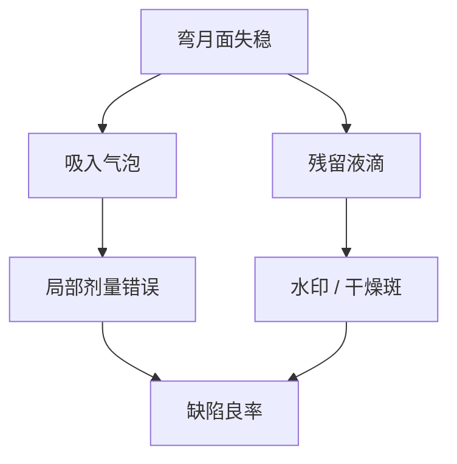

# 浸没缺陷：气泡与水印

弯月面一破，光学还没来得及改 NA，晶圆上已经写下气泡微透镜和水印干燥斑。浸没缺陷是流体事件，不是瑞利公式的新项。

<footer>—— 据 SPIE 与产线公开的浸没缺陷类型：气泡、水印、干燥斑</footer>

[上一课](/litho/immersion-hood)把局部头和随动水膜钉成架构，并指出失稳时会吸入空气或甩出液滴。缺口是这些事件在胶上长什么样、如何与干式颗粒缺陷分家。本课钉气泡与水印。PAG 溶进水里污染镜头与改变局部化学，留给[下一课](/litho/topcoat-leaching)，不在这里把浸出写成气泡。

## 问题

干式缺陷主要是颗粒、残胶和桥连。浸没多出一类与水相关的形貌：气泡在曝光瞬间当微透镜或遮挡，留下圆形或彗形的局部剂量错误；扫描后残留液滴干燥，溶质与胶组分浓缩成水印（watermark），常表现为环形、斑状增感或减感区；干燥斑、水痕则是液膜退缩路径的记录。SPIE 产线报告把它们列为浸没导入期的主缺陷族。

缺口是诊断：看起来像热点或随机桥连，根子可能是上一场步进时弯月面在边场破了。修 OPC 或加剂量会空转。

### 气泡不是 flare

[Flare](/litho/flare-and-stray) 是镜头与掩模的长程散射底座，全场缓变。[浸没](/litho/arf-immersion) 课已经预告气泡与水印不进 1.35 这个数。气泡是局部、可重复或随扫描路径走的流体光学，Kirk 测试量不到它。把水印当开孔率 flare 去补剂量，会把邻区 CD 补歪。

气泡缺陷往往尺寸远大于器件 CD，审查时像「大圆斑」或彗尾。把它当成 EUV 式缺失孔，是把两套随机语言加错栏。

## 方法

分类：用缺陷检测的形貌 + 与扫描路径、晶圆边缘、停顿点的空间相关，把气泡 / 水印 / 颗粒分开。减气泡：供水除气、头内排气、限制加速度、维持接触角窗口。减水印：扫描结束的干燥策略、表面疏水（面涂或胶配方）、回收不留滴。这些是流体与轨道旋钮，不是照明光瞳。

短环用空白或简单栅看缺陷密度对扫描速度。产品图形会把水印放大成桥连，密度相关，但源头仍是液滴，不是禁戒节距。换头世代或换胶，缺陷谱要重画。

### 与边场 CDU 一起看

边场弯月面最难闭合，缺陷图与边 overlay、边 CD 常同源。只把中心场 FEM 做漂亮，边场水印可以把良率吃掉。路径策略（怎么进边、怎么出边）是浸没特有的「曝光配方」项。

## 机制

气泡折射率接近 1，相对水是强透镜，曝光瞬间把空中像扭掉，胶上留下圆形过/欠曝。扫描方向运动把气泡拉成彗形。水印是干燥动力学：三相线钉扎处溶质沉积，局部 PAG 或淬灭剂浓度变，显影后 CD 或桥连。干燥斑可以不含「脏」溶质，只是胶被水溶胀再干裂，仍是缺陷。

颗粒可被弯月面从晶圆表面捞起再放下，表观缺陷率随扫描次数涨。供水过滤器解决的是来水，解决不了晶圆自带颗粒的捞取。头的回收若把胶渣打回去，会变成循环污染。

同一颗水印在正胶和负胶上的亮暗可以相反。报缺陷必须写胶极性与是否有面涂，否则形貌图不可比。

## 边界

本课不给出未公开的缺陷密度规格，也不把某代浸没机宣传的「缺陷中性」写成物理定律。EUV 真空里没有这层水，不要把水印语言搬到 NXE。后课默认：浸没缺陷首先按流体形貌分类，再决定是改头、改速度、改表面化学，还是改 OPC。

浸出造成的镜头污染是慢变量，水印是单次扫描事件。下一课改化学隔离，不替代本课的除气与干燥。

停顿、重试、对准失败后的再入场，是水印高发点。日志里的异常扫描路径要进缺陷复盘，不能只看平均 wph。

## 小结

- 气泡当微透镜/遮挡，水印与干燥斑是残留液滴的记录。
- 与 flare、EUV 缺孔分家：这是流体事件，跟扫描路径和边场走。
- 杠杆是除气、头回收、加速度、接触角与干燥，不是光瞳。
- 边场路径是浸没特有配方项。
- 出处：SPIE / 产线公开的浸没缺陷类型；ASML 浸没流体架构的公开说明。
