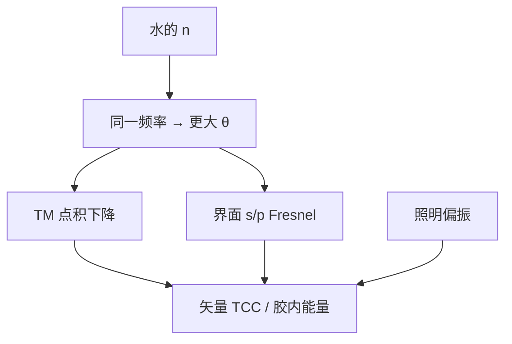

# 浸没成像的矢量分析

水把 $n\sin\theta$ 送到 1.35，同一节距对应更大的光线夹角；TM 税和界面 Fresnel 一起写进矢量 TCC，不是把干式标量核乘上 1.44。

<footer>—— $\mathrm{NA}=n\sin\theta$ 见 Born &amp; Wolf；浸没矢量成像对照 Mack、Levinson 与 Flagello 分层模型</footer>

[上一课](/litho/scalar-breakdown-high-na)标明标量 $|U|^2$ 在高 NA 失效。缺口是：浸没不是「把空气换成水之后标量核自动变细」，而是**夹角、偏振、水–胶–BARC 界面**同时改传递。主干已有[ArF 浸没](/litho/arf-immersion)与[高 n 浸没液](/litho/high-n-immersion)的产线史；本课只做成像计算上的矢量分析。像差如何吃 NILS，留给[下一课](/litho/aberration-nils-sensitivity)。不重推 $\mathrm{CD}=k_1\lambda/\mathrm{NA}$。

## 问题

像方 $\mathrm{NA}=n\sin\theta$。水 $n\approx 1.44$ 让同一横向频率 $n\sin\theta/\lambda$ 对应更大的 $\theta$。标量理论会说截止外推了、Airy 变瘦；矢量理论说 TM 对的点积更差，密线对比可能**不如**按截止外推所期待的那样好。干式 0.93 的「矢量修正」在 1.35 上变成默认项。

缺口因此是把浸没写进已经建立的 TCC/SOCS：流体折射率进传播与光瞳映射，偏振通道进核，分层薄膜进每条角谱的 Fresnel——而不是把干式标量 PSF 缩放 $1/n$。

### 水层不是又一块玻璃

最后透镜、水、胶顶，三层折射率台阶。s/p 透射不同，胶内驻波节点随角和偏振移。浸没头保证的是均匀水膜；光学模型假定膜厚稳定，气泡与水印是缺陷，不是矢量核的一部分。本课不重写喷淋。

Hyper-NA / High-NA EUV 是反射光学另一套 $n=1$ 的大角度，机制同类（矢量 + 掩模 3D），介质不是水。不要把浸没矢量分析抄成 EUV 的水层。

## 方法

角谱：每个源点、每个偏振，把平面波按水中 $\mathbf{k}$ 传到胶，用薄膜矩阵（后课展开）得到胶内 $\mathbf{E}$，再 $|E|^2$ 加权吸收。对源积分即矢量 Abbe；预计算即矢量 TCC。SOCS 对本征核同样成立，只是 $K$ 通常更大。

照明偏振：密线走 TE，让电场平行于线条。[TE/TM 课](/litho/te-tm-polarization)的对比差在浸没下放大。二维孔无法两向同时最优，浸没孔层往往更早逼近矢量地板。

### 焦深与偏振税不要合成一个 k₂

$\mathrm{DOF}\propto\lambda/\mathrm{NA}^2$ 仍描述离焦二次相位的轴向窗。TM 损失在 $z=0$ 已征收。把浸没后「窗变瘦」全部记成 $k_2$，会把偏振与薄膜角谱误写成调焦问题。下一课把像差敏感度放在矢量像的 NILS 上，正是为避免这种记账。

## 机制

横向波矢 $k_\perp=2\pi n\sin\theta/\lambda$ 由节距决定。$n$ 增大若 $\theta$ 跟着增大，$k_\perp$ 才增大——镜头必须按新 $\mathrm{NA}$ 设计，灌水不会把旧干式 NA 乘上 $n$。矢量机制：$\theta$ 大，$E$ 不平行，干涉项小；同时胶内有效 PSF 随偏振裂成两只不完全重合的核，疏密偏差和孔椭圆化都会改。

## 边界

本课假定水的 $n$ 已知、吸收可忽略、无气泡。第二代高 $n$ 流体未量产，不在这里编折射率。标量 OPC 在浸没层靠校准存活的部分，换偏振模式或换 BARC 角谱后必须重校准。禁止引用未公开的 1.35 镜头矢量误差表。

## 小结

- 浸没提高的是 $n\sin\theta$，也提高 TM 税与界面角谱。
- 矢量 TCC 替换标量核，SOCS 仍可用。
- 不要缩放干式 Airy 来当浸没 PSF。
- 偏振税不是焦深；孔比线更早付二维矢量账。
- 下一课：像差在这条矢量像上怎样打 NILS。
- 出处：Born &amp; Wolf；Mack；Levinson；Flagello。
