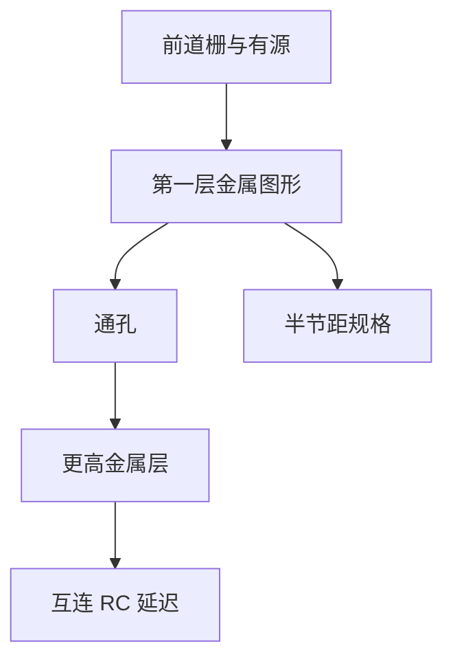

# 互连半节距与金属层

晶体管之上是多层金属互连；半节距描述相邻线中心距的一半。节点推进时，互连缩放往往比栅长更早碰到图形化极限。

<footer>—— 据 Sze 器件互连讨论与 Mack, Fundamental Principles of Optical Lithography 对节距作为光刻对象的整理</footer>

[上一课](/litho/cmos-inverter-pair)说明前道需要 n/p 分区与多块掩模。[MOSFET 与栅长](/litho/mosfet-gate-length) 不是芯片上唯一的横向尺度。缺口：金属线宽与节距如何命名、为何与栅长并列成为节点指标，以及为何每一层金属都要再做一次图形。晶体管做成之后，电路仍不存在，直到金属被画在指定网上。

## 问题

逻辑门必须接到电源与相邻单元。铝或铜互连层 M1、M2… 各由图形定义沟槽或线条。线越密，电阻电容延迟越大；继续缩小就要更细的线、更薄的介质。若只谈栅长，无法理解规格书里「金属节距 40 nm」与栅长并排出现。缺口是后道的尺度语言：半节距，以及多层金属每一层都是一次图形化。

### 半节距不是线宽的别名

线宽 $W$ 与间距 $S$ 可以不相等。节距 $p=W+S$，半节距 $p/2$。只有 1:1 线空时半节距才等于线宽。把「半节距 20 nm」读成「线宽一定是 20 nm」，设计规则与光刻目标都会偏。DRAM 常用阵列半节距对外说话；逻辑常用接触多晶节距与金属节距的组合。

M1 通常最密，上层可逐层放宽以降低电阻。通孔连接相邻金属层，图形是孔而不是线，下一课专讲。本课先把线的节距钉死。

## 方法

后道典型顺序：介质沉积 → 图形化开槽 → 阻挡层与种子 → 铜填充 → 化学机械抛光。每一金属层有最小 $W$ 与最小 $S$，半节距 $\approx p/2$。图形化的对象是整层导线图案：哪里有金属、哪里是绝缘。没有这一层图形，晶体管即使做成也无法构成电路。

半节距成为对外规格，是因为它同时约束线宽与间距：只缩 $W$ 而 $S$ 不缩，电容仍在；只缩 $S$ 则桥连风险先爆。路线图表格因此报 pitch 而不是只报 CD。本课要的正是这把尺子，好让后课「一次曝光够不够」问的是 $p$，不是某个营销纳米数。

节点路线图在栅长缩小放缓之后，把金属节距与接触多晶节距推到台前。后课 [节点名不再等于栅长](/litho/node-vs-gate-length) 会说明对外数字与这些物理节距如何脱钩；本课先给出物理量本身。

接触多晶节距（CPP）是栅方向上相邻接触栅的重复周期，常与金属一节距一起出现在逻辑节点表里。它不是 $L$，而是另一把前道尺子。

## 机制

互连图形化与前道用同一类图形转移思想：先定义平面图案，再把材料填进或蚀刻掉。动机同样根本：没有图案，铜无法出现在指定的网表位置。节距变小之后，单次曝光是否够用，是 [多重图形化之前的单次曝光极限](/litho/single-expose-limit) 的题目；本课不把波长与孔径提前解完，只指出对象是节距而不仅仅是栅长。

层间介质变薄、线距变近，电容上升；线截面积下降，电阻上升。电路于是要求更多层金属来换布线资源，而不是无限缩小同一层的节距。图形化层数因此随节点增加：每一层都是一次图案定义。这与前道「栅只有一层」不同——互连是栈，节距可以每层不同，最密的通常靠近晶体管。

RC 延迟随线变细、介质变近而变差，这是「为何还要继续做更密图形」的电路理由。光刻要服务的是这张网，不是某一根栅的美学。

## 边界

本课不展开双镶嵌步骤、低介电常数材料化学或背面供电。不写照明、胶与成像公式。通孔与接触孔的孔类图形下一课才与线对照。

双重图形化出现之后，同一金属层可能被拆成两次线图形，节距定义仍是最终铜线的 $p$，不是单次曝光的节距。本课尺子是成品节距。后课默认：后道有多层金属；每层有节距；半节距是 $p/2$，仅在 1:1 时等于线宽。下一课解释节点名为什么不再等于 $L$。

## 小结

- 后道金属层各需一次图形化；半节距是 $p/2$，不等于任意线宽。
- 节点规格越来越看金属节距与接触多晶节距，而不只看栅长。
- 图形化动机：把网表上的导线写在指定位置。
- 单次曝光够不够，后课再谈；本课只定义对象。
- 1:1 线空时半节距才等于线宽；否则必须同时报 $W$ 与 $S$。
- 出处：Sze &amp; Ng, *Physics of Semiconductor Devices*；Mack, *Fundamental Principles of Optical Lithography*。
