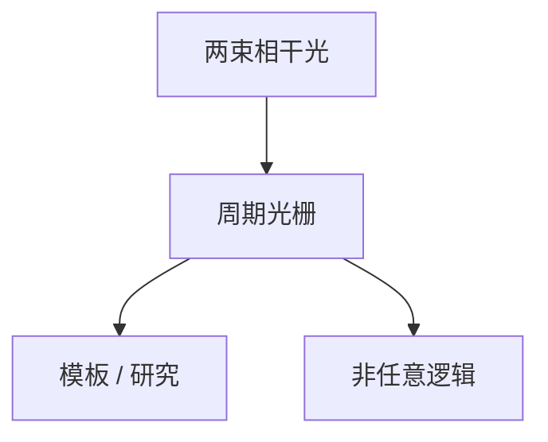

# 干涉光刻

两束相干光的干涉条纹给出极密的周期线，不需要透镜把掩模成像；代价是几乎只能做周期，没有任意逻辑。

<footer>—— 对照 interference lithography（Lloyd 镜、achromatic IL）在实验室与模板中的传统</footer>

[上一课](/litho/multibeam-direct-write)说明串行直写的墙。缺口是并行光子的非投影用法。本课钉干涉光刻。X 射线与近场，留给[下一课](/litho/xray-near-field）。

## 问题

两束平面波干涉，周期 $λ/(2\sinθ)$，可在胶上得到大面积光栅。无需投影物镜，NA 概念换成交角。应用：实验室纳米光栅、某些自对准模板、研究用 periodic test。不能直接印 SRAM 二维任意孔，除非多次曝光叠加或与切线组合——那就又回到分解复杂度。

缺口是**周期特化**，不是新波长扫描机。把干涉当 EUV 替代，丢了逻辑图形的信息容量。

### 与离轴照明的关系

投影光刻的偶极是「在瞳里选两束」去加强某一周期；干涉光刻是直接两束、没有掩模频谱。主干 OAI 课已讲前者。本课不重推部分相干。

Achromatic IL 用宽带减相干长度问题，适合大面积，仍是周期。

## 方法

实验室：激光分束、交角、稳定。工业：罕见作为逻辑主曝光；可能作为辅助光栅。与 SAQP：有人讨论干涉做 mandrel，仍要切线。评估用「能否任意 2D」一票否决逻辑全流程。

## 机制

强度 $I \propto 1+\cos(Kx)$，K 由交角定。对比度靠相干与剂量。焦深可以很大（准直束），这是优点。信息量：一维周期的自由度远小于掩模场。

## 边界

不把 EUV 干涉源幻想成已量产扫描机。不给实验室最小周期当厂规。

后课默认：无掩模光子路可以印周期；下一课更短波长的 X 射线与近场为何没成为逻辑主路径。

## 小结

- 干涉光刻用交角定周期，大面积、深焦深，图形几乎必须周期。
- 不能替代投影光刻的任意 2D 逻辑。
- 与偶极照明同族的是「两束」，不是同一台机器。
- 出处：interference lithography 实验室与模板传统。
