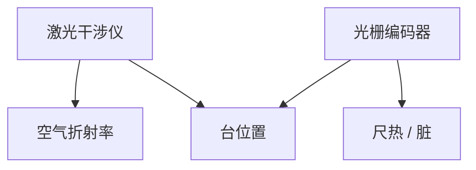

# 干涉仪对光栅编码器

工件台要知道自己在哪。激光干涉仪走光程，光栅编码器走尺。空气、阿贝臂和污染对两者的打法不同。

<footer>—— 对照扫描投影机双频干涉仪与光栅编码器公开方案；套刻见 [litho-overlay](/litho/litho-overlay)</footer>

[上一课](/litho/lens-contamination)把物镜表面污染收束，并点名下一单元是台子上的计量脏。本课打开「工件台与传感」：位置反馈选干涉仪还是编码器。不重写套刻预算分解。

## 问题

纳米套刻要求台位置在扫描全程可溯源。干涉仪把位移变成光程差，空气折射率（温、压、湿、CO₂）直接进读数，阿贝臂误差把俯仰变成横向。光栅尺把位移变成莫尔条纹，对空气不敏感，但对尺的热胀、安装与脏敏感。把「台不准」写成一种传感器，会选错补偿。

## 方法

量产机常编码器为主、干涉仪交叉校验或分轴。环境：干涉仪要气浴与波长补偿；编码器要尺温与清洁。校准把两种读数在同一轨迹上对起来，残差进套刻模型。

EUV 真空里空气项消失，干涉仪环境变了，但不等于编码器自动更好：磁浮台与热仍在。

## 机制

干涉相位 $\Delta\phi = 4\pi n L/\lambda$。$n$ 漂等于假运动。光栅周期固定，误差来自尺本身与读头间隙。两者的噪声谱不同：气流是低频，读头振动可以更高频。

## 边界

下一课调平：竖直方向另一套传感器，不要用同一套 XY 编码器冒充。

## 小结

- 干涉仪吃空气与阿贝臂；编码器吃尺与脏。
- 套刻补偿必须声明用了哪路反馈。
- 出处：扫描机位置计量通识；套刻课。
