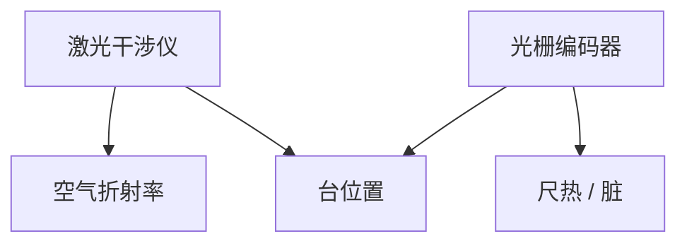
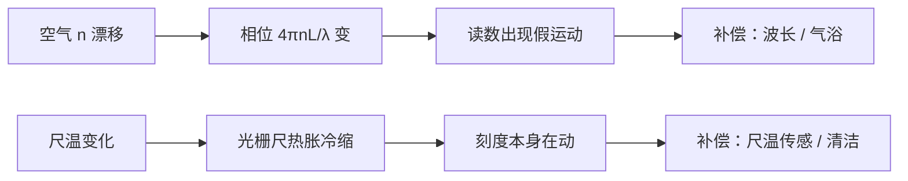

# 干涉仪对光栅编码器

工件台要知道自己在哪。激光干涉仪走光程，光栅编码器走尺。空气、阿贝臂和污染对两者的打法不同。

<footer>—— 对照扫描投影机双频干涉仪与光栅编码器公开方案；套刻见 [litho-overlay](/litho/litho-overlay)</footer>

[上一课](/litho/lens-contamination)把物镜表面污染收束，并点名下一单元是台子上的计量脏。本课打开「工件台与传感」：位置反馈选干涉仪还是编码器。不重写套刻预算分解。

## 问题

纳米套刻要求台位置在扫描全程可溯源。干涉仪把位移变成光程差，空气折射率（温、压、湿、CO₂）直接进读数，阿贝臂误差把俯仰变成横向。光栅尺把位移变成莫尔条纹，对空气不敏感，但对尺的热胀、安装与脏敏感。把「台不准」写成一种传感器，会选错补偿。

「阿贝臂」翻译成大白话：测量传感器与真正干活的曝光点之间隔着一段横向距离，这段「手臂」会把台子的微小俯仰放大成横向读数误差。代个数：偏 50 mm、俯仰仅 1 微弧度，横向误差就是 $50\,\mathrm{mm}\times10^{-6}=50$ nm——对套刻预算是天文数字，所以传感器必须尽量与曝光面对齐。

## 方法

量产机常编码器为主、干涉仪交叉校验或分轴。环境：干涉仪要气浴与波长补偿；编码器要尺温与清洁。校准把两种读数在同一轨迹上对起来，残差进套刻模型。

```mermaid
flowchart TD
  IF["激光干涉仪"] --> AIR["空气折射率"]
  ENC["光栅编码器"] --> SCALE["尺热 / 脏"]
  IF --> POS["台位置"]
  ENC --> POS
```

EUV 真空里空气项消失，干涉仪环境变了，但不等于编码器自动更好：磁浮台与热仍在。

## 机制

干涉相位 $\Delta\phi = 4\pi n L/\lambda$。$n$ 漂等于假运动。光栅周期固定，误差来自尺本身与读头间隙。两者的噪声谱不同：气流是低频，读头振动可以更高频。

```mermaid
flowchart LR
  DRIFT["空气 n 漂移"] --> PH["相位 4πnL/λ 变"]
  PH --> FALSE["读数出现假运动"]
  TEMP["尺温变化"] --> EXP["光栅尺热胀冷缩"]
  EXP --> FALSE2["刻度本身在动"]
  FALSE --> C1["补偿：波长 / 气浴"]
  FALSE2 --> C2["补偿：尺温传感 / 清洁"]
```

这张图回答的问题是：两种传感器各自的误差沿哪条物理链混进读数，对应的补偿杠杆又分别在哪——拿错杠杆，补偿本身就是新的误差源。

激光干涉仪的测距原理是「数条纹」：台子每移动半个波长（HeNe 激光约 316 nm），干涉条纹就明暗交替一次；数出次数乘上半波长就是位移，分辨率能做到亚纳米。但它读的是「光走过的路」，不是「台子走的路」——中间的空气全算在账里。

直觉类比：光栅编码器像贴在导轨上的卷尺，读头贴着读刻度，尺上刻度是哪就是哪，天生不管空气；代价是这把「米尺」自己会热胀冷缩——尺一变长，所有刻度一起错。所以编码器机的关键日常是尺温控制与清洁，而不是气浴。

## 边界

下一课调平：竖直方向另一套传感器，不要用同一套 XY 编码器冒充。

## 小结

- 干涉仪吃空气与阿贝臂；编码器吃尺与脏。
- 套刻补偿必须声明用了哪路反馈。
- 出处：扫描机位置计量通识；套刻课。
