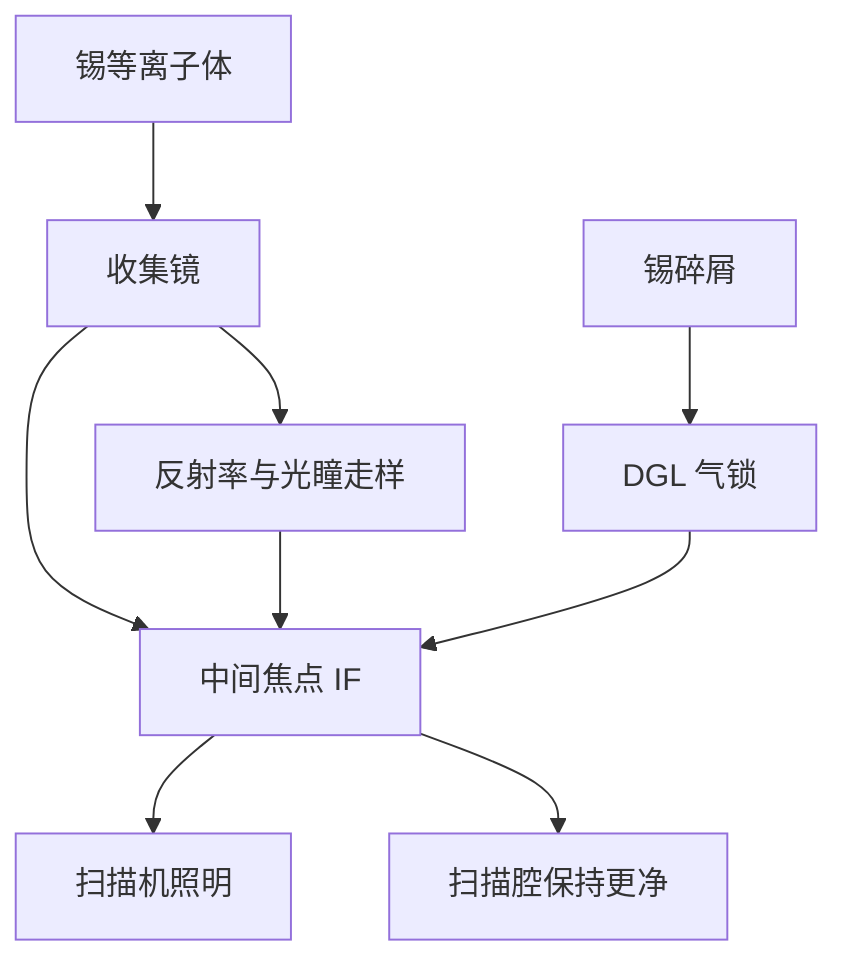

# 中间焦点 IF

中间焦点是光源与扫描机的合同面：功率、光谱、位置和洁净度都在这里验收，而不是在等离子体旁边。

<footer>—— 改写自 ASML 对 EUV 光源中间焦点（intermediate focus）作为系统接口的公开叙述</footer>

[上一课](/litho/collector-lifetime)把收集镜写成反射率会走的消耗品。缺口是：下游并不看见镜子本身，只看见镜子第二个焦点上那团光还干不干净、稳不稳定。本课钉中间焦点（IF）。功率如何换成硅片剂量与产能，留给[下一课](/litho/euv-power-throughput)。

## 问题

收集椭球把等离子体共轭到 IF。扫描机照明假定这里有一个尺寸、发散、光谱和偏振都合格的二次源。收集镜变脏，IF 上先掉的是带内功率，接着是光瞳填充变形和散射底座——剂量环能加激光能量补平均瓦数，补不回光瞳形状。IF 因此是光学合同，不是「管道上的一个孔」。

洁净度是另一半合同。锡蒸汽、微滴和氢化物若穿过 IF 进入扫描腔，投影多层和掩模比收集镜金贵得多。[DGL](/litho/euv-hydrogen-dgl) 的差压气流把质量流挡在光源舱，前提是 IF 通道本身是窄的、被气流吹扫的，而不是一个敞口。

### 合同面不是几何焦点那么简单

几何焦点只保证共轭。验收还要：带内功率、2% 带宽内的光谱纯度、带外（尤其是 DUV/UV 会给胶和传感器添乱）、位置稳定度、以及脉冲间抖动。ASML 公开的 250 W 级里程碑指的是 IF 处可维持的平均带内功率，不是等离子体旁的辐射总功率。

IF 在真空里，没有可以随便换的窗口。所谓「洁净」是气流、光阑、收集镜状态和泵组一起维持的准稳态，停光之后自由基产量下降，洁净度策略也要改。

## 方法

光源舱把等离子体、收集镜、氢缓冲和碎屑抑制做在 IF 之前。IF 模块提供光阑与气锁缝：光子过去，大部分中性锡被吹回或抽走。下游照明光学从 IF 取光，再送到掩模。剂量传感器在硅片侧闭环，但执行器仍在激光、滴触发和气体流量上——IF 是这条环的观测代理之一。

收集镜寿命课已经说明反射率曲线会走。维护策略是：在 IF 功率与光瞳仍能用剂量环和照明补偿压进规格时继续跑；超出则洗或换收集镜。换镜日历直接进 [NXE](/litho/asml-nxe) 可用性，所以 IF 仪表是工厂成本仪表，不只是实验室功率计。

### 光谱纯度与光阑

多层收集已经是带通滤波器，但等离子体还出带外。IF 附近的光谱滤波与光阑切掉进不了照明设计的那部分。切得太狠，IF 瓦数虚高实际剂量不够；切得太松，胶的带外敏感和杂散对比变差。公开材料把这些收进「IF 规格」，不给光阑图纸。

## 机制

椭球的两个焦点把物方等离子体的尺寸和角分布变成像方 IF 的尺寸和 NA。收集镜面形、污染造成的中频粗糙、以及氢致应力，都会改这个映射：IF 光斑变大或晃，照明填充跟着走，CD 指纹出现「光源腔」分量。洁净失效则更直接：颗粒或锡膜一旦进扫描腔，投影镜和掩模的损伤不可用换收集镜那种节奏修。

功率抖动在 IF 上被积分成狭缝剂量。扫描速度与 [磁浮台](/litho/euv-maglev-stage) 假定 IF 平均功率稳定；发生器打空或收集镜局部污染会造成与扫描同步的剂量纹波。

不要把 IF 画成「EUV 激光器的输出耦合镜」。没有 13.5 nm 激光腔；IF 只是自发发射被收集后的二次源。CO₂ 光路在光源舱另一侧，进不了扫描机。

## 边界

本课不重写收集镀膜，也不展开剂量–产能公式。不要把实验室在真空室里测到的「焦点功率」写成 IF 合同；量产 IF 含光阑、气体透过和污染态。后课默认：说到光源功率，先问是不是 IF 带内、是否在收集镜寿命曲线的哪一段。

公开材料给出接口角色与功率里程碑，不给出 IF 缝宽和气流表。不要发明。

「IF 洁净」不是无菌室口号。它是允许进入照明与 POB 的锡、碳、颗粒上限。超了先伤镜子，再伤掩模，最后才是 IF 功率计读数。

## 小结

- IF 是光源与扫描机的合同面：功率、光谱、位置、洁净度在此验收。
- 收集镜退化首先表现为 IF 瓦数与光瞳填充变差。
- DGL 与 IF 通道几何把锡质量流留在光源舱。
- 250 W 级公开里程碑指 IF 平均带内功率，不是等离子体总辐射。
- 出处：ASML 对 EUV 光源中间焦点与系统接口的公开材料。
