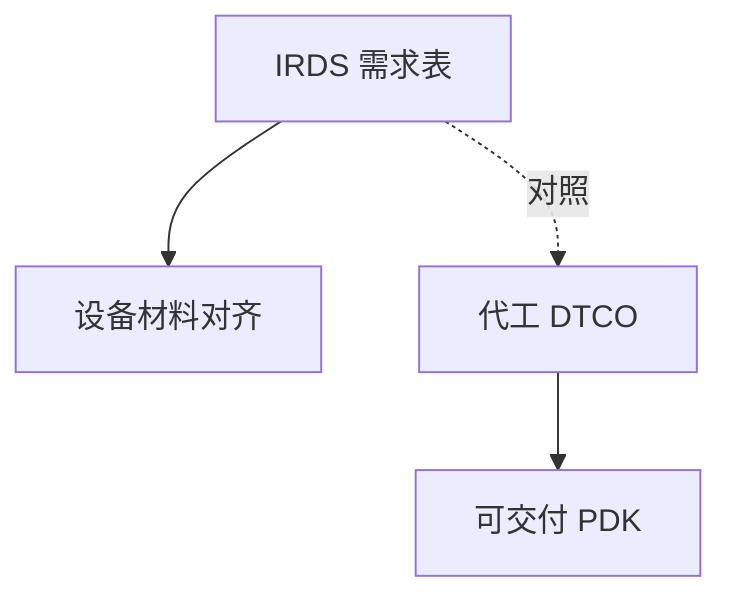

# IRDS 路线图

ITRS 停更之后，IRDS 用器件与系统视角列光刻需求：它是共识表，不是某厂承诺，更不是物理定律。

<footer>—— 对照 IEEE IRDS（International Roadmap for Devices and Systems）及其 Lithography 章节的定位</footer>

[上一课](/litho/transistor-density-metric)统一了密度口径。缺口是行业共识表从哪来。本课钉 IRDS。表上的层成本如何落到晶圆，留给[下一课](/litho/cost-per-layer-wafer）。

## 问题

IRDS 继承 ITRS 的「需求表」角色：未来节点的节距、套刻、CDU、EUV/DUV 选项、计量。用途：设备与材料供应商对齐研发，不是代工厂的 PDK。读表时要看年份与「要求 vs 已知解」。把 IRDS 行当成 ASML 出货计划，会错。

缺口是**共识需求 vs 交付**，不是再争节点名。表中的 overlay/CD 预算结构可与掩模 CDU 课对照，数值仍随版次变，课文不抄死表。

### 与 DTCO 的关系

IRDS 给行业边界；DTCO 在某厂机台集合内选点。厂可以比表激进或保守。光刻课程用 IRDS 当对照骨架，用厂公开路径当实例，二者标注来源。

IRDS 含 More than Moore、封装、光子。后课替代形态会回到这些章，本课先钉：它不是只服务逻辑 CMOS 平面缩。

## 方法

读 Lithography 章：关键层半节距、多重 vs EUV、计量缺口。对照自己的 CPP/MMP。缺口表（没有已知解的红格）才是研究课题，不是已量产。

## 机制

路线图是委员会博弈后的需求投影，受物理（随机、DOF）与工业（单一来源）约束。它滞后或超前于某厂都正常。物理极限课将与表中 Hyper-NA 之后的红格对照。

## 边界

不把某年版数值当 2026 永远有效。不发明 IRDS 未写的 arXiv。IRDS 不报价。

后课默认：行业需求有公开表；下一课把需求翻译成每层与每晶圆成本结构。

## 小结

- IRDS 是共识需求路线，不是厂承诺或物理定律。
- 读「要求 vs 已知解」；红格才是研究。
- 与 DTCO 对照使用，不互相替代。
- 出处：IEEE IRDS Lithography 章节定位。
