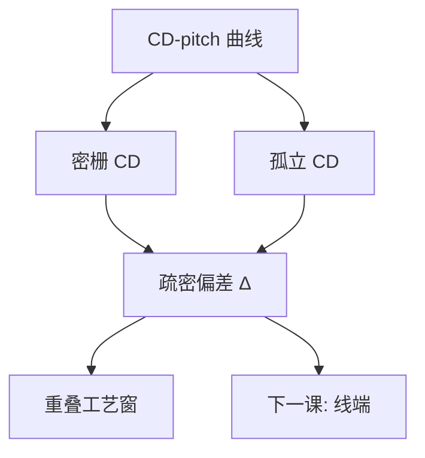

# 疏密偏差

同一条画线宽度，孤立环境与密栅环境印出的差，是邻近曲线上两个点，不是一条可以贴到全芯片的「经验纳米」。

<footer>—— 据 Mack 对 iso–dense bias 与 through-pitch CD 的论述整理</footer>

[上一课](/litho/ope-proximity)把光学邻近写成邻域对空中像的前向作用，并点名：一维上最常被叫到的切片是孤立对密集。缺口是把这条切片展开成可测的偏置，而不是再声明一次「邻居会改像」。线端缩短是二维的下一刀，留给[下一课](/litho/line-end-shortening)。OPC 仍不出场。

## 问题

OPE 的身份证是整条 CD–pitch 曲线。产线口头却常只问一句：孤立线和密线差多少。疏密偏差（iso–dense bias）定义为同一画线宽度、同一剂量与焦点下

$$
\Delta = \mathrm{CD}_\mathrm{iso}-\mathrm{CD}_\mathrm{dense}.
$$

符号随照明和 $k_1$ 可正可负：偶极把某密节距的调制抬高，密线可能反而更胖或更瘦。缺口不是再画一遍邻域函数，而是：这两个点不能代替曲线，却是窗口重叠时最先撞上的一维约束——密线的 Bossung 与孤立线的 Bossung 往往对不齐。

把 $\Delta$ 写成胶批次或刻蚀微负载，会漏掉瞳面里级次重叠不同这一光学项。把 $\Delta$ 写成一个与 pitch 无关的常数，又会漏掉禁戒节距附近的尖峰。

### 两个点不是整条 through-pitch

密，通常指定 1:1 或设计规则允许的最密节距；孤立，指定光学直径之外没有邻居。中间那些「半密」节距才是曲线的身子，也常是禁戒所在。本课允许用 $\Delta$ 作切片名，禁止用它当 OPC 模型。

报疏密偏差必须声明：照明、NA、$\sigma$、画线宽度、剂量、焦点、ADI 还是 AEI。换偶极取向，$\Delta$ 会改号。省略条件的「我们层偏置 8 nm」不能进后课修版。

## 方法

量测：固定剂量焦点，扫 pitch，得到 CD–pitch；再在同一场里放足够空的孤立线。$\Delta$ 是曲线两端（或指定两 pitch）的差。换环形、偶极、四极，曲线峰谷移动，偏置跟着移动——这证明主导项是空中像，不是当天显影液。

模拟：Hopkins / TCC 已经在光学课里；比较「只有目标线」与「左右加上等宽邻线」的阈值 CD，差就是光学 iso–dense。胶扩散与刻蚀负载会再叠一层工艺偏置。拆开的办法是同一掩模、同一胶、只改照明：光学项动，纯刻蚀项不动。

### 窗口重叠

密集与孤立要落在同一曝光–散焦窗里，才叫这一层可印。$\Delta$ 大，等于两条 Bossung 在 CD 轴上错开，重叠窗变瘦。减 $\Delta$ 的光学手段是换照明或加助条改孤立线的空中像；化学手段是后课的 PEB 与显影。本课只承认偏置会吃窗口，不把 RET 目录做完。

## 机制

密栅能量集中在有限衍射级，部分相干决定级间如何进瞳；孤立线频谱宽，像更接近点扩散与边沿响应。同一阈值切两条剖线，宽度不必相等。低 $k_1$ 时通带更挤，两端差涨——与上一课 OPE「低 $k_1$ 成为一阶」是同一条穷途的一维读数。

剂量改占空比：过曝通常让密线空间变宽、线变瘦，孤立线也瘦，但斜率不同，$\Delta$ 随剂量走。焦点改调制：密栅对离焦更敏感的那些 pitch，偏置会在焦轴上翻。所以 $\Delta$ 是窗上的函数，不是掩模上写死的一个偏置表项。

刻蚀微负载也制造疏密差，而且常与光学同号或反号。签核要 ADI 与 AEI 各报一次 $\Delta$。只在胶上把偏置修到零，硬掩模上可以再裂开。

## 边界

本课不写助条放置、不写模型基 OPC、不把某节点的纳米偏置当普适常数。电子束写掩模的密度效应是后课 PEC，与晶圆侧 iso–dense 不是同一算子。

二维：线端、拐角、SRAM 对角邻居，用 $\Delta$ 盖不住。下一课只切线端缩短这一刀，仍然不是全芯片。MEEF 在密节距和孤立上各是一个数，偏置最大的 pitch 往往也是掩模误差最被放大的地方，两张图叠着看，仍不要合成「经验纳米」。

## 小结

- 疏密偏差是 OPE 曲线上孤立与密集两个点的差，不是全芯片偏置。
- $\Delta$ 随照明、剂量、焦点变；换瞳会改号。
- 密与孤立的 Bossung 错开，重叠窗变瘦。
- 光学项与胶/刻蚀项要拆；ADI、AEI 分报。
- 线端是下一课的二维切片。
- 出处：Mack, *Fundamental Principles of Optical Lithography*。
