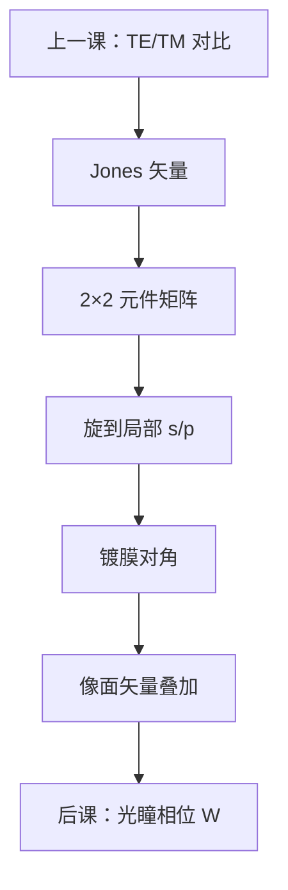

# Jones 矩阵

TE / TM 已经给出两条通道的对比差；要把偏振器、波片和局部 s/p 旋转串成一条光线，需要 $2\times 2$ 的 Jones 演算，而不是再比一次点积。

<footer>—— R. C. Jones 的偏振矩阵演算；教材表述见 Born &amp; Wolf, Principles of Optics</footer>

[上一课](/litho/te-tm-polarization)把密线对比差钉在电矢量平行还是躺在入射面里。缺口是：**通道之间如何沿光路相乘**。点积损失是像面结局；Jones 矩阵是途中的算法。光瞳相位如何展开，留给[Zernike 像差](/litho/zernike-aberrations)。不要从瑞利 CD 起笔，也不要引用未公开的机台偏振纯度指标。

## 问题

上一课选定了「好偏振」与「坏偏振」，却没有把一块起偏器、一层延迟、一次坐标转到局部 s/p 写成可级联的算符。高 $\mathrm{NA}$ 每条光线的 s/p 基底随方位角转，实验室 $x/y$ 不是全局的 TE/TM。缺口因此是偏振的**矩阵语言**，而不是再解释为何标量不够。

完全偏振、单色时，场用 Jones 矢量 $(E_x,E_y)^\mathrm{T}$。每个光学元件（或沿光线的一小段）是 $2\times 2$ 复矩阵，系统总矩阵是沿传播顺序的乘积。部分偏振要改 Stokes / Mueller，后课计量会用；成像主干先用 Jones。

### Jones 不是又一种对比定义

NILS 的输入仍是能量沉积。Jones 只负责在到达薄膜之前把矢量分量算对。把「Jones 矩阵对角」直接叫成高对比，会跳过像面点积与胶内 Fresnel——那两步仍属于上一课与矢量成像课。

Jones 假定完全偏振、单色、无退偏。镀膜散射、多层膜粗糙会把能量打进非偏振通道，必须改 Mueller；本课不把退偏写进 $2\times 2$。

## 方法

约定基底（实验室 $x/y$，或随光线的 s/p）。线起偏器、四分之一波片、旋转矩阵 $R(\psi)$ 都有标准 Jones 表，见 Jones 原文与 Born &amp; Wolf。光线从照明进入投影后：先把全局 Jones 旋到该光线的 s/p，乘镀膜的对角（s、p 振幅透过率不同），再旋回像面基底，与其他衍射级叠加。Flagello / Yeung 的矢量核正是把这一串藏进传递；本课把藏着的 $2\times 2$ 写明。

照明侧切向偏振，等于在源瞳每个方位放一个随 $\phi$ 转的线起偏器——仍是 Jones，只是源点相关。它不改 $\mathrm{NA}/\lambda$ 截止。

### 级联顺序不能交换

偏振器与波片一般不对易。光瞳边缘的 s/p 旋转角最大，同样的镀膜相位差在边缘比在中心更伤 TM 通道。这把「偏振税随 $\mathrm{NA}$ 涨」从点积语言接到矩阵语言：旋转角进 $R$，镀膜进对角元，两者相乘。

掩模吸收体也可以有 Jones（取向相关透过率）。薄屏标量 $t$ 没有这张矩阵；厚掩模电磁课才会把它算出来。本课的物默认已经是进光瞳的 Jones 矢量。

## 机制

两束光在像面的交叉项是 $\mathbf{E}_1\cdot\mathbf{E}_2^*$。Jones 把每个 $\mathbf{E}$ 从源追到像：若系统矩阵把本该平行的 TE 分量拧出 TM 分量，点积在到达之前就已经被稀释。机制仍是上一课的夹角，计算单元换成矩阵。非偏振照明是两正交 Jones 矢量各算一遍再加强度，得到中间对比——与上一课「非偏振是平均」一致。

几何像差（下一课的 $W$）在标量里是公共相位 $e^{ikW}$，乘在 Jones 矢量上等于乘单位矩阵的相位因子；各向异性镀膜才会让两偏振看见不同的 $W$。先把公共相位放进 Zernike，再问镀膜双折射。

### 后课默认的接口

说到偏振传递，默认可以用 Jones 级联（完全偏振）或声明改用 Mueller（退偏）。Zernike 相位默认乘在两个通道上，与本课矩阵相乘，不互相替代。截止频率仍是 $\mathrm{NA}/\lambda$。

## 边界

本课不是掩模 FDTD，不是 EUV 多层膜反射率光谱。不要把 Jones 写成已经包含部分相干：每个源点一张 Jones，强度事后相加。禁止引用未公开的偏振消光比验收表；Jones 的代数与 Born &amp; Wolf 的表述已经够用。

椭圆偏振、延迟量随波长变，是色差课与膜系课的交叉，此处单色。

## 小结

- TE/TM 对比是结局；Jones 是沿光线的 $2\times 2$ 演算。
- 高 $\mathrm{NA}$ 必须旋到局部 s/p 再乘镀膜，顺序不能随便交换。
- 完全偏振用 Jones；退偏改 Mueller。
- 公共几何相位下一课用 Zernike 展开，与本课矩阵相乘。
- 本课不改 NILS 定义，只改进入 $I$ 的矢量。
- 出处：Jones, JOSA 偏振演算论文；Born &amp; Wolf, *Principles of Optics*。
