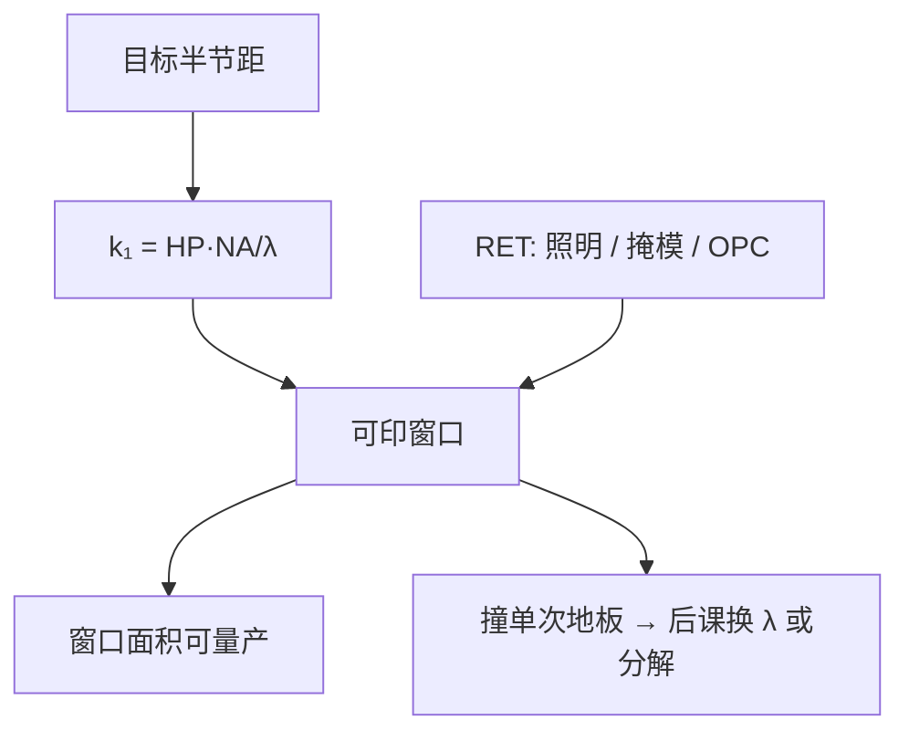

# k₁ 窗口与分辨率增强

$k_1$ 把「这一层还印不印得动」收成无量纲数；分辨率增强不改 $\lambda$ 与 $\mathrm{NA}$，只把可印窗口往更低的 $k_1$ 推。

<footer>—— 据 Mack、Levinson 对 $k_1$ 工艺因子与 RET 的产线定义整理</footer>

[上一课](/litho/halfpitch-vs-cd)（半节距对线宽）。在此之上，临界尺寸钉成 $\mathrm{CD}=k_1\lambda/\mathrm{NA}$，并指出 $k_1$ 不是显微镜的 0.61。缺口是：产线并不是选定一个 $k_1$ 再开印——它有一块随节距、图形维度和工艺容差变化的可印窗口；分辨率增强（RET）的工作就是让目标层落在窗口里面。波长不能连续拧，留给[下一课](/litho/litho-wavelengths)。离轴图案、相移膜系、OPC 算法各自成课，本课不提前做目录。

## 问题

把上一课的式子反过来写

$$
k_1=\mathrm{HP}\cdot\frac{\mathrm{NA}}{\lambda},
$$

半节距 $\mathrm{HP}$ 一旦给定，$k_1$ 就是这一层在这台镜头上的工作点。工作点太高，浪费 $\mathrm{NA}$；太低，空中像对比不够，[曝光–散焦窗口](/litho/ed-process-window)收成一条缝。缺口因此是把 $k_1$ 从「公式里的一个数」改成「窗口」：哪些节距还活着、二维拐角比一维栅差多少、RET 买的是窗口面积而不是名义分辨率。

单次曝光的经验地板大约 0.25，上一课已经说过。本课要补的是：靠近地板时，不是所有图形类别同时死——密线栅可以靠两束成像再撑一档，孤立线和孔先关窗。所以「这一层的 $k_1$」必须声明图形。

### 窗口不是瑞利距的百分比

显微镜判据给出一个刚可分辨的距离。光刻窗口问的是：剂量漂几个百分点、焦距漂几十纳米，CD 是否仍在规格内。同一 $k_1$ 下，照明一变，窗口可从可用变成零。因此 RET 的成绩单是重叠工艺窗口，不是又把 $\lambda/\mathrm{NA}$ 乘了一个更小的系数。

同一 $\lambda$、同一 $\mathrm{NA}$，逻辑金属的有效 $k_1$ 和 SRAM 栅的有效 $k_1$ 可以差一截。报节点时写「$k_1=0.31$」而不写层别，等于没报。

## 方法

先算目标半节距对应的 $k_1$，再问常规圆照明下 NILS 够不够。不够，就动三个不改波长的旋钮：照明光瞳（把能量挪到能进光瞳的级）、掩模复透过率（压零级、造相消）、物体预畸变（OPC/ILT）。三者都在同一套部分相干成像里，只是改 TCC 的源、改物体频谱、或两者一起改。

本课只给判据：RET 成功与否看 $k_1$ 窗口有没有回到可量产面积。具体光瞳画成偶极、掩模做成衰减相移，是后面 DUV 课序的题目。

### 二维比一维更早撞墙

一维密栅可以做成近两束，有效 $k_1$ 能贴近地板。二维接触孔、拐角、线端缩短需要的空间频率是各向同性的，同一数值 $k_1$ 下窗口窄得多。这就是为什么「演示了 0.27 的线栅」不能外推成逻辑后段可印。后课的多重曝光，本质是把二维目标拆回若干张较高 $k_1$ 的曝光。

## 机制

$k_1$ 低，意味着目标频率靠近光瞳截止。零级偏置相对变大，对比度掉，NILS 掉，剂量灵敏度变差——光学链在[空中像](/litho/aerial-image-contrast)上已经写过。RET 的机制是同一句话的工程化：改哪些级进光瞳、级的相对相位，让截止附近仍有可用调制。它不增加 $\mathrm{NA}$，也不缩短 $\lambda$，所以焦深的 $\mathrm{NA}^2$ 惩罚不会被 RET 取消；有时两束成像反而买回一点轴向窗口。

胶的 $\gamma$ 可以切锐空中像，等效上让同一光学 $k_1$ 变得「能用」，但切的是噪声和扩散一起。把胶衬度算进 $k_1$ 可以，把它当成免费的分辨率旋钮不行。化学细节在抗蚀剂课程，本课只承认 $k_1$ 含工艺。

窗口随图形类别裂开：一层里最难的图形决定这一层能不能单次过。SMO 在光瞳上为最难的那一族搬家，必然牺牲另一族的余量。因此 $k_1$ 窗口是向量，不是全场一个标量；报「本机台 $k_1=0.28$」必须附图形与照明。

多重图形不改单次曝光的 $k_1$ 定义。每一次曝光仍要落在自己的窗口里。不要用最终金属节距反推单次 $k_1$ 却宣称「打破了 0.25」。

## 边界

$k_1$ 窗口不含套刻、缺陷、产能。多重图形把最终节距降下去，每一次曝光自己的 $k_1$ 仍须落在窗口内——不要把「SAQP 之后的节距」代回式子再宣称单次 $k_1$ 破了 0.25。也不要在本课展开波长台阶：$\lambda$ 从 193 跳到 13.5 是下一课的整栈替换，不是又一种 RET。

后课默认：说到「压 $k_1$」就是在固定 $\lambda$、$\mathrm{NA}$ 下扩窗口；说到「换波长」才动 $\lambda$。

## 小结

- $k_1$ 是工作点，可印性由窗口面积衡量，不由名义 CD 衡量。
- RET 不改 $\lambda$ 与 $\mathrm{NA}$，只改哪些衍射级如何干涉。
- 一维栅与二维孔的有效 $k_1$ 不可互换。
- 单次曝光地板约 0.25 仍然成立；再往下是分解或换波长。
- 波长台阶下一课，本课不列光源年表。
- 出处：Mack, *Fundamental Principles of Optical Lithography*；Levinson, *Principles of Lithography*。
