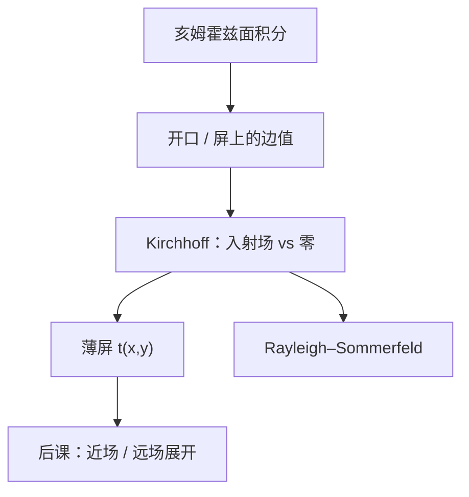

# Kirchhoff 衍射

亥姆霍兹加上辐射条件，把孔径下游的场收成面积分；真正动手时还必须规定屏上的 $U$ 与法向导数——Kirchhoff 用入射场去填开口、用零去填铬，这是边值近似，不是又一条波动方程。

<footer>—— Born &amp; Wolf, Principles of Optics 对 Kirchhoff 衍射与边值不自洽的讨论</footer>

[上一课](/litho/helmholtz-huygens)已经用格林定理把亥姆霍兹写成惠更斯–菲涅尔积分，并点过 Kirchhoff / Rayleigh–Sommerfeld 的名字。缺口是：**孔径平面上到底代入什么 $U$ 和 $\partial U/\partial n$**。积分核有了，边值仍是猜的。本课只钉这条近似；近场二次相位与远场傅里叶极限，留给[菲涅尔与夫琅禾费](/litho/fresnel-fraunhofer)。不要从瑞利 CD 起笔，也不要把厚掩模电磁另起炉灶——那是后课 Kirchhoff 对严格电磁的题目。

## 问题

观察点场由包围孔径的闭曲面上的 $U$ 与 $\partial U/\partial n$ 决定。铬屏外侧的真实场既不是入射波，也不是严格为零：边缘有散射，阴影区有绕射。若坚持先解完整边值再积分，掩模开口课走不下去。Kirchhoff 的办法是：开口内用未扰动的入射场及其法向导数，不透明屏上两者都取零，半球上的贡献用辐射条件丢掉。缺口因此是这套**边值替换**合不合法，而不是再写一遍 $e^{ikR}/R$。

不自洽立刻出现：亥姆霍兹在平面上不能同时指定 Dirichlet 与 Neumann；开口边缘上场值跳跃，与连续解矛盾。尽管如此，当开口线度远大于波长、观察点不太靠近边缘，积分对后课已经够用。

### 薄屏透过率是同一句话的工程写法

光刻把开口写成复透过率 $t(x,y)$，出射 $U=t\,U_\mathrm{inc}$，铬上 $t=0$。这就是 Kirchhoff 边值的物面版：不追边缘电流，只乘一层。$t$ 可以带相移，仍是标量薄屏，不是三维吸收体。

「Kirchhoff 掩模」在计算光刻里几乎总是薄屏 $t(x,y)$，与本课的衍射边值是同一近似的两端。吸收体厚度与波长同量级时，边值本身错，必须换电磁求解器。

## 方法

Helmholtz–Kirchhoff 公式把观察点写成

$$
U(P)=\frac{1}{4\pi}\iint_{\Sigma}\Bigl(U\frac{\partial G}{\partial n}-G\frac{\partial U}{\partial n}\Bigr)\,dS,\qquad G=\frac{e^{ikR}}{R}.
$$

代入 Kirchhoff 边值，开口积分只剩入射场，倾斜因子来自 $\partial G/\partial n$ 与球面波的夹角，Born &amp; Wolf 给出常用的 $(1+\cos\theta)/2$。$k$ 里的 $n$ 仍是[第一课](/litho/em-wave-index)的符号。

Rayleigh–Sommerfeld 换一套在孔径平面上为零的格林函数，于是只需要 $U$ 或只需要 $\partial U/\partial n$，边值不再过定。角谱传播与它等价。本课不改仿真代码，只要求：说到「标量衍射」，默认已经做了 Kirchhoff 类边值，而不是麦克斯韦在铬角上的精确解。

### 倾斜因子不是新的折射率

大角度贡献被压掉，对应倏逝分量进不去下游。这与后课「可传播频率不超过 $n/\lambda$」同根，本课不引入 $\mathrm{NA}$。

Kirchhoff 在边缘上场不连续，严格说会辐射不存在的电荷层。开口 $\gg\lambda$ 时，误差集中在边缘一条带，对远场级振幅的相对贡献变小。

## 机制

入射平面波被铬截断。Kirchhoff 假装开口里的场仍是那一束平面波，屏上什么都没有；下游每一点是开口面元的相干叠加。亮暗条纹来自光程差，机制与上一课相同，只是现在明确：**错的是边值，不是核**。边缘附近的真实场会修正级振幅的相位，薄铬、大开口时这项是小量。

后课把 $R$ 在近场展到二次、在光瞳展到线性，全部坐在本课的开口积分上。没有边值约定，菲涅尔数没有积分对象。

### 后课默认的接口

说到标量掩模衍射，先承认 Kirchhoff 薄屏（或等价 Rayleigh–Sommerfeld / 角谱），再问近场还是夫琅禾费。厚吸收体、偏振边界留给电磁课；本课不把 $t(x,y)$ 升级成波导。

## 边界

本课不管透镜玻璃里的逐面折射：物镜后课收成光瞳，等于在频率域乘窗。也不处理有限带宽。禁止把 Kirchhoff 说成「麦克斯韦的精确解」；不自洽是教材里写明的，不是可以忽略的脚注。更不要引用未公开的掩模电磁误差表——开口远大于波长时，标量边值已经够后课用。

## 小结

- 惠更斯积分的核上一课已有；本课补的是开口与屏上的 Kirchhoff 边值。
- 开口填入射场、铬填零，与薄屏 $t(x,y)$ 是同一近似。
- 边值过定、边缘不连续；开口 $\gg\lambda$ 时对远场仍可用。
- Rayleigh–Sommerfeld / 角谱去掉过定，仍是标量。
- 近场与远场如何砍相位，下一课。
- 出处：Born &amp; Wolf, *Principles of Optics*。
