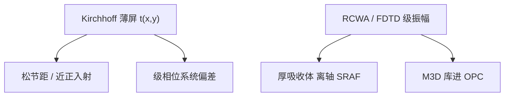

# Kirchhoff 对严格电磁

薄屏把开口乘上一个 $t(x,y)$ 就做衍射；吸收体一厚，开口是波导，级振幅必须解麦克斯韦，而不是再乘一层经验透过率。

<footer>—— 据 Wong 对投影光刻成像与厚掩模衍射的论述，以及 Erdmann 等对严格电磁（EMF）掩模模拟的表述</footer>

[上一课](/litho/mask-3d-effect)已经列出 M3D 的晶圆后果：HV 偏置、焦漂、左右不对称，并声明 OPC 要含厚掩模衍射级。缺口是计算接口：何时 Kirchhoff 薄屏还够用，何时必须 RCWA、FDTD 或等价严格电磁。几何阴影的斜入射图留给[下一课](/litho/mask-shadowing)，本课不把 6° 再讲成一套新效应。

## 问题

上一课的对照物是薄屏 $t(x,y)$。量产 OPC 仍大量从 Kirchhoff（或薄屏加标量角谱）起步，再决定要不要换电磁级库。若处处 FDTD，全芯片跑不起；若永远薄屏，SRAF 与离轴级振幅会系统错。需要一条切换判据，而不是把「有厚度」再描述一遍。

缺口因此是两种求解器的误差账：Kirchhoff 何时失败。失败指衍射级的复振幅（含偏振）相对严格解不可忽略，从而 EPE 与最佳焦距漂出预算——不是「掩模看起来立体」。

### 薄屏忽略的边值

Kirchhoff 假定开口平面上的场等于入射场乘规定透过率，开口外为零，忽略边缘散射、波导模式、侧壁角与材料色散。Wong 把投影成像建在这个物体频谱上；Erdmann 等用严格麦克斯韦证明，193 nm 吸收体厚度与波长同量级时，0 级与 ±1 级的相位差已经够把焦点和 HV 偏置做进空中像。

「严格」指掩模近场满足电磁边值，不是晶圆侧也改用 FDTD。晶圆侧仍是矢量成像 + 薄膜栈；贵的是物体频谱那一截。

## 方法

实践分层：松节距、近正入射、吸收体相对特征很薄 → Kirchhoff 或薄屏加测量透过率。特征进入波长量级、离轴极大、SRAF 宽度接近膜厚 → 对代表 clips 跑 RCWA / 时域有限差分 / 波导模态，把级振幅制成 M3D 库，全芯片用查找表或代理模型。校准用不同方位、不同密度的线和孔，看薄屏 OPC 残差是否呈系统 HV 与焦漂。

不要用「加一个全局相位」冒充 EMF：波导相位随开口宽度变，不是常数。att-PSM 的标称 6%+$180^\circ$ 是膜系目标，有效级振幅以电磁为准。

### 与矢量成像的分工

[矢量成像](/litho/vector-imaging)处理投影侧大夹角的 s/p。本课处理物体侧：掩模把入射琼斯变成衍射级琼斯。两段都忽略，标量 $k_1$ 会双重乐观。计算上可以先薄屏矢量，再换成厚掩模矢量；顺序不能把 EMF 理解成「已经包含浸没」。

## 机制

误差首先出现在级的相对相位：薄屏按 $\Delta n\cdot t$ 给一块均匀相移，严格解按开口宽度选波导常数。于是干涉条件随 CD 变，最佳焦距变成图形相关。其次是级的振幅比：边缘散射让「有效开口」不等于顶视多边形，MEF 与 SRAF 透过都偏离面积比。偏振：线栅掩模对 s/p 透过不同，薄屏若只用标量 $t$，等于丢掉掩模偏振器。

全芯片仍不能处处严格：域分解、边查表、机器学习代理都是在逼近这份级库。校正环必须调用同一份库，否则离轴方向的放置误差系统性偏。

ILT 曲边在 Kirchhoff 下好看、在 EMF 下可能违 MRC 或阴影异常。曲掩模签字必须以严格级振幅为准，不能用薄屏 ILT 直接写版。

## 边界

本课不展开阴影的狭缝扫描几何——那是斜入射投影的下一课，尽管求解器仍是 EMF。也不把掩模台倾斜、pellicle 皱纹叫做 Kirchhoff 失效。低 $k_1$ 默认含 M3D；教学零阶仍允许薄屏，但后课写 OPC/SMO 时薄屏只作对照。

不要给 Wong 或 Erdmann 编造不存在的文献编号。出处是投影光刻成像专论与严格掩模衍射的公开文献传统。本课不提供「193 nm 必须 EMF 的纳米阈值」当宇宙常数：判据随膜系、照明角与预算变。

计算预算上，代表 clips 的严格解可以很贵，但仍远小于全芯片 FDTD。工程失败模式是：库的几何覆盖不到真实侧壁角或膜厚批次，OPC 以为自己在用 EMF，实际在用过期表。

EUV 多层膜加吸收体几乎总是 EMF 区；DUV 仍可能对松层用薄屏。切换看误差预算，不看节点商品名。

## 小结

- Kirchhoff 薄屏是零阶物体频谱；厚掩模要解麦克斯韦得级振幅。
- 失败信号是级相位/振幅系统偏差，表现为 HV、焦漂、SRAF 透过失常。
- 全芯片用 EMF 库 + 紧凑模型，不是每处 FDTD。
- 阴影几何下一课；本课钉求解器切换。
- 出处：Wong 投影光刻成像与厚掩模衍射；Erdmann 等严格 EMF 掩模模拟。
