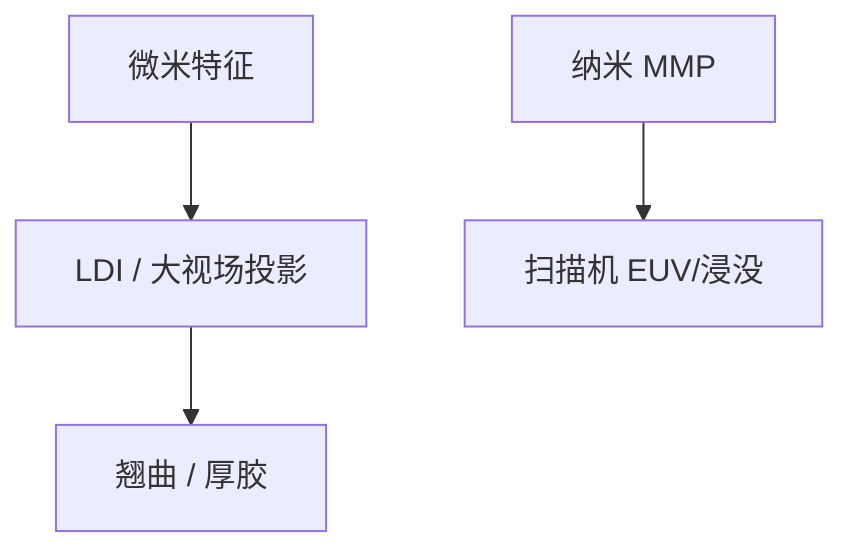

# 激光直写与封装光刻

封装的线宽在微米，场在厘米；激光直写或大视场投影够用，不必借 EUV 的随机与掩模链。

<footer>—— 对照 LDI（laser direct imaging）与先进封装光刻尺度的通称</footer>

[上一课](/litho/xray-near-field)关掉接近式短波主路。缺口是后段互连与封装的尺度。本课钉激光直写与封装光刻。面板级更大场，留给[下一课](/litho/panel-level-litho）。

## 问题

先进封装 RDL、铜柱、部分 fan-out，特征比 BEOL 松、面积比芯片大。工具：激光直写（无掩模或用 DMD）、或大视场步进投影。套刻与畸变来自翘曲的重建晶圆或有机基板，不是高 NA 镜头。用前道光刻规则去卡封装，会过度工程；用封装工具去印 MMP，会不够。

缺口是**尺度换工具族**，不是分辨率竞赛。主干不把封装并进逻辑 EUV 附录——本课显式分开。

### 无掩模在封装为何可行

面积仍大，但像素比逻辑少几个数量级（微米 vs 纳米），直写 wph 可以接受。与晶圆多束电子的面积墙对照：光子封装直写的「像素负担」轻。

翘曲补偿、自动对焦行程、厚胶是封装光刻的一等规格，NILS 不是。

## 方法

选工具：按最小线宽、场、基板、产能。计量：不同套刻标记与红外/透过方案（键合课将遇）。与逻辑接口：凸点节距仍在收紧，封装光刻也在进步，但路径是大视场低 NA，不是 High-NA。

## 机制

分辨率需求低，DOF 需求高（厚胶、形貌）。低 NA 大视场光学或扫描激光满足这组，而不是高 NA。信息量按微米栅格，数据路径像 PCB LDI。

## 边界

不把所有 fan-out 当同一工具。不给凸点节距路线当常数。本课不覆盖显示（后课）。

后课默认：封装用大视场低 NA 或 LDI；下一课面板比圆片更大时的畸变与套刻。

## 小结

- 封装光刻尺度在微米与大场，工具是 LDI 或低 NA 大视场。
- 直写因像素粗而可行，与晶圆电子束直写不是同一墙。
- 翘曲与厚胶是主规格。
- 出处：LDI 与先进封装光刻通称。
