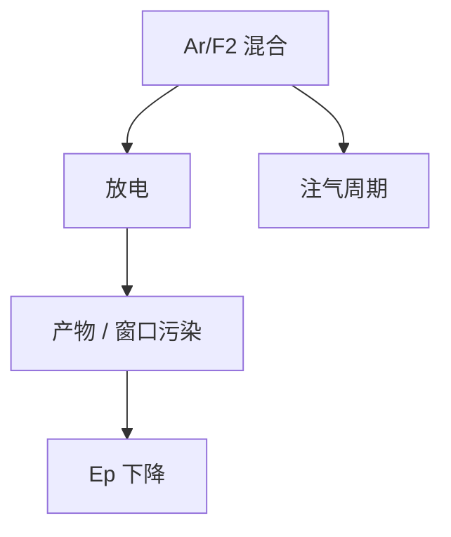

# 激光气体与寿命

氟在放电里干活，也在腐蚀电极和窗口。气体寿命是功率、带宽和成本的同一条曲线，不是耗材小票。

<footer>—— 对照准分子气体补给 / 腔寿命的公开运行描述</footer>

[上一课](/litho/pulse-energy-rep-rate)要稳定的 $E_p$。缺口是工作气体会脏、会耗：氟消耗、产物污染、窗口透过率掉。本课钉气体与腔寿命，不写 EUV 锡。

## 问题

放电把 F₂ 变成产物、溅射电极、在窗口上镀一层脏。同一套压窄设定下，$E_p$ 慢慢掉、带宽慢慢漂，看起来像剂量漂移。只调剂量闭环、不换气，会把耗材问题写成胶批次。

## 方法

运行：定期注气、循环过滤、按脉冲计数或能量积分触发换气/换窗。寿命指标用「可维持规格的脉冲数」而不是日历天。窗口与腔镜是另一条资本寿命，与气体罐分开记账。

过量注氟可以提高短期能量，加快腐蚀。寿命曲线是化学与功率的权衡，不是越大越狠越好。

## 机制

准分子形成需要足够 F₂；过多 F₂ 吸收 193 nm、腐蚀加剧。金属氟化物沉积改腔 Q 值与透过。压窄光栅对污染同样敏感，带宽规格会先于肉眼「变暗」而失守。

## 边界

下一课离开激光头，进照明均光。气体课不解释复眼透镜。

## 小结

- 气体与窗口寿命表现为 $E_p$ 与带宽漂移。
- 注气周期是工艺参数，要进 SPC。
- 出处：准分子运行通识；脉冲能量课。
