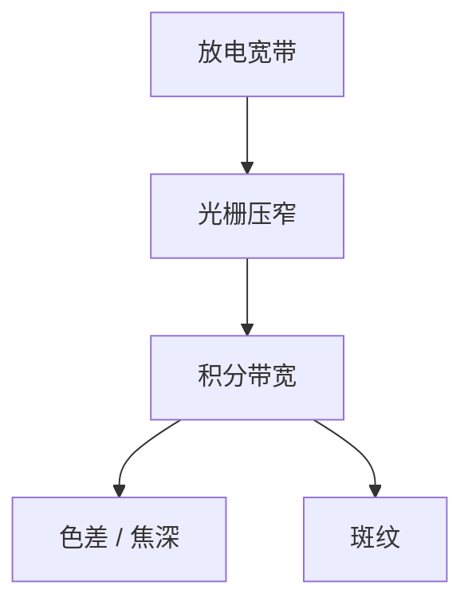

# 线宽压窄与带宽

准分子的自然线宽对高 NA 物镜太宽。压窄到皮米量级，色差与焦深才进预算；压得过窄，脉冲能量和相干性又会找上门。

<footer>—— 对照 [色差与光源带宽](/litho/chromatic-bandwidth)；Cymer 等对 narrowing 的公开说明</footer>

[上一课](/litho/arf-excimer-laser)给出放电光谱。缺口是：这条光谱对 [Zernike 色差](/litho/chromatic-bandwidth) 和焦深是否可接受。本课钉线宽压窄，不重做阿贝或瑞利。

## 问题

高 NA 浸没物镜有残余色散。光源积分带宽 $\Delta\lambda$ 过宽，不同波长的焦面错开，等效于焦深被吃、NILS 掉。自由运行准分子的带宽远大于物镜预算，必须腔内光栅或棱镜压窄。压得过窄：提取效率下降、斑纹（[speckle](/litho/speckle)）上升，因为时间相干变长。

## 方法

公开手段：腔内扩束 + 光栅选频，反馈锁中心波长。指标用 FWHM 或 E95 积分带宽，单位 pm。监测：波长计进剂量/波长闭环。换胶或换 NA 配方可能换带宽规格，不是「越窄越好」。

中心波长漂移与带宽是两件事。漂移把整场焦面挪走；带宽把焦面涂厚。稳定环两套传感器。

## 机制

物镜的纵向色差把 $\Delta\lambda$ 映射成 $\Delta z$。预算从镜头设计来，光源必须供得上。时间相干长度 $\sim\lambda^2/\Delta\lambda$，带宽变窄，照明相干性变长，斑纹对比上升——与 [时间与空间相干](/litho/temporal-spatial-coherence) 同一骨架。

## 边界

下一课脉冲能量与重复频率：带宽规格约束下还要出功率。不在本课写气体寿命。

## 小结

- 压窄是为色差与焦深，不是为了「光谱好看」。
- 过窄付能量与斑纹。用积分带宽进镜头预算。
- 出处：色差课；准分子 narrowing 公开技术。
