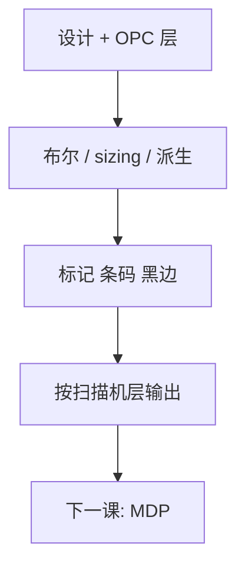

# 版图分层与流程

设计层号不是掩模层：布尔、偏置、派生和填充分完之前，写模机没有一张可曝光的版。

<footer>—— 对照掩模数据准备中层映射与派生层的产线通称</footer>

[上一课](/litho/gdsii-oasis)把交换格式钉成带网格的多边形流。缺口是流里有几十上百个层号：哪些进同一张版、哪些只是标注、哪些要先 OR/AND/NOT 才能变成吸收体。本课钉版图分层与派生流程。真正的 MDP 作业链，留给[下一课](/litho/mask-data-prep）。

## 问题

PDK 的 drawing 层、pin、boundary、fill、dummy 与 OPC 输出层不是一一对应扫描机层。一张二元铬版通常对应「某设计层经布尔得到的明暗图」，外加条码、对准标记、 pellicle 区与黑边。EUV 反射版还要派生吸收体开口与多层暴露区，不能把 DUV 透射的极性假设直接贴过去。

缺口是**层映射表**，不是再解释 GDS 记录。把「metal1 层」当成「metal1 掩模」，会漏掉：辅助图形、缝、槽、化学机械抛光填充是否并入同一张版；双重曝光的分解色是否已经拆成两张。映射错一次，后面 fracturing 写的是另一层工艺。

### 极性与色调是流程决定的

正胶/负胶、亮场/暗场、二元/衰减相移，决定布尔之后还要不要 NOT。同一套设计多边形，掩模厂收到的可能是「要镀铬的区域」或「要透光的区域」。合同里的 tone 必须与 [OPC](/litho/opc) 模型里的掩模极性一致，否则助条会印反。

fill 与 dummy 常在 TAPOUT 前才插。它们改局部密度，从而改 PEC 与刻蚀负载。层流程若把 fill 排除在 OPC 之外、却写入版，密度核会与签核不一致。

## 方法

典型顺序：读入设计与 OPC 层 → 按技术文件做布尔派生（sizing、OR 孔与沟、切线合并）→ 插入掩模厂标记与作业框 → 按扫描机层吐出一张张 mask layer。每一步保留层级命名与哈希，以便 die-to-database 知道金标准是派生后还是派生前。

与 [6 寸基板](/litho/six-inch-reticle) 的衔接：有效区、条码、对准键的坐标在这一步就锁进流程，而不是写模时手画。与多重图形衔接：着色后的两张版是两个派生结果，必须成对做套刻标记一致性检查。

## 机制

布尔是几何上的集合运算，但对网格多边形会制造零宽度缝、碎片洞和自相交。这些在显示器上看不见，却让 fracturing 产生非法炮或让 MRC 误报。因此派生后要做拓扑清理（并重叠、杀缝），再交给分割。sizing 是掩模偏置的第一种来源——它还不是 [MPC](/litho/mpc)，只是把设计意图收成「要写的开口」。

## 边界

层流程不校正电子散射，不代替检验。它只定义「这一张版上有什么多边形」。加密 IP 块若不能在掩模厂展开派生，只能在客户侧完成布尔再交 OASIS.MASK——责任边界要写进 TAPOUT 合同。

后课默认：掩模层已经是派生后的明暗图；MDP 从这张图开始做分割与校正。

## 小结

- 设计层号经布尔与插入标记才成为扫描机层。
- 色调、fill 是否入版、分解色拆分，必须与 OPC 模型一致。
- 派生会制造缝与自交，清理后再分割。
- 出处：掩模数据准备层映射与 PDK 技术文件惯例；SEMI 掩模作业通称。
