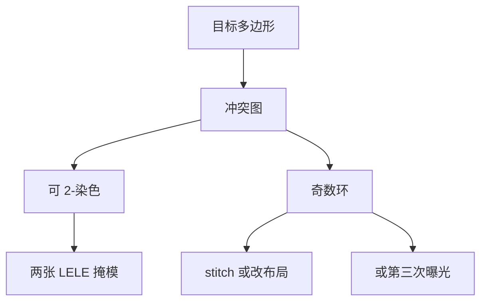

# 两次曝光的颜色分解

双重图形能印，先决条件是冲突图可 2-染色：相邻太近的边不能同色。光学在上一课已经回到可印节距；本课钉的是版图染色。

<footer>—— 据双重图形（DPT）文献对冲突图、着色与 stitch 的通称整理</footer>

[上一课](/litho/lele-multipattern)把 LELE 写成两次光刻–刻蚀，并指出套刻 $\delta$ 直接变成节距误差。缺口是分解算法：哪些多边形必须拆开、奇圈怎么办、stitch 把同一根线拆到两张版时引入什么。不要再走一遍涂胶–刻蚀流程。[SADP](/litho/sadp-saqp) 用芯轴而不是染色，本课不改写成 spacer。

## 问题

LELE 的物理前提是每张掩模的最小间距回到单次可印窗口。电子设计自动化把「两根线近于最小同色间距」画成冲突边，节点是多边形（或边片段）。图可 2-染色，则两色对应两次曝光；出现奇数环，则不可 2-染色，必须改布局、切一刀 stitch、或升级到三次（LELELE）。

缺口因此是冲突图，而不是再解释为什么 $k_1$ 不能低于 0.25。上一课已说「染色与分解不是光学魔术」；本课把那句话展开成可操作的图论约束。

### 同色间距与异色间距

同色间距受单次光学限制；异色间距受套刻与 CD 预算限制，通常仍大于 0，因为 $\delta$ 会把间隔吃掉。设计规则于是有两套：colorable pitch 与 overlay-driven space。把「两次曝光所以密度加倍」写成无条件，等于假设冲突图总是二分图且 $\delta=0$。

通孔层的冲突常常是洞与洞；金属层是边与边。同一套着色器，图的定义不同。孔的三次分解在公开 DPT 讨论里很常见，不要默认所有层都能 2-色。

## 方法

流程：根据最小同色间距建图 → 尝试 2-着色 → 对奇数环报告违例或自动切 stitch → 每色生成掩模，再各自 OPC / SRAF。Stitch：把一根线在允许的重叠区拆成两段不同色，用重叠吸收套刻，使电学上仍是一条线。重叠太短会在套刻下断开；太长则浪费密度并可能在两次刻蚀下 CD 鼓包。

分解还要满足每色自己的二维可印性：一张「看起来疏」的色仍可能有难印拐角。着色器若不顾 SRAF 位置，辅助杆会落到异色最小间距里，二次曝光互相印脏。

### 与版图迁就

标准单元与布线轨道预先做成可 2-色（格点化、禁止某些拐角），比事后对全芯片求着色失败更稳。这是设计规则闭环，不是光学新效应。三次着色用于更密孔或无法 2-色的局部，掩模与套刻矢量再加一套。

## 机制

冲突边的几何阈值来自单次空中像：再近则同色无法分开。着色只是把冲突边的端点分到不同曝光，并不创造新的空间频率——光学仍是上一课每张掩模各自的 $k_1$。Stitch 区两次曝光重叠，剂量与刻蚀负载局部改变，CD 与电阻要单独标定。套刻 $\delta$ 在异色相邻处改变 space，在 stitch 重叠处改变重叠长度，两种失败模式不同。

与 SADP 对照：SADP 不靠冲突图把线分成两次线层曝光，成对线由同一芯轴定义。本课对象只是 LELE 家族的颜色分解。切线层也常被口语叫「第二色」，但切的是已有栅，图的节点是切多边形，规则另表，切断课再钉。

自动化着色若允许任意 stitch，掩模数好看，热点会转移到重叠区。产线通常限制 stitch 的合法位置，而不是追求着色成功率 100% 的宣传数字。

## 边界

本课不给某节点「必须三重孔」的清单，那是各厂工艺包。着色算法的会议实现很多，本课只用冲突图通称，不点名某篇内部论文当唯一标准。后课 SADP 默认读者已理解：LELE 的密度来自颜色，自对准的密度来自薄膜。二者可以同节点共存，不要把所有 double patterning 都叫着色。

同一层上 OPC 必须分色跑：两张版的邻近环境不同，不能先当一张密版做完再拆色。SRAF 也分色，否则辅助杆在异色间距里变成真图形。

LFLE 等冻胶方案仍要同一套颜色分解，变的是中间是否刻蚀。颜色图不因为冻胶而变成三分图。

## 小结

- LELE 分解是冲突图 2-染色；奇圈要 stitch、改设计或第三次曝光。
- 同色间距走光学，异色间距走套刻。
- Stitch 用重叠吸收 overlay，代价是局部 CD 与热点。
- 不重写 litho–etch 流程；不把 SADP 写成染色。
- 出处：双重图形（DPT）文献对 coloring / conflict graph 的通称。
