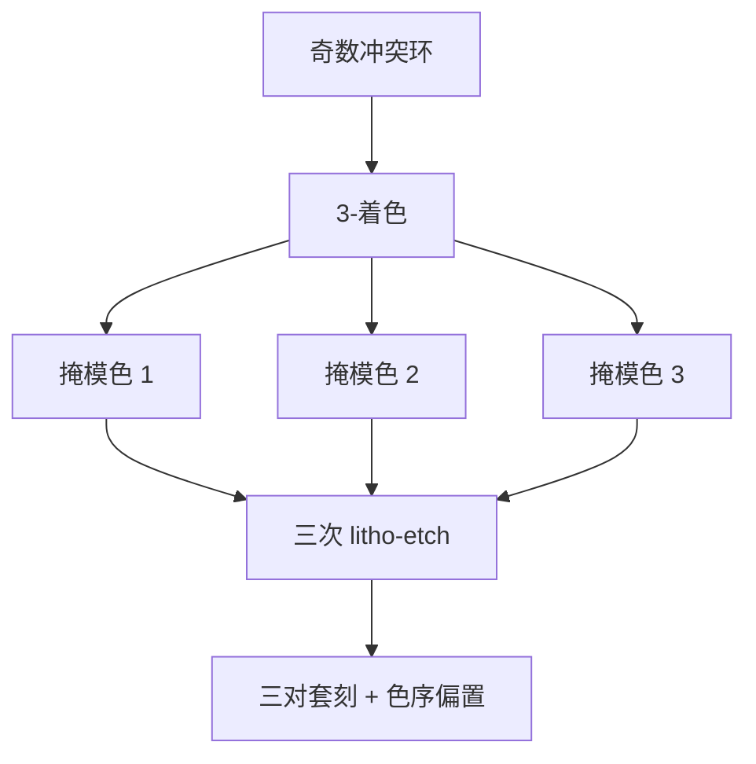

# LELELE

冲突图出现奇数环，两次染色不够：第三次光刻–刻蚀把那一环拆开，套刻从两张版变成三张版同时活在同一节距里。

<footer>—— 据多重图形（DPT）对三重曝光 LELELE 与 3-着色的通称整理</footer>

[上一课](/litho/lele-color-decomposition)把 LELE 写成冲突图可 2-染色，并点名：奇数环必须改布局、stitch，或升级到三次。缺口是把第三次展开成工艺与预算，而不是再画一遍二分图。自对准从[下一课](/litho/sadp-saqp)另起，本课不改写成 spacer。

## 问题

2-着色失败的典型是奇数冲突环：三根线两两都近于同色间距，任何两色都会让其中一对同色。LELELE（litho-etch × 3）把多边形分到三张掩模，每张回到单次可印间距，三次刻蚀把线拼回目标密度。理论上节距可按三份拆；实际上三次套刻 $\delta_{12},\delta_{13},\delta_{23}$ 与三次 CD 全部进入相邻 space。

缺口因此是 3-色与三套 overlay，不是再解释 $k_1$ 地板。把「三次所以密度 ×3」写成无条件，等于假设冲突图总是 3-可着色且三次套刻为零。stitch 在 3-色里仍然存在：同一根线跨色，接头处有两次或三次边缘对位。

### 三色不是两次再加一次免费

每次 litho-etch 都有胶、刻蚀偏置、套刻。第三次往往是为了那一小撮奇数环或最密的二维结，却让整层的机时与掩模张数跳一档。设计规则若能靠改布局消掉奇环，通常比上 LELELE 便宜。本课承认三重是 2-色的升级，不是默认目标。

有的层用「两次线 + 一次切」或 SADP，并不叫 LELELE。名字专指三次线层曝光–刻蚀着色。切层三重是另一张预算，后课 cut 再写。

## 方法

分解：冲突图 3-着色（NP-难的工程近似：启发式、拆段、局部 stitch）。同色间距仍受单次光学限制；异色间距受两两 overlay 与 CD 限制，三对异色各有一条规则。签核要看最坏的那一对 space，不能只报平均节距。

工艺：三次涂胶曝光刻蚀，中间图形要扛住后续刻蚀的微负载——先写下的色会被后两次等离子体再修一刀，CD 偏置按色序分裂。计量：三套套刻标记、三套 ADI/AEI，pitch walking 式的「邻边一宽一窄」在 LELELE 上来自 overlay 而不是 spacer。

### 与 LELE 的增量

上一课的 2-色工具仍在：冲突边、同色/异色间距、stitch。增量是色数、套刻对数、色序刻蚀负载。若 2-色只在少数单元失败，优先局部改设计或 stitch；全芯片 3-色是最后杠杆。

## 机制

每次曝光只印稀疏子集，空中像回到可印 $k_1$。最终节距由三次图形的并集定义，相邻边若来自不同色，它们的间距误差是 $\delta$ 与两边 CD 误差之和。三次独立 $\delta$ 不会抵消，统计上 space 的方差比 LELE 更差，除非套刻控制按对数收紧。色序：第一色的硬掩模吃两次后续刻蚀，线宽系统偏与后两色不同，OPC 必须分色建模。

二维拐角与 T 结是奇环的高发区。分解器在这里切段，stitch 把电学上的一根线变成工艺上的两段接头，可靠性预算另计。DPT 文献把这写成可着色性与制造的交界，而不是光学魔术。

不要用商品节点的「三重图形」新闻稿反推某层一定是 LELELE。它可能是 SAQP、切三重、或孔的 LELELE。要看是不是三次线层着色。

## 边界

不编三次套刻各几个纳米，不写某代金属层张数。SADP/SAQP 用薄膜劈节距，套刻结构不同，下一课才讲；不要把 LELELE 的 $\delta$ 语言搬到 spacer 的 core/gap 上。EUV 单次若已印下，三重 DUV 的动机消失——那是后课层策略，本课只给 2-色失败时的 DUV 出口。

掩模是三块 6 寸版，物流与 PEC 各做三次，成本按张数加，不是按节距线性加。

## 小结

- LELELE 是冲突图 3-着色后的三次光刻–刻蚀，用来拆 2-色奇环或更密二维。
- 三对套刻与色序刻蚀负载进入相邻 space；不是密度免费 ×3。
- 优先改布局消奇环；全芯片三重是升级不是默认。
- 分色 OPC 与分色计量；stitch 仍在。
- 出处：双重/三重图形 DPT 对 3-着色与 LELELE 的通称。
