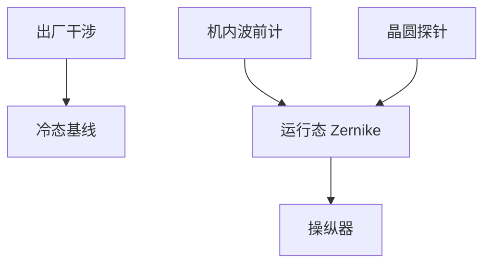

# 物镜像差测量

操纵器没有眼睛。相位测量、剪切干涉或晶圆上像差探针，才把 Zernike 从故事变成伏特。

<footer>—— 对照光学车间检测（Malacara）与扫描仪内像差计量；[Zernike](/litho/zernike-aberrations)</footer>

[上一课](/litho/fused-silica-caf2)给出玻璃。缺口是计量：如何在机台上看到波前。本课钉物镜像差测量，执行器映射已在操纵器课。

## 问题

离线干涉仪看冷态镜头；装进扫描仪后，热、气压、浸没水都会改数。只用出厂报告，补偿表是开环。晶圆上 CD 是混叠了胶、聚焦、照明的结果，不能当纯 Zernike 传感器。

## 方法

层次：出厂全口径干涉；机内源/光瞳相关的波前传感器；专用像差标记 + 散射或成像重建缝内低阶项。报告要声明：干式还是浸没、哪一缝位置、哪一波长。与 [光瞳测量](/litho/pupil-metrology) 分工：那边是照明角谱，这边是投影相位。

浸没下末片–水界面是计量的一部分。把水拿掉测，再声称浸没像差，会差一层折射率与面形负载。

## 机制

干涉把相位变成条纹；Zernike 拟合把条纹变成系数向量。噪声和遮拦使高阶项方差大，故反馈只用信噪比够的低阶。

## 边界

下一课双折射：即使相位 Zernike 完美，偏振像差仍能毁对比。标量相位计量不够。

## 小结

- 像差计量必须在运行态（含浸没）闭合。
- 与照明光瞳计分开；CD 不是纯波前计。
- 出处：Optical Shop Testing；Zernike 课。
