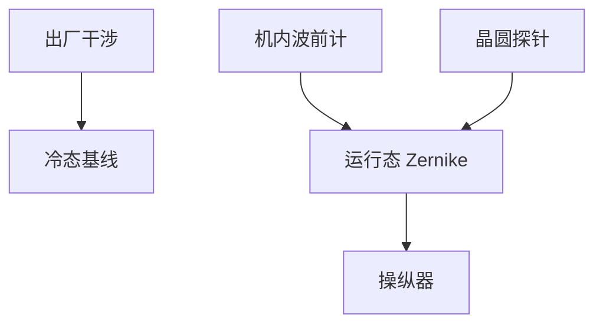
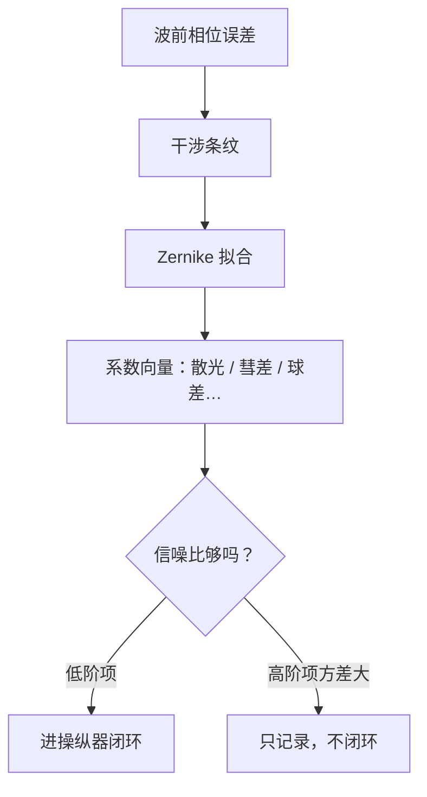

# 物镜像差测量

操纵器没有眼睛。相位测量、剪切干涉或晶圆上像差探针，才把 Zernike 从故事变成伏特。

<footer>—— 对照光学车间检测（Malacara）与扫描仪内像差计量；[Zernike](/litho/zernike-aberrations)</footer>

[上一课](/litho/fused-silica-caf2)给出玻璃。缺口是计量：如何在机台上看到波前。本课钉物镜像差测量，执行器映射已在操纵器课。

## 问题

离线干涉仪看冷态镜头；装进扫描仪后，热、气压、浸没水都会改数。只用出厂报告，补偿表是开环。晶圆上 CD 是混叠了胶、聚焦、照明的结果，不能当纯 Zernike 传感器。

直觉类比：出厂干涉像新车出厂检验；上车之后轮胎、气温、路况都在实时改车况。扫描仪里的镜头被热、气压、浸没水持续改变，补偿表若只抄出厂报告，等于照着冷车参数开高速。

## 方法

层次：出厂全口径干涉；机内源/光瞳相关的波前传感器；专用像差标记 + 散射或成像重建缝内低阶项。报告要声明：干式还是浸没、哪一缝位置、哪一波长。与 [光瞳测量](/litho/pupil-metrology) 分工：那边是照明角谱，这边是投影相位。

```mermaid
flowchart TD
  IF["出厂干涉"] --> BASE["冷态基线"]
  IN["机内波前计"] --> RUN["运行态 Zernike"]
  WAF["晶圆探针"] --> RUN
  RUN --> MAN["操纵器"]
```

浸没下末片–水界面是计量的一部分。把水拿掉测，再声称浸没像差，会差一层折射率与面形负载。

## 机制

干涉把相位变成条纹；Zernike 拟合把条纹变成系数向量。噪声和遮拦使高阶项方差大，故反馈只用信噪比够的低阶。

术语翻译：Zernike 多项式是给镜头写「验光单」的标准词汇——某阶近似散光、某阶近似球差……把任意波前误差展成一张系数列表，操纵器才知道该拧哪颗螺丝、拧多少圈。系数是「多少」，多项式名字是「什么毛病」。

```mermaid
flowchart TD
  W["波前相位误差"] --> FR["干涉条纹"]
  FR --> FIT["Zernike 拟合"]
  FIT --> VEC["系数向量：散光 / 彗差 / 球差…"]
  VEC --> SN{"信噪比够吗？"}
  SN -->|"低阶项"| FB["进操纵器闭环"]
  SN -->|"高阶项方差大"| DROP["只记录，不闭环"]
```

## 边界

下一课双折射：即使相位 Zernike 完美，偏振像差仍能毁对比。标量相位计量不够。

常见误区：以为晶圆上 CD 测得准就能反推像差。CD 是胶、焦、剂量、照明共同作用后的混合结果，拿它当像差传感器，等于把工艺噪声一并写进镜头补偿表。

## 小结

- 像差计量必须在运行态（含浸没）闭合。
- 与照明光瞳计分开；CD 不是纯波前计。
- 出处：Optical Shop Testing；Zernike 课。
