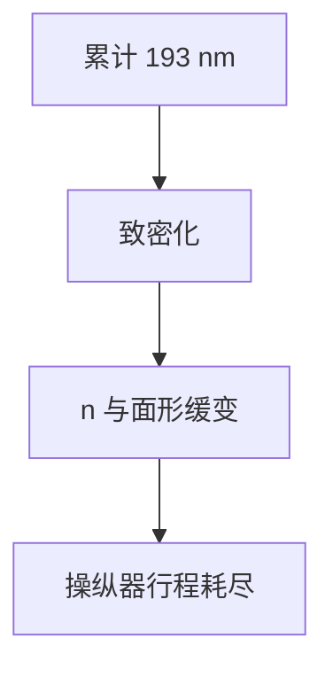

# 透镜致密化与寿命

193 nm 在熔石英里会诱发致密化：密度与折射率缓慢爬升，像差变成剂量的积分，不是温度的函数。

<footer>—— 对照 fused silica compaction under DUV；与可逆 [透镜加热](/litho/lens-heating-compensation) 对照</footer>

[上一课](/litho/aberration-manipulators)把可逆调节写完。缺口是不可逆：长时间 193 nm 辐照导致玻璃网络致密化（compaction）或相关损伤。本课钉寿命，材料牌号留给下一课。

## 问题

加热关掉灯就回。致密化积分光子，焦点和球差单调爬，操纵器行程被吃光后必须换组或降规格。把半年 CD 漂移全写成胶或热板，会漏掉镜头剂量史。

## 方法

运行：跟踪累计能量、限制不必要的高剂量测试、用低吸收材料（下一课）。监测：定期像差计量，看不可用加热模型解释的残差。寿命以「可维持 NA/像差规格的脉冲或年」记账，不是日历保修空话。

浸没末片还多一层：水、污染物、镀膜。致密化主要谈体材料；污染是再后一课。

## 机制

DUV 在缺陷/杂质处打断网络，结构弛豫使密度升，$n$ 升，等效光焦度漂。空间上跟强度分布走，所以也是「图形相关」的慢效应，但时间尺度是月，不是分钟。

## 边界

下一课为何用熔石英与 CaF₂，是致密化与透过率的材料解。

## 小结

- 致密化是剂量积分的永久 $n$ 漂移，与热可逆效应分账。
- 寿命表现为操纵器余量和像差规格。
- 出处：熔石英 DUV compaction 通识；加热课对照。
