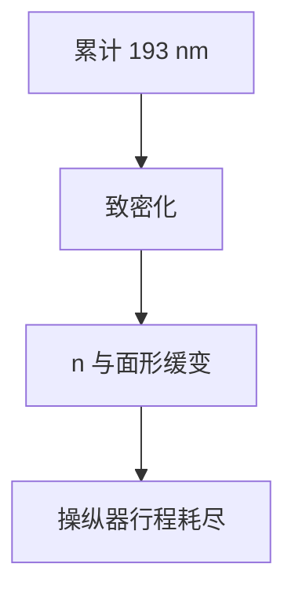
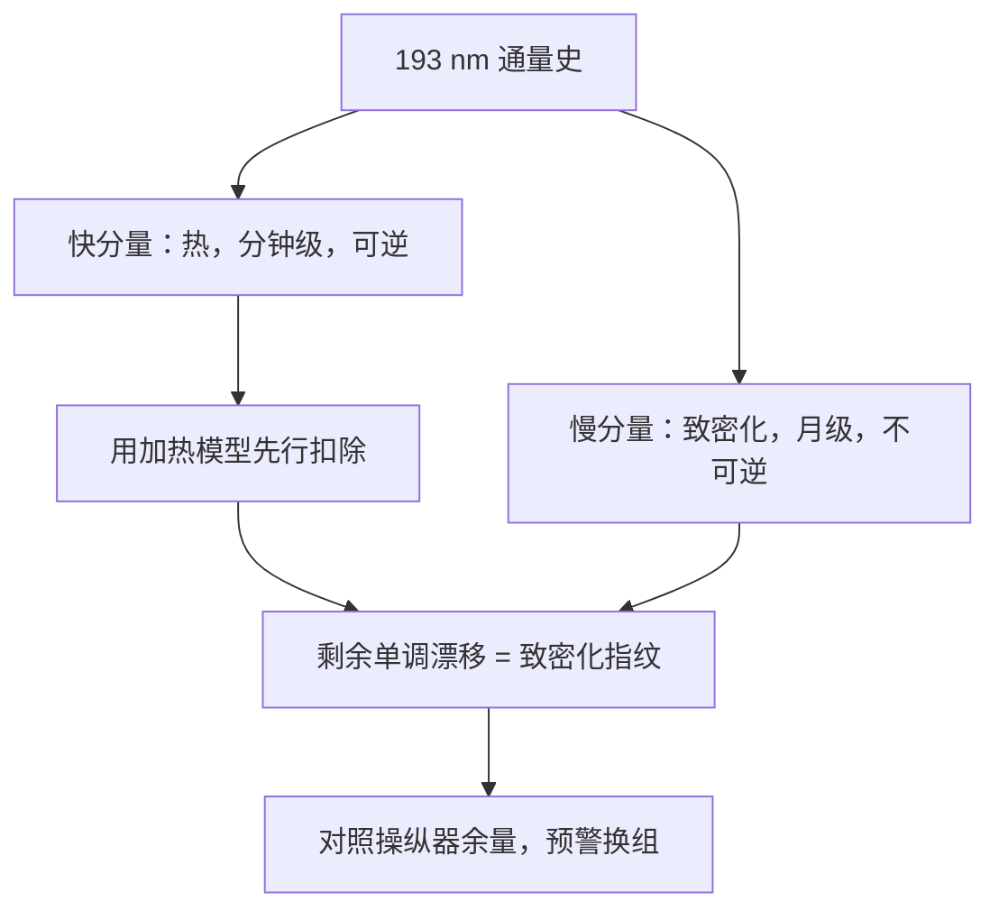

# 透镜致密化与寿命

193 nm 在熔石英里会诱发致密化：密度与折射率缓慢爬升，像差变成剂量的积分，不是温度的函数。

<footer>—— 对照 fused silica compaction under DUV；与可逆 [透镜加热](/litho/lens-heating-compensation) 对照</footer>

[上一课](/litho/aberration-manipulators)把可逆调节写完。缺口是不可逆：长时间 193 nm 辐照导致玻璃网络致密化（compaction）或相关损伤。本课钉寿命，材料牌号留给下一课。寿命问题排在操纵器之后是有理由的：致密化正是操纵器最终也追不动的那类漂移——它可以被补偿，但永远不能被复位。

## 问题

加热关掉灯就回。致密化积分光子，焦点和球差单调爬，操纵器行程被吃光后必须换组或降规格。把半年 CD 漂移全写成胶或热板，会漏掉镜头剂量史。

193 nm 光子 6.4 eV，低于熔石英带隙，本征单光子吸收为零，损伤走缺陷通道：氧空位、金属杂质、被拉伸的 Si–O–Si 键角在辐照下断键重排，网络弛豫到更密的构型。一台量产机台每年吃下 $10^{11}$ 量级个脉冲，寿命末端最热点元件的密度爬升也不过千分之一量级。比例看着小，后果不小：波前预算只有几个纳米，而玻璃厚度是厘米量级，$\Delta\phi=(2\pi/\lambda)\int\Delta n\,\mathrm{d}l$ 把 $10^{-6}$ 量级的局部折射率变化都放大成纳米级 OPD。焦点与球差的慢爬由此而来。另一半麻烦在分账：热效应时间常数是分钟，致密化是月，把两者塞进一个拟合，两组系数都被污染；剂量史不在机台日报里，只在脉冲计数器里。

数字实例：局部折射率只变 $\Delta n=1\times10^{-6}$，穿过 10 cm 玻璃后光程差约 $\Delta n\times l=100$ nm——比整条波前预算还大一个量级。「密度只升千分之一」听着无害，乘上厘米级厚度就致命。

## 方法

运行：按元件位置维护通量模型，把每片玻璃的累计剂量记成脉冲数乘局部辐照度；整备与对焦时关快门，别拿生产剂量寿命去付调试光；测试晶圆与超高剂量请求单独审批。监测：定期做镜头像差计量（见 [镜头像差计量](/litho/lens-aberration-metrology)），先用 [透镜加热](/litho/lens-heating-compensation)的模型扣掉快分量，剩下随剂量单调走的慢分量才是致密化指纹；指纹对上操纵器余量，就知道还能撑几个季度。寿命以「可维持 NA/像差规格的脉冲或年」记账，不是日历保修空话——同一颗镜头在高剂量产线与混线工厂里日历寿命差一倍，脉冲寿命几乎一样。触线即三选一：降规格、降功率，或整组更换，但都要求提前预警，而不是到期才发现。

```mermaid
flowchart TD
  DOSE["累计 193 nm"] --> COMP["致密化"]
  COMP --> N["n 与面形缓变"]
  N --> LIFE["操纵器行程耗尽"]
```

浸没末片还多一层：水、污染物、镀膜。致密化主要谈体材料；污染是再后一课。

## 机制

DUV 在缺陷/杂质处打断网络，结构弛豫使密度升，$n$ 升，等效光焦度漂。折射率随密度的走向由 Lorentz–Lorenz 关系钉住：极化率近似不变，密度升则 $n$ 升。致密化在空间上跟着强度分布走——束腰处最密、边缘次之，元件等效于长出一块中心厚、边缘薄的附加相位体：一阶表现为焦距缩短，高阶表现为球差爬升，照明不对称时再叠出像散。这就是「图形相关慢效应」的物理来源，只是时间尺度是月，不是分钟，所以能被周期性再标定跟踪，却不能被加热模型外推。速率近似正比于局部辐照度乘缺陷密度，而缺陷本身会被辐照逐渐耗尽或转化，曲线前陡后缓；低缺陷合成石英把整条曲线往下压，材料牌号的取舍是下一课。

直觉类比：致密化像把海绵反复压实——孔隙变少，单位体积里的玻璃变多，折射率随之升高。压实不可逆：加热补偿只能临时把焦点搬回去，不能把海绵弹回来。

```mermaid
flowchart TD
  F193["193 nm 通量史"] --> HEAT["快分量：热，分钟级，可逆"]
  F193 --> COMP["慢分量：致密化，月级，不可逆"]
  HEAT --> SUB["用加热模型先行扣除"]
  SUB --> RES["剩余单调漂移 = 致密化指纹"]
  COMP --> RES
  RES --> BUD["对照操纵器余量，预警换组"]
```

## 边界

下一课为何用熔石英与 CaF₂，是致密化与透过率的材料解。再钉两条：本课的体玻璃物理只在 DUV 透射系统成立，EUV 走多层反射膜，寿命语言换成反射率与污染；致密化也不可逆，烘烤、净化、停机都回不来，能做的只有补偿与记账。

常见误区：把镜头慢漂记到胶或热板头上。致密化跟剂量走、不跟日历走——两台同型号机台，一台常年高产能、一台调试为主，几年后像差状态完全不同，差别全记在脉冲计数器里，不在机台日报里。

## 小结

- 致密化是剂量积分的永久 $n$ 漂移，与热可逆效应分账。
- 厘米级玻璃厚度把 $10^{-6}$ 量级的 $\Delta n$ 放大成纳米级波前误差，焦点与球差单调爬。
- 寿命表现为操纵器余量和像差规格，按脉冲记账、按季度预警。
- 出处：熔石英 DUV compaction 通识；加热课对照。
