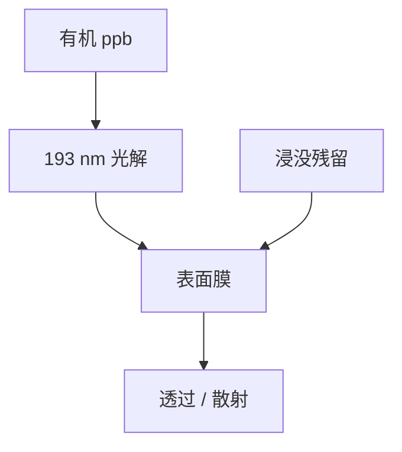

# 物镜污染

193 nm 把空气里的有机物打成膜，镀在镜头上：透过率掉、散射升、像差漂。污染是化学寿命，不是致密化。

<footer>—— 对照 DUV 光学 carbon contamination；浸没末片的水痕与析出</footer>

[上一课](/litho/birefringence-polarization)收束偏振。本课是物镜单元最后一课：表面脏。致密化在体里；污染在面上。下一单元工件台从机械另起。

## 问题

净化空气仍有 ppb 级有机。193 nm 光解沉积碳氢膜，均匀性差时像加了一层随机相位。浸没末片还有水印、胶析出、气泡残骸。把透过率下降全写成气体寿命（激光），会去换错耗材。

## 方法

环境：化学过滤器、镜头吹扫。末片：浸没回收与清洗循环。监测：透过率/杂散光、定期像差。清洗有离线与在线限制，末片比内组容易够到。与 [杂散光 flare](/litho/flare-and-stray) 相关：脏是 flare 的时间函数。

EUV 多层污染是氢与锡的另一套化学，见 EUV 课，不要把 DUV 碳膜和锡滴混名。

## 机制

光子打断挥发有机，碎片吸附聚合。薄膜改反射/吸收，也改有效 $W$。颗粒则是局域缺陷，计量上像 flare 热点。

## 边界

工件台干涉仪和编码器的脏是下一单元，不是投影物镜。本课只管投影光路光学面。

## 小结

- 污染是表面光化学，与体致密化分账。
- 浸没末片多一条水与析出通道。
- 出处：DUV carbon contamination 通识；flare 课。
