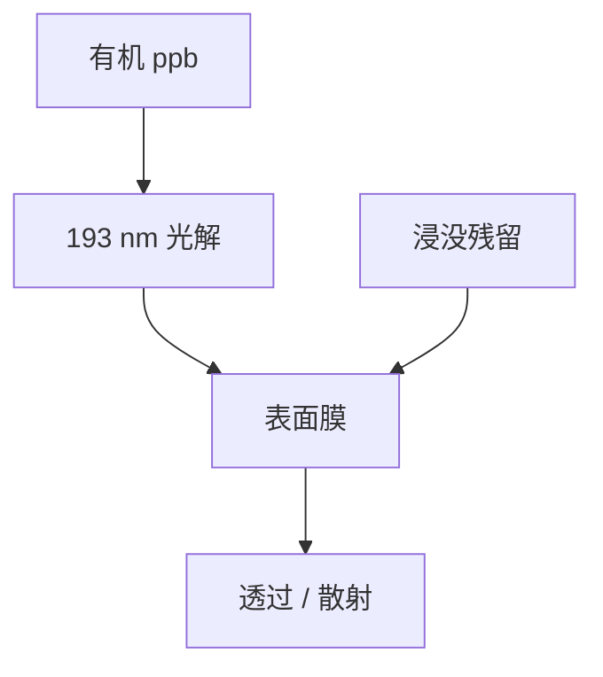

# 物镜污染

193 nm 把空气里的有机物打成膜，镀在镜头上：透过率掉、散射升、像差漂。污染是化学寿命，不是致密化。

<footer>—— 对照 DUV 光学 carbon contamination；浸没末片的水痕与析出</footer>

[上一课](/litho/birefringence-polarization)收束偏振。本课是物镜单元最后一课：表面脏。致密化在体里；污染在面上。下一单元工件台从机械另起。表面脏的另一面是它比体损伤快得多：致密化按月走，一张碳膜几周就能把透过率拉低百分之一级；但它可逆——脏能洗，致密化不能。

## 问题

净化空气仍有 ppb 级有机：光刻胶单体、轨道烘烤排气、真空泵油雾穿过末端 ULPA 之后仍留有 ppm 到 ppb 分压。193 nm 光子 6.4 eV，高于 C–H、C–C 键能（3–5 eV），直接光解这些分子；碎片在玻璃面吸附、交联成亚稳碳膜，生长速率正比于局部辐照度乘有机分压——所以膜先长在离掩模最近、辐照最强的前组。膜厚几十纳米就有三件事：透过率掉，剂量闭环把激光功率推上去，[激光气体寿命](/litho/laser-gas-lifetime)被顺手偷走；膜厚不均匀是块楔形相位板，表现像慢变像差；表面散射把能量漏进杂散光。浸没末片还有水印、胶析出、气泡残骸：水膜把胶里低分子物浸出来，弯液面扫过处干燥成环。把透过率下降全写成气体寿命（激光），会去换错耗材——先查吹扫日志和有机源，再动激光。

## 方法

环境：化学过滤器（活性炭加离子交换介质两级）按压差与寿命更换，镜头吹扫用过滤干燥氮气保持微正压，密封圈老化与流量漂移进点检表。末片：浸没回收与清洗循环。监测：透过率/杂散光、定期像差——三条曲线互证才能分开「膜」与「体」。清洗有离线与在线限制，末片比内组容易够到：可拆卸、离线湿法清洗最干净；内组要开桶重新装调，停机成本与风险都高，而且过度清洗伤增透膜，清洗次数和剂量一样是有限资源。

与 [杂散光 flare](/litho/flare-and-stray) 相关：脏是 flare 的时间函数，flare 的定期复查因此是污染的免费仪表。

```mermaid
flowchart TD
  ORG["有机 ppb"] --> UV["193 nm 光解"]
  UV --> FILM["表面膜"]
  FILM --> T["透过 / 散射"]
  H2O["浸没残留"] --> FILM
```

EUV 多层污染是氢与锡的另一套化学，见 EUV 课，不要把 DUV 碳膜和锡滴混名。

## 机制

光子打断挥发有机，碎片吸附聚合。自由基在表面停留期间交联，最终形成溶剂擦不掉的碳氢网络——清除要靠等离子体或专用化学，这是清洗配方难写的根源。薄膜改反射/吸收，也改有效波前：非均匀厚度等价于一块楔形相位板，进了像差计量就是「热模型解释不了的慢残差」。颗粒则是局域缺陷，计量上像 flare 热点，暗场复查可定位。速率律 $r\propto I\cdot p_\mathrm{org}$ 解释了两件事：净化等级差一个数量级、镜头寿命差数倍；以及闲置时关快门、缩短光路暴露时间，与换滤芯同样有效。颗粒沉积则与光化学膜不同源：颗粒走输运与静电吸附，不靠光子，吹扫挡不住，抓手换成环境与浸没水的颗粒过滤，两类污染分两条账治理。清洗之后还有一条隐藏账目：清洗会微弱改变元件面形与膜层，机台镜头文件要重新标定一次，否则清洗本身就变成一次像差台阶。

## 边界

工件台干涉仪和编码器的脏是下一单元，不是投影物镜。本课只管投影光路光学面。掩模面上的 haze 是硫酸盐与胺在掩模侧的光化学（[掩模 haze](/litho/mask-haze)），账不能记到镜头头上；反过来，镜头碳膜也不该写成激光问题。

## 小结

- 污染是表面光化学，与体致密化分账。
- 沉积速率 ∝ 辐照度 × 有机分压，净化与吹扫直接定寿命。
- 浸没末片多一条水与析出通道。
- 出处：DUV carbon contamination 通识；flare 课。
