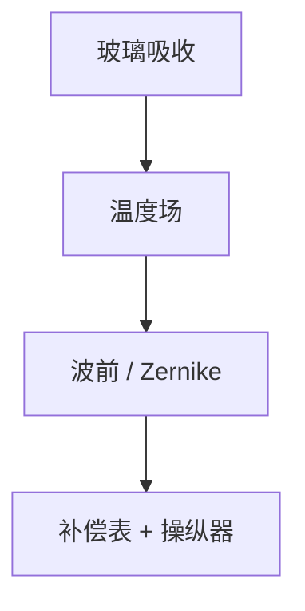

# 透镜加热与补偿

玻璃吃掉的那一小截 193 nm 变成热。折射率与面形随温度场变，像差跟着扫描历史走，不是一场一个常数。

<footer>—— 对照投影物镜 lens heating 补偿的公开描述；[Zernike](/litho/zernike-aberrations)</footer>

[上一课](/litho/catadioptric-lens-design)给出冷态设计。缺口是运行：吸收 → 温度场 → $n(T)$ 与面形 → 波前。本课钉加热与补偿，不重写 Zernike 定义。

## 问题

透过率不是 100%。狭缝里的功率密度随光瞳与掩模透过率变，热场是「这场图形」的函数。刚开机与连扫一小时的像差不同。把套刻/CD 漂移全写成工件台，会漏掉镜头热时间常数（秒到十分钟）。

## 方法

模型：若干 Zernike 的加热系数 × 估计功率（剂量、光瞳、掩模开放率）。执行器：后课操纵器、调焦、波长微调。生产：idle 曝光或补偿表随 lot 更新。换高透过掩模等于换热负载。

补偿是前馈为主：用即将曝光的场预测热，而不是等 CD 坏了再反馈。传感器在镜头里有限，模型误差会变成系统残差。

## 机制

$dn/dT$ 与热膨胀改光程。非均匀热场激发球差、像散等轴对称或扫描向模态。时间上像一个低通：脉冲级看不見，场间与 lot 间看见。

## 边界

下一课操纵器是执行器细节。致密化（compaction）是剂量积分的永久损伤，不是可逆加热，再后一课。

## 小结

- 镜头热像差随图形与历史变，要前馈补偿。
- 时间常数在场–lot 之间，不在单个脉冲。
- 出处：lens heating 公开实践；Zernike 课。
