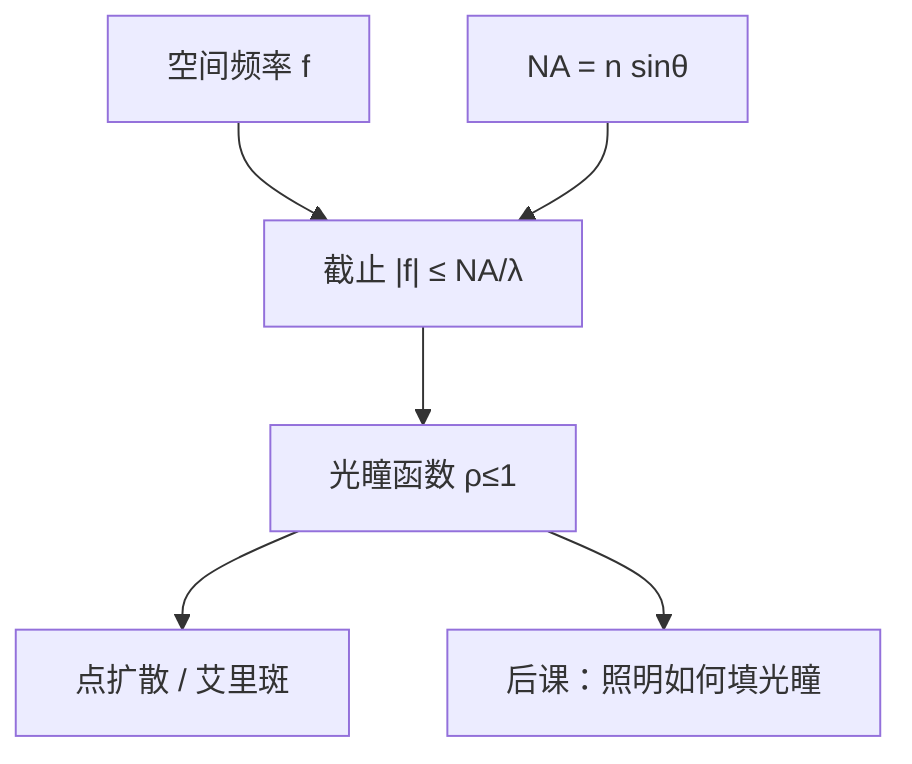

# 透镜与数值孔径

数值孔径是物镜在像方（或物方约定下）能接收的最大 $n\sin\theta$；它把空间频率轴上的截止写成一个可写入镜头合同的数。

<footer>—— 归纳自 Abbe 正弦条件与 Mack, Fundamental Principles of Optical Lithography 对 NA 的定义</footer>

[上一课](/litho/pupil-apodization)（光瞳滤波与切趾）。在此之上，掩模收成空间频率，并指出均匀介质里可传播的上限是 $n/\lambda$。缺口是：投影物镜并不是整块均匀介质，它只收集进入入瞳的那一段频谱。本课引入数值孔径 $\mathrm{NA}=n\sin\theta$，把「进得去的最高空间频率」写成 $\mathrm{NA}/\lambda$。照明如何填充这个光瞳，留给[部分相干](/litho/partial-coherence)。

## 问题

衍射级已经按角度排好。没有光瞳半径，就无法回答「一级还在不在」。显微镜和投影光刻都用同一个几何量：边缘光线与光轴的夹角 $\theta$，乘上该侧介质的折射率 $n$。这个乘积叫数值孔径。若只写 $\sin\theta$ 而丢掉 $n$，浸没看起来像作弊；若只写「镜头很大」而不写 $\theta$，空间频率截止无法代入公式。

缺口因此是给上一课的频率轴装一个硬截止，而不是开始谈临界尺寸。$\mathrm{CD}=k_1\lambda/\mathrm{NA}$ 仍要等到矢量成像之后的产线判据课。

### NA 必须带介质的 n

像方 $\mathrm{NA}=n\sin\theta$，其中 $\theta$ 是像方边缘光线角，$n$ 是像方最后一段介质的折射率：干式是空气 $\approx 1$，浸没是水 $\approx 1.44$。同一个玻璃镜头，把最后一段换成水，并不自动把旧 $\mathrm{NA}$ 乘上 1.44——那是浸没课的设计问题。本课只钉定义：截止频率用的是成像侧的 $n\sin\theta$，与[第一课](/litho/em-wave-index)的 $n$ 是同一个符号。

投影光刻的缩比 $\beta$（常见 $4\times$，即 $|\beta|=1/4$）把物方 NA 与像方 NA 连在一起：物方立体角更小。合同上的 $\mathrm{NA}$ 默认指像方，也就是晶圆侧。

## 方法

阿贝正弦条件要求理想成像满足 $n_o x_o\sin\theta_o=n_i x_i\sin\theta_i$。在固定缩比下，它保证离轴视场不引入多余彗差，并把物方、像方的 $n\sin\theta$ 锁成一对。光瞳平面是空间频率的坐标系：径向坐标 $\rho$ 归一到 1 代表 $|\mathbf{f}|=\mathrm{NA}/\lambda$。光瞳函数在 $\rho\le 1$ 内取复透过率（含像差），在 $\rho>1$ 为零。

点物的像是这个光瞳的夫琅禾费衍射，圆孔时即艾里斑。本课需要艾里斑只是为了承认：有限 $\mathrm{NA}$ 给出有限的脉冲响应宽度，宽度正比于 $\lambda/\mathrm{NA}$。比例系数留给瑞利课的 $k_1$；这里不把 0.61 写进产线公式。

### 光瞳里装的是频率，不是「亮度」

入瞳半径增大，意味着更斜的平面波也能进镜头，也就是更高的 $f$。光源把光瞳填得满不满，是照明 $\sigma$，不是 $\mathrm{NA}$。把两者混成「孔径越大越亮」，会把收集角与填充因子搅在一起。本课的 $\mathrm{NA}$ 只约束投影成像通道；照明孔径另写。

高 $\mathrm{NA}$ 时边缘光线的偏振与能量沉积不再是标量艾里斑能概括的。那是[矢量成像](/litho/vector-imaging)的缺口。本课仍用标量光瞳，以便先把截止频率钉死。

## 机制

掩模衍射级落在光瞳上的位置由 $f=n\sin\theta/\lambda$ 决定。$\mathrm{NA}$ 越大，同一周期 $p$ 的一级越靠近光瞳内部，两束干涉的调制越稳。$\mathrm{NA}$ 不够，一级被挡，只剩零级，空中像变平。这就是「镜头决定分辨率」的频率机制，尚未引入工艺因子。

焦深尚未正式定义，但几何上已经能看见惩罚：$\theta$ 变大，离焦时边缘光线的额外光程涨得更快。定量式子 $\mathrm{DOF}\propto\lambda/\mathrm{NA}^2$ 是[焦深](/litho/depth-of-focus)课的缺口；本课只要求记住：抬 $\mathrm{NA}$ 不是免费的轴向宽容度。

### 折反射与反射物镜用同一 NA

DUV 投影物镜是折射或折反射，EUV 是多层膜反射镜。无论折还是反射，合同里的 $\mathrm{NA}$ 仍是像方 $n\sin\theta$。EUV 的 $n=1$（真空），$\mathrm{NA}=0.33$ 或 High-NA 的 $0.55$，与浸没的 $1.35$ 可以写在同一根轴上比较截止频率，不能比较「镜子张数」。本课不进入 EUV 膜系。

点物的像是光瞳的夫琅禾费衍射，圆孔时即艾里斑。本课需要它只为承认：有限 $\mathrm{NA}$ 给出有限的脉冲响应宽度，宽度正比于 $\lambda/\mathrm{NA}$。比例系数留给瑞利课的 $k_1$；这里不把 0.61 写进产线公式。

投影缩比 $\beta$（常见 $4\times$）把物方 NA 与像方 NA 连在一起：物方立体角更小。合同上的 $\mathrm{NA}$ 默认指像方，也就是晶圆侧。

## 边界

$\mathrm{NA}$ 不包含套刻、光源功率、胶对比度。也不要把镜头口径的毫米数当成 $\mathrm{NA}$：同样口径，工作距离和焦距不同，$\theta$ 就不同。像差使光瞳函数带相位，截止频率仍是 $\mathrm{NA}/\lambda$，但调制传递会低于理想圆孔；像差预算是镜头工程，不是本课的定义。

后课需要用到的只是：投影系统是 $\mathrm{NA}/\lambda$ 的低通，晶圆侧 $\mathrm{NA}=n\sin\theta$，光瞳径向坐标按此归一。照明填充、相干因子、空中像对比度，一律往后推。

## 小结

- $\mathrm{NA}=n\sin\theta$ 给出空间频率截止 $\mathrm{NA}/\lambda$。
- 合同 $\mathrm{NA}$ 指晶圆侧；缩比把物方角压小。
- 光瞳是频率平面，不是亮度旋钮；照明填充是另一课。
- 抬 $\mathrm{NA}$ 改善截止，同时恶化离焦敏感，焦深公式下一课再写。
- 本课不写 $\mathrm{CD}=k_1\lambda/\mathrm{NA}$。
- 出处：Abbe 正弦条件；Mack, *Fundamental Principles of Optical Lithography*；Born &amp; Wolf 对孔径与衍射极限的讨论。
