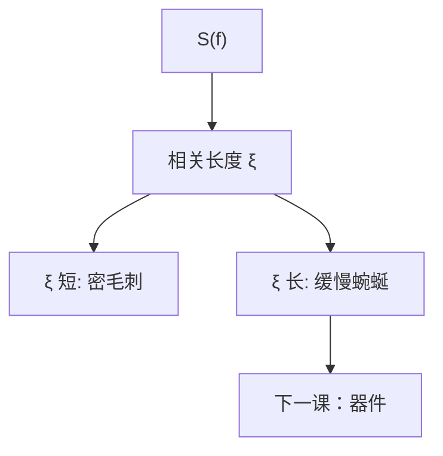

# 相关长度与低频粗糙

同样的 $3\sigma$，毛刺密和边慢慢弯，对漏电与击穿不是一回事。相关长度 $\xi$ 是谱里那根尺子。

<footer>—— 据 LER 自仿射描述中的相关长度；Naulleau / Constantoudis 对低频分量的讨论</footer>

[上一课](/litho/ler-psd)把 $S(f)$ 立成接口。缺口是把谱收成可谈的标长：相关长度 $\xi$，以及为何低频（长程）粗糙往往比高频毛刺更难靠 PEB 修、也更伤后课的器件。本课钉 $\xi$ 与低频。LER 怎样进晶体管，留给[下一课](/litho/ler-device-impact)。

## 问题

自仿射近似里，$S(f)$ 在 $f\xi\ll 1$ 趋于白（或受线长截断），在 $f\xi\gg 1$ 按幂律下降。$\xi$ 大致是「边还记得自己」的距离，量级上与有效模糊核、聚合物相关、显影前沿相关有关。酸扩散加长 $\xi$、砍高频：看起来 $3\sigma$ 可能降，低频功率却可能重新分配。只报 LWR 下降，可能把问题从毛刺换成缓慢蜿蜒。

低频分量还来自剂量、焦点、掩模——$\xi$ 变得与线长可比时，LER 与 LCDU、甚至跨场 CDU 边界模糊。协议线长必须长过关心的 $\xi$，否则低频被窗口吃掉，数好看、器件仍疼。

### $\mathrm{LWR}\approx\sqrt{2}\,\mathrm{LER}$ 的前提

两侧不相关时成立。$\xi$ 长到两侧通过剂量或焦点共模，关系打破。主干酸扩散课已警告；本课指出：低频主导时不要用这个换算去签核。

$\xi$ 不是光学相干长度，也不是 $\lambda/\mathrm{NA}$。不要从瑞利式「推导」相关长度。

## 方法

从 PSD 拟合 $\xi$、或从自相关函数掉到 $1/e$。比较：降 PEB，$\xi$ 应缩短、高频抬；加剂量，幅度降、$\xi$ 若主要来自核则不太动；换掩模，低频台阶动。MC 的核宽度应与拟合 $\xi$ 同量级，差太多则核抽错或 SEM 滤波未声明。

滤波：工业 LER 常经高斯滤波再报 $3\sigma$，等价于砍一段高频，并改变表观 $\xi$。对表必须同一滤波。

## 机制

核把点噪声涂开，自相关变宽，$\xi$ 升，高频 $S(f)$ 降。聚合物溶解前沿有自己的相关（成簇脱落），显影也可以加 $\xi$。低频若来自扫描剂量条纹，胶核滤不掉——那是光源/剂量环，拧 PEB 无效。Naulleau 拆谱的实验意义正在这里：执行器选错，相关长度不会按你预期动。

线长 $L$ 截断最低频 $1/L$。$L$ 太短，测到的是中高频 LER，漏掉蜿蜒。器件沟道长度若长过测量窗，会吃到你没报的那截功率。

孔没有长边，$\xi$ 语言弱，改用 LCDU 与缺陷。不要给接触孔报一个「相关长度」充数。

## 边界

不把某胶 15 nm 相关长度写成工艺常数。不把幂律指数 $\alpha$ 考据成普遍临界指数。下一课用 $\xi$ 与谱去对漏电、阈值电压、击穿，而不是再用一个 $3\sigma$ 对所有电学。

## 小结

- $\xi$ 是边位置的记忆长度，从 PSD 或自相关读出。
- 加模糊往往加 $\xi$、砍高频；$3\sigma$ 降不等于低频安好。
- 线长必须覆盖关心的 $\xi$；滤波要声明。
- 低频可能根本不是胶，对拍剂量与掩模。
- 出处：Constantoudis 等自仿射 LER；Naulleau 低频拆分。
