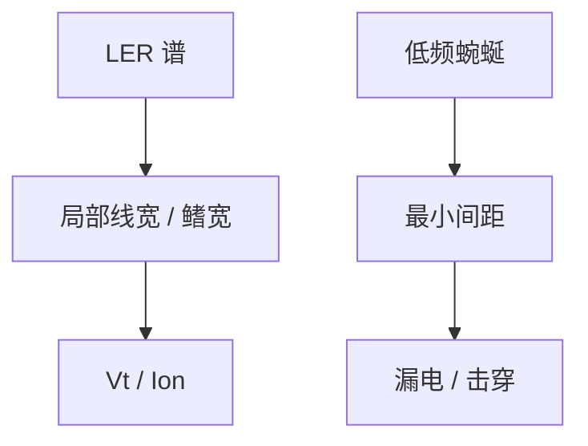

# LER 对器件的影响

计量 LER 是边怎么毛；器件问的是沟道宽、漏电路径和击穿间距怎么被这张谱抽样。频率权重与 SEM 协议不必相同。

<footer>—— 据 LER 对 FinFET / 平面 MOSFET 电学影响的公开讨论；谱权重见计量与器件文献通称</footer>

[上一课](/litho/ler-correlation-length)把 $\xi$ 与低频钉住。缺口是电学：同样积分 LER，高频毛刺与长程蜿蜒对阈值电压、关态漏电、栅氧/间距击穿的权重不同。本课钉 LER 对器件的影响。印刷失效（桥与断）是更极端的几何，留给[下一课](/litho/bridge-break-defects)。

## 问题

平面 MOS：沟道宽度沿 $W$ 被两边 LER 调制，有效 $W$ 涨落进 $I_\mathrm{on}/I_\mathrm{off}$；短沟再叠局部势垒。FinFET / GAA：鳍宽直接是线 CD，LWR 变成 $V_t$ 与寄生电阻的局部散；相关长度相对鳍长，决定许多鳍是共模还是独立抽样。击穿与漏电更吃最小间距：低频蜿蜒让两线在某一点贴近，比密毛刺更危险。

缺口不是再报 PSD 怎么测，而是：器件传递函数是另一道滤波。ITRS 计量窗不一定等于沟道长度。用计量 $3\sigma$ 当电学规格的充分统计，会漏掉 $\xi$ 与最小间距尾。

### 平均 CD 合格可以电学失败

OPC 把均值鳍宽放进规格。局部最窄处决定漏电或开路风险。这与[随机效应](/litho/euv-stochastics) 的「均值 OPC 修不掉尾」同构，对象从孔换成线宽调制。DTCO 要把 LER 谱而不是一个纳米数送进 SPICE 抽样。

刻蚀后鳍的 LER 才是器件几何。ADI 谱要经过转移函数；有的高频被修圆，有的被侧壁粗糙放大。声明 AEI。

## 方法

映射：把边实现（实验或 MC）做成器件网格，抽 $V_t$、$I_\mathrm{off}$、击穿。简化：用 $\xi$ 与幅度生成相关随机边界。比较：只压高频（加核）看漏电是否真降——若最小间距由低频主导，加核几乎不帮，还伤分辨率。设计规则：线宽/间距余量要按谱的低频功率加，而不是按计量 LER 的一半。

与 LCDU：多鳍并联时，鳍间 CD 散是 LCDU 语言，鳍内沿长度是 LER。两者进不同的失配项。

## 机制

电导对最窄截面敏感（非线性），$I_\mathrm{off}$ 对势垒更指数。于是边分布的尾比均方根更重要——又一次极值。$\xi$ 长，一条鳍内部相关，等效于整鳍偏置，像局部 CDU；$\xi$ 短，沿沟道平均，部分噪声被沟道长度滤掉，但密毛刺增加表面散射。节点缩小时沟道更短，滤波变弱，同一 $\xi$ 更疼。

High-NA 更细的鳍让相对 LWR 变大。光学 NILS 若跟着变好，幅度可降；电子核不跟着 NA 降，材料地板在。这是随机预算进器件，不是再写瑞利公式。

接触孔电阻吃 LCDU 与缺孔，不吃线 LER。层别对象不能混。

## 边界

不把某代 FinFET 的 mV/$V_t$ 数写成课标。不发明器件论文 arXiv。下一课桥与断是几何连通性失败，比 $V_t$ 散更靠良率墙；本课默认线还连着、孔还开着。

## 小结

- 器件对 LER 的滤波不同于 SEM 协议；必须用谱和 $\xi$，不是单 $3\sigma$。
- 低频蜿蜒伤最小间距与击穿；高频伤表面与短沟平均。
- 均值 CD 进规格不等于电学尾合格。
- 声明 AEI 几何；鳍内 LER 与鳍间 LCDU 分列。
- 出处：LER–器件公开讨论；谱方法接上一课。
