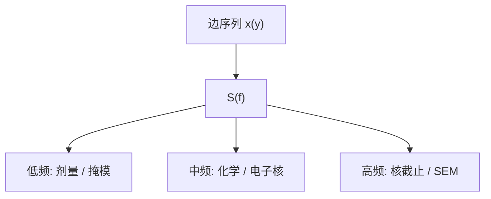

# LER 的 PSD 分析

一个 $3\sigma$ 把所有频率捆死。功率谱才问：毛边是剂量低频、化学核，还是 SEM 白噪声。

<footer>—— 据 Constantoudis / Patsis 与 Naulleau 对 LER 功率谱的公开方法；Mack 对频谱分段的讨论</footer>

[上一课](/litho/stochastic-monte-carlo)给出边的许多次实现。[酸扩散与 LWR](/litho/acid-diffusion-lwr) 与 [LWR/LCDU](/litho/lwr-lcdu) 已经警告不要只报一个纳米数。缺口是把沿边位置序列做成功率谱密度（PSD），并规定怎么读。相关长度作为谱的一个参数，留给[下一课](/litho/ler-correlation-length)。

## 问题

沿设计边取样 $x(y)$，去均值后做功率谱 $S(f)$。低频（长程）常来自剂量、flare、掩模、扫描；中频常含化学与电子核；高频被核压掉，又被 SEM 噪声抬起。积分 $S(f)$ 在一定频窗内得到协议 LER——窗一改，数就改。ITRS 类协议要声明线长与滤波，本课指出物理原因：不同频段对应不同执行器。

缺口不是再定义 LER，而是：MC 或实验必须交谱，才能判断上一课的核有没有抽对。只拟合 $3\sigma$，可以把电子核、酸核、SEM 噪声调成同一积分。

### 谱不是光学 MTF

光学传递函数作用在空中像上。LER 的 PSD 是边位置过程的谱。两者通过 NILS 耦合：光学调制差，同一化学噪声在边上放大，整张 $S(f)$ 抬高，形状仍由核与相关决定。不要把 LER 谱的截止频率写成镜头 NA。

自仿射模型常用 $S(f)\propto 1/(1+(f\xi)^{2\alpha})$ 一类，三个参数：幅度、相关长度 $\xi$、粗糙指数。本课先钉 PSD 是接口；$\xi$ 下一课展开。

## 方法

实验：CD-SEM 沿边密采样，多条线、多视场平均 $S(f)$，减仪器噪声（重复扫描同一边）。比较：只改 PEB，看中高频是否掉；只改剂量，看整体是否按 $1/N$ 降；只改掩模批次，看低频是否钉死。MC：对每个实现算谱再平均，应与实验同一频窗。

[LWR 与 LCDU](/litho/lwr-lcdu) 的分工：PSD 主要服务长边；孔用 LCDU 与失效，不硬做「孔的 LER 谱」。

## 机制

线性化图像：边位移 $\approx$ 噪声场 / 当地斜率。噪声场的相关函数是核的自卷积一类，傅里叶后就是 $S(f)$ 的形状；斜率是 ILS，决定幅度。酸扩散低通，砍高 $f$；电子核同样，截止频率更高或相当，视材料。剂量均匀性几乎是 $f\to 0$ 的 $\delta$，线长不够时漏进「LER」。

Naulleau 等用谱把光子项（随剂量降、形状受核约束）与掩模项（不随剂量降）分开。这是随机预算的计量，不是学术装饰。

刻蚀转移是另一道滤波，ADI 与 AEI 的 PSD 不同。必须声明。

## 边界

不把某篇会议的 $\alpha=0.8$ 写成所有层。不发明谱仪型号。下一课把 $\xi$ 从这张谱里读出，并解释为何低频粗糙特别伤器件。SEM 收缩对细线谱的污染，计量课再写；本课要求报谱时声明是否校正。

## 小结

- PSD 把 LER 按频率拆给不同执行器；积分窗必须声明。
- 幅度乘光学 ILS；形状乘化学/电子核；低频常非胶。
- MC 只拟合 $3\sigma$ 不够，必须对谱。
- ADI/AEI 谱不同。
- 出处：Constantoudis 等 LER 谱方法；Naulleau 用谱拆光子与掩模；Mack。
