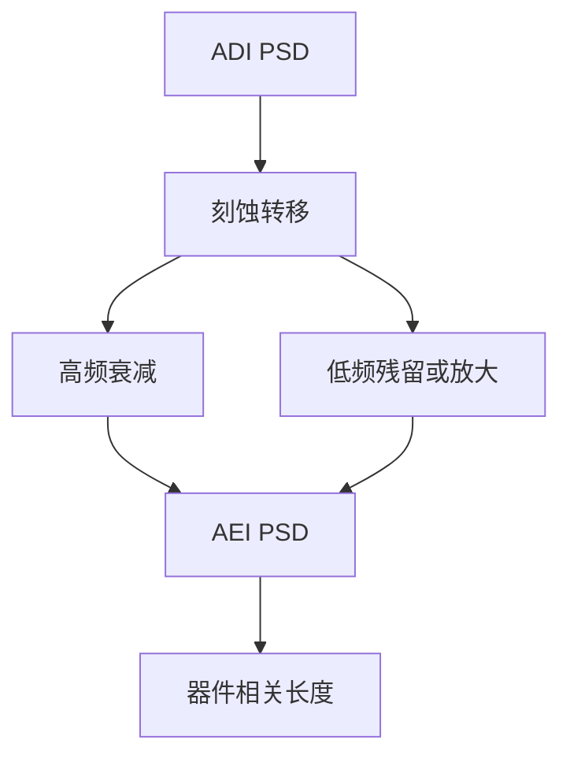

# LER 转移与平滑

显影边的粗糙不会原样刻进硅：等离子体可以抹高频、放大低频，或把相关长度改写成器件看见的那一截。

<footer>—— 对照 LER/LWR 转移、刻蚀平滑与 PSD 的公开讨论；[LER 的 PSD](/litho/ler-psd) 已钉频谱</footer>

[上一课](/litho/selectivity-arde)把过刻写成选择比的税。缺口是边的频谱：ADI 的 LER 不是 AEI 的 LER。[LER PSD](/litho/ler-psd) 与 [相关长度](/litho/ler-correlation-length) 已在胶侧讲过；本课钉转印算子对频谱做什么，不重推 3σ 定义。硬掩模材料如何当「更耐打的边」，留给[下一课](/litho/hardmask-sin-tin）。

## 问题

离子轰击与侧壁聚合物可以平滑高频粗糙（小突起先被打掉或填平），低频弯曲（来自光学或长程负荷）往往留下甚至因负载放大。器件关心的相关长度通常在栅长量级：[器件影响课](/litho/ler-device-impact) 已说明；转印若把低频留下、高频抹掉，3σ 下降却电学不变——报表会骗人。

缺口是**转移函数**，不是再测一次 ADI LER。把「刻蚀平滑 20%」写进预算而不声明频段，是类别错误。

### 平滑不是免费的

能抹粗糙的工艺往往也抹小 jog、小 SRAF 残和尖角，或引入斜侧壁。过度平滑与 CD 放宽、选择比损失捆绑。EUV 随机的高频成分可被部分抹平，但缺孔/桥连是拓扑事件，平滑救不回。

比较 ADI/AEI LER 必须同一部位、同一 SEM 算法。收缩与滤波差会假装平滑。PSD 比单点 3σ 更难作假。

## 方法

成对 ADI/AEI SEM，算 PSD 比而不是只报 3σ。工艺旋钮：离子能量、聚合物、过刻、后续修整（含 ALE）。与 OPC：若 AEI 低频 LER 来自光学，应改光源/OPC 而不是指望腔体。与随机窗：拓扑缺陷计数仍用缺陷检测，不把 LER 下降当随机良率。

硬掩模转印多一跳，每跳一个转移函数，总 PSD 是级联。

报告 AEI LER 时声明：空间频率窗、SEM 滤波、以及对应的器件相关长度。只报「刻蚀后 3σ 降了」而不给 PSD 比，器件课无法使用。公开的 LER 转移讨论都把频段写进方法，本课把这句话收成计量合同。

## 机制

高频：曲率大，离子角与表面扩散优先削峰。低频：对应开口宽度调制，负荷与 ARDE 把它变成速率调制，可能放大。相关长度在转印后常变长，3σ 降、电学有效 LER 不一定降。侧壁角把顶视 SEM 的「边」定义改变，表观平滑可能是投影效应。

## 边界

不把某食谱的平滑百分比当宇宙常数。不重写胶化学随机。本课不谈限价簿。

后课默认：预算要用 AEI PSD 的频段，并对着器件相关长度。下一课引入 SiN/TiN 硬掩模，把胶的薄与粗糙从深度预算里拆出去。

## 小结

- 刻蚀对 LER 是带通/低通算子，必须看 PSD 而不是只看 3σ。
- 高频可抹，低频与拓扑缺陷不能靠平滑报销。
- 多级硬掩模是级联转移。
- 出处：LER 转移与刻蚀平滑公开讨论；Mack / 计量对 PSD 的用法。
