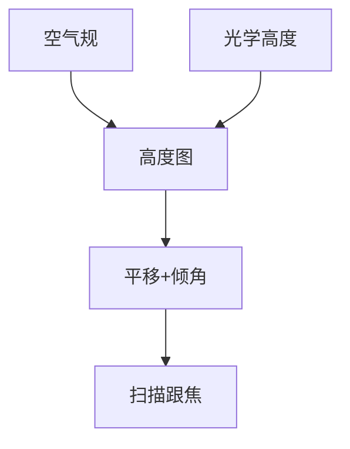

# 调平传感器与空气规

晶圆不是平面。调平要在扫描前把局部高度收进焦深；空气规用间隙气流测距，光学高度计看的是另一套反射。

<footer>—— 对照 level sensor / air gauge；[焦深](/litho/depth-of-focus)、[Focus drilling](/litho/focus-drilling)</footer>

[上一课](/litho/interferometer-vs-encoder)钉住 XY。缺口是 Z 与倾角：焦深在高 NA 下只有几十纳米量级，形貌必须测。本课钉调平与空气规，焦点伺服细节下一课。

## 问题

未调平的片：场内一侧在焦、一侧糊。光学高度计受薄膜栈反射率骗（假高度）；空气规近乎接触气隙，受气孔堵塞和表面多孔骗。只用一种，CDU 会在特定层上爆。

## 方法

扫描前测绘高度图，拟合平移+倾角，扫描中跟踪。空气规沿狭缝或多点。与浸没头的水膜厚度耦合：气隙测量不能破坏液膜。标定用已知台阶片。

空气规在真空 EUV 上不是同一硬件。本课默认浸没/干式 DUV 气隙；EUV 用光学或电容一类，后课 EUV 再点。

## 机制

气隙流量或压力与距离近乎单调，带宽高、对光学常数不敏感。光学测距带宽可以更高、不占机械间隙，但 $n$、$k$ 变了读数就漂——薄膜课的直接后果。

## 边界

下一课把高度图接到焦点传感与形貌的动态跟踪，不只是曝光前一张图。

## 小结

- 调平是焦深预算的测量前置。
- 空气规与光学高度计欺骗源不同，要互校。
- 出处：DOF 课；level sensor 通识。
