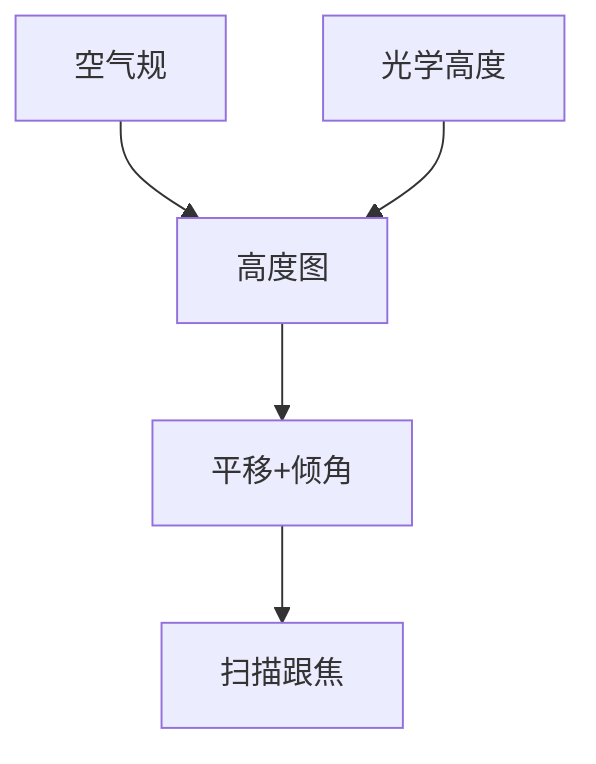

# 调平传感器与空气规

晶圆不是平面。调平要在扫描前把局部高度收进焦深；空气规用间隙气流测距，光学高度计看的是另一套反射。

<footer>—— 对照 level sensor / air gauge；[焦深](/litho/depth-of-focus)、[Focus drilling](/litho/focus-drilling)</footer>

[上一课](/litho/interferometer-vs-encoder)钉住 XY。缺口是 Z 与倾角：焦深在高 NA 下只有几十纳米量级，形貌必须测。本课钉调平与空气规，焦点伺服细节下一课。数量级先摆出来：按 $k_2\lambda/\mathrm{NA}^2$ 取 $k_2\approx0.5$，NA=1.35 时焦深约 50 nm，而片内台阶、CMP 凹陷、晶圆翘曲都是几十到几百纳米——不测地形，焦深一半以上直接送掉。

## 问题

未调平的片：场内一侧在焦、一侧糊。光学高度计受薄膜栈反射率骗（假高度）；空气规近乎接触气隙，受气孔堵塞和表面多孔骗。只用一种，CDU 会在特定层上爆。

展开说：光学高度计的光要穿过或反射自整叠膜，BARC、氮化硅、多晶硅的折射率与厚度都进读数，透明膜的双界面反射混在一起，读数是各界面反射的加权和——换一层膜，同一位置读出不同的「高度」，这就是按层出现的假高度，与 [薄膜反射](/litho/topography-reflection)一课直接同源。空气规不碰光学常数，但气流是它唯一的信息来源：喷嘴被颗粒堵了半个孔、多孔低 k 把气漏走、表面斜率把流量曲线带偏，都变成假距离；它的气隙是开放的，测量本身还可能扰动表面颗粒。两者的欺骗源正交——一个怕光学栈，一个怕气流路径——这正是互校的价值。

## 方法

扫描前测绘高度图，拟合平移+倾角，扫描中跟踪。空气规沿狭缝或多点。与浸没头的水膜厚度耦合：气隙测量不能破坏液膜。标定用已知台阶片。

具体顺序：曝光前沿扫描带采高度图，至少三点拟合活塞与倾角，残差图交给下一课的焦点伺服；狭缝上多个传感器要互相配准，配准漂移会伪装成场内倾斜。标定用已知台阶片，台阶值可追溯，周期并入机台校准循环；光学与空气规在同一参考片上比对，谁撒谎当场现形。浸没机台上调平在液膜铺开之前完成，测量路径避开浸没头，防止气隙扰动水膜、或反过来被水膜扰动。

```mermaid
flowchart TD
  MAP["高度图"] --> FIT["平移+倾角"]
  AG["空气规"] --> MAP
  OPT["光学高度"] --> MAP
  FIT --> SCAN["扫描跟焦"]
```

空气规在真空 EUV 上不是同一硬件。本课默认浸没/干式 DUV 气隙；EUV 用光学或电容一类，后课 EUV 再点。

## 机制

气隙流量或压力与距离近乎单调，带宽高、对光学常数不敏感。光学测距带宽可以更高、不占机械间隙，但 $n$、$k$ 变了读数就漂——薄膜课的直接后果。

再补一层：空气规的本质是通过隙缝的流导，压力或流量对距离的灵敏度在小间隙端最陡，所以它天生适合纳米级读数，代价是读数对「一切影响流导的东西」都敏感，不只是距离。光学高度计走三角法或共焦法，带宽高、不占机械空间，但读数永远是膜的相位与振幅的混合体；胶与 BARC 的工艺变更会整体搬移假高度偏置，所以每次换膜栈都要重新配准。两种传感器的带宽对扫描都够用，瓶颈反而在扫描速度对空间采样的限制——采样不足会把高频地形混叠进焦点图，那不是传感器错，是采样律错。

## 边界

下一课把高度图接到焦点传感与形貌的动态跟踪，不只是曝光前一张图。还有一条边界：平移+倾角只吃掉地形的一阶量，CMP 凹陷与碟形这类片内残余形貌要靠焦点图逐点补偿；晶圆本身的翘曲与吸附应力是另一层账（[晶圆应力与畸变](/litho/wafer-distortion-stress)），不要与传感器误差混算。

## 小结

- 调平是焦深预算的测量前置，几十纳米的焦深等不起。
- 空气规与光学高度计欺骗源不同，要互校。
- 出处：DOF 课；level sensor 通识。
