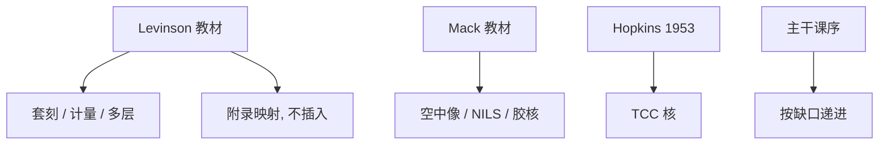

# Levinson 光刻原理

教材把扫描仪、胶、套刻、计量和多层工艺写成同一条产线语言；主干课按知识树拆开递进，书则按工程师手头的问题排章。

<footer>—— Harry J. Levinson, Principles of Lithography, SPIE Press（多版）</footer>

附录对照，不插入主干。[上一课](/litho/hopkins-1953-paper)对照了 1953 年的成像核。本篇对照 Levinson 的《光刻原理》：它是产线手册式教材，覆盖波长、RET、套刻、胶、计量与后道分层，**不是**本课程序列的替代目录。主干已按深度优先拆成单课；这里只标书与树的映射，避免把每一课重新从书的第一章写起。High-NA 光学论文对照留给[下一课](/litho/vanschoot-high-na-paper)。

## 问题

主干禁止百科：后课只补上一课缺口。Levinson 的读者却可能从任意章进入——先看 overlay 再看光学。附录的缺口是：如何引用这本书而不把树打乱。计算光刻专文用 Mack 收逆问题；Levinson 更偏设备、工艺窗、套刻预算和工厂计量。两本教材重叠在瑞利式与 RET，分工不同。

若把 Levinson 当主干，读者会在每一叶重复「光刻是什么」。本课只对照：书里哪些章对应已经写过的叶，哪些（如工厂组织）树里故意不单列。

### 与 Mack 的分工

Mack, *Fundamental Principles of Optical Lithography* 更咬空中像、NILS 与胶模型。Levinson 更咬扫描仪使用、套刻、掩模与多层选择。主干成像课序更靠近 Mack；[后道波长分层](/litho/beol-wavelength-mix)、[套刻](/litho/litho-overlay)、计量课更常点 Levinson。附录同时承认两本，不选唯一圣经。

引用时写书名与出版社即可。不要为教材发明 arXiv 或论文编号。

## 方法

对照表按树来读，不按书的页码背诵。光学与 $k_1$：对主干 [rayleigh-litho](/litho/rayleigh-litho) 与波长台阶。套刻与对准：对 litho-overlay、标记与热源课。胶与 CAR：对 CAR / 衬度课。计量：CD-SEM、OCD、套刻计量。多层与工具选择：对 beol-wavelength-mix。掩模：对二元/相移与掩模厂流程。

读法：需要产线词汇（on-product overlay、工艺窗、标记）时翻 Levinson；需要成像核与 NILS 时翻 Mack 或 Hopkins。计算光刻专文已经声明不编造内部小时数；Levinson 同样不提供某厂 OPC 产能。

### 版本

书有多版，设备世代会变，原理章相对稳。对照时以原理为准：套刻贡献源、波长不能连续拧、计量定义要声明。具体机型数字以 ASML 当时产品页为准，不要把旧版教材里的步进器规格写成 2026 年的 EXE。

## 机制

教材的机制是**横向索引**：同一条产线问题（窗口不够）会同时指向照明、胶、刻蚀和计量。主干的机制是**纵向缺口**：上一课留下什么，本课只补什么。两者合用时，书负责防止工程师只记得自己那一课，树负责防止每篇都从 Rayleigh 起笔。

后道分层是例子：Levinson 用专章讲不是所有层都用最短波长；主干把它收成 beol-wavelength-mix 一叶，接在接触孔之后。书不会按 GAA 再 ALD 再 DSA 的树顺序排——那是课程，不是教材目录。套刻章与对准/热源三课的关系同样：书把贡献源写在一处，树把它拆成策略、掩模热、晶圆热三叶，避免一课吞并三课。

SPIE Press 的教材不是期刊论文。出处写书，不要编 DOI 去冒充 1953 那种论文。

## 边界

本篇不插入主干，不把 Levinson 的章序改写成 sidebar。不摘录大段原文。不把书中某张过时的节点表当成 2026 年路线图。下一篇 van Schoot 是 High-NA 光学的公开论文对照，对应 [asml-high-na](/litho/asml-high-na) 那一叶，仍是附录。

出处：H. J. Levinson, *Principles of Lithography*, SPIE Press。与 Mack 2007 对照使用；均不替代课程序列。

## 小结

- 附录对照教材：产线词汇与多层工艺，不插入深度优先课序。
- 与 Mack（成像核）、Hopkins（TCC）分工，不选唯一课本。
- 引用原理，不把旧版机型表当现行规格。
- High-NA 公开论文下一篇。
- 出处：Levinson, *Principles of Lithography*, SPIE Press。
