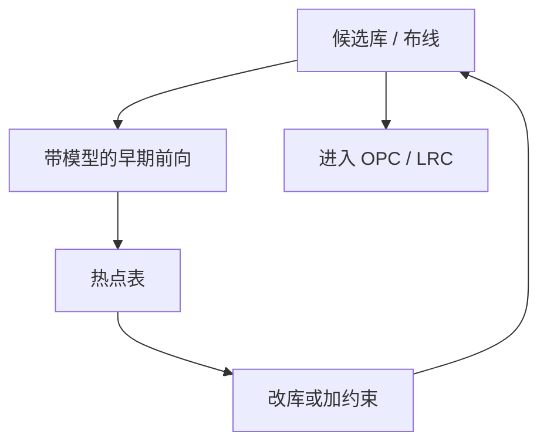

# 光刻友好设计 LFD

友好不是「画得好看」，是把单元和布线预先投影到可印、可分解、可转印的子集，让全芯片核少遇见必然失败的邻域。

<footer>—— 对照 Mentor Calibre LFD 一类工具的公开定位；DTCO 与光刻友好设计的产线通称</footer>

[上一课](/litho/full-chip-simulation-cost)把全场仿真收成算力合同。缺口是设计侧：若库和布线仍制造核修不回来的二维组合，再便宜的卷积也只是更快报红。[DTCO](/litho/dtco-patterning) 已在主干谈协同；本课钉 LFD 作为签核门的设计入口。哪些红是「长得像已知杀手」而不是再跑一遍仿真，留给[下一课](/litho/pattern-matching）。

## 问题

LFD（lithography-friendly design / litho-friendly design）把计算光刻前向接到单元库与布线阶段：在 TAPOUT 之前，用同一套紧凑模型抽检标准单元、SRAM、互连 clips，找出 PV-band 越界、桥连、线端缩短、via 覆盖不足。它不是第二套 DRC 几何规则，而是**带工艺模型的早期签核**。

缺口是**何时在设计里花仿真**，不是重写 SMO。[热点与 PV](/litho/hotspot-pv) 已定义什么叫先死的图形；LFD 问的是这些图形能不能在库冻结前被消灭，而不是留给 OPC 工程师通宵。

### LFD 不是放宽 DRC

有人把 LFD 理解成「模型说能印就允许破规则」。方向反了：LFD 用模型证明规则该更严、或该改成单向金属加切线。规则仍是合同；模型是产生与验证合同的仪器。把 LFD 当破例通道，签核版本会分裂。

LFD 用的模型必须与 OPC/LRC 同版本、同刻蚀核。用实验室 3D 去签库、用紧凑核去签芯片，友好会在全场蒸发。

## 方法

输入：候选库、布线方向约束、via 网格、多重分解选项。动作：对代表 clips 跑 OPC 级前向或快速 PV，输出热点表与建议（加间隔、改轨道、禁某 jog）。循环停在库 freeze，而不是每块产品版再发明一套友好。与 [SMO](/litho/smo) 的分工：SMO 优化光源与掩模；LFD 优化允许存在的多边形。

金属层尤其吃 LFD：二维拐角和 tip-to-tip 是全芯片账单的主要制造者。via 覆盖与下层金属协同，本课只点名，细节在本课序末课。

库 freeze 之后仍会有布线器生长出表外 jog。LFD 的日常形态是：新产品 TAPOUT 前对增量 clips 再跑一轮，而不是每夜全库。Calibre LFD 一类工具的公开定位正是这条「带模型的设计检查」，不是第二套光学引擎。SRAM 库与逻辑库必须分开跑 LFD：同一套「友好」在 bitcell 上可能非法。输出是带版本的约束文件，而不是一封邮件里的热点截图。

## 机制

设计多边形进入成像算子前，已被轨道高度、最小间隔、单向偏好投影。LFD 是这条投影的带模型反馈：前向说某 jog 在离焦下桥连，就从库里删掉，而不是指望 ILT 把 jog 修圆。算力课的含义是：删掉一个系统坏图形，等于少付全场每一处相似邻域的迭代。

冻结后的库进入全芯片，LRC 仍会见到布线器新组合。LFD 降低的是系统坏图形的先验密度，不是签发「布线后不必再查」。

## 边界

LFD 不替代全芯片 LRC，也不替代掩模 MRC。不把某 EDA 商标写成物理定律。随机缺陷率通常不在 LFD 默认目标里，除非明确加随机窗。

后课默认：库应在模型反馈下冻结；下一课用图形匹配把「已知杀手」从全场里廉价扫出来。

## 小结

- LFD 是带同一套光刻–刻蚀核的设计早期签核，用来冻结友好库。
- 它收紧或改写规则，不是发破例通行证。
- 删系统坏图形，直接降低全芯片仿真账单。
- 出处：Calibre LFD 公开定位；imec / 计算光刻对 litho-friendly 库的论述。
