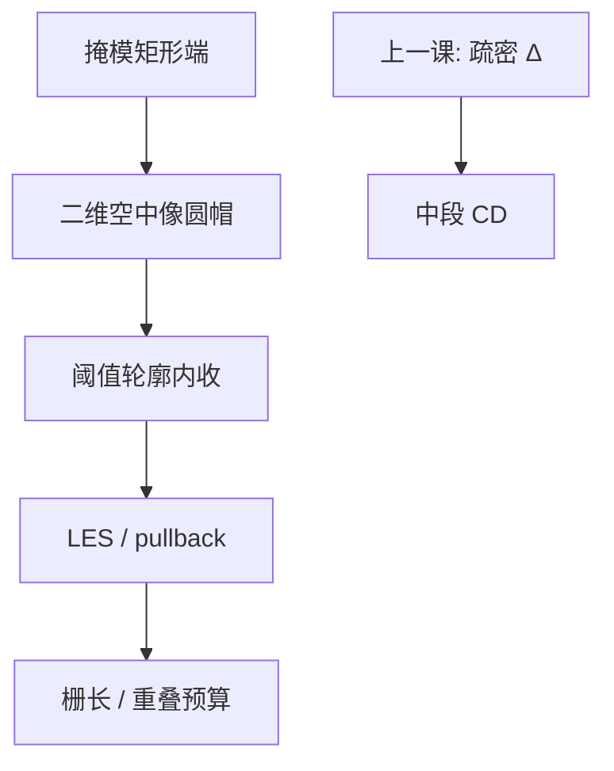

# 线端缩短

线还在，端已经往回收：二维衍射让等强度轮廓在开口终止处变圆，缩短不是「显影把头咬掉」的同义词。

<footer>—— 据 Mack 对 line-end shortening（LES）与二维邻近的论述整理</footer>

[上一课](/litho/iso-dense-bias)把 OPE 的一维切片钉成疏密偏差。缺口是开口沿长度方向终止的地方：同一条线的端头比中段短一截，规格上的栅长、金属重叠会先死在端上，而不是死在 pitch 曲线上。本课钉线端缩短（LES）。波长台阶与工艺流程从后课另起，这里不换光源史。

## 问题

疏密偏差比较的是「有没有左右邻居」。线端比较的是「这条线还在不在纵向」。掩模上画的是矩形端，空中像的等强度线在端头变成圆帽，阈值轮廓相对设计端面向内收，量到的长度小于画线长度。这个差叫 LES（line-end shortening），有时也报 pullback。

把它写成胶溶得太狠或刻蚀把头顶掉，会把光学低通误诊成轨道事故。一维 $\Delta$ 再小，端头仍可短到接触套刻预算不够。缺口因此是二维终止，不是再报一次 iso–dense。

### 缩短量不是端到端的 CD

LES 量的是纵向位置：设计端面到实际等 CD 轮廓的距离。横向线宽仍可以合格。只抽中段 CD 的计量会看不见缩短。SRAM 与逻辑的栅端、金属线端对重叠敏感，签核必须有端头测点，不能用中段 CD–pitch 代替。

光学直径大约几个 $\lambda/\mathrm{NA}$。端头邻域里有没有对面的另一条线、有没有助条，缩短量差一截。报 LES 要声明对面间隙与照明，不能只报「线端短了几纳米」。

## 方法

量测：画一组变长度、变对面间隙的线端，同一剂量焦点下用 CD-SEM 量端面位置（或量缝的残留长度）。得到 LES–间隙、LES–焦点曲线。离焦时二维轮廓更圆，缩短通常变本加厉——这是焦窗在端头比在长直线上更瘦的原因。

模拟：在已经用过的 TCC 上放有限长线，看阈值轮廓相对多边形端面向内多少。不必重推 Hopkins。对比「无限长线」与「有端」的差，就是光学 LES。胶扩散会再收一截，刻蚀会再收或再放；拆法与上一课相同：改照明、改对面间隙，光学项先动。

### 修版只点到为止

锤头、衬线、端头加宽是后课 OPC 对 LES 的逆。本课只要求看懂：端头要额外的掩模面积，是因为像已经圆了，不是因为多边形画短了。若在这里排规则表，会把计算光刻提前做完。

## 机制

有限口径丢掉高频，直角端的傅里叶分量进不了瞳。能量从亮线漏进端面以外的暗区，等强度线变圆，就像低通滤波器抹角。对面若有另一条线，暗缝的光互相灌，缩短与桥连是同一枚硬币的两面：间隙太窄先桥，间隙略宽则两端对拉。照明 σ 改变哪些对角频率进得去，LES 随光瞳变，不是胶批次常数。

Mack 把 LES 放进二维 OPE，而不是放进显影动力学：显影会放大已经变钝的端，但根是空中像。CAR 的酸扩散再卷积一个核，端头曲率半径变大，缩短加一截；那是抗蚀剂课的账，本课先把光学项钉住，禁止把全部 LES 写成 PEB。

套刻把两层端对端的重叠写成预算时，LES 是系统偏置，overlay 是随机与指纹。先把缩短量进 OPC 目标，再谈扫描机 overlay，不要把端头短写成「对不准」。

## 边界

本课不写 ILT 曲线端、不写 MRC 对锤头的限制、不把某代 SRAM 的纳米缩短当所有 λ/NA 的常数。孔和切缝的「端」是另一类二维图形，后课切层再遇，不在这里用线端公式硬套。

计量：SEM 充电与收缩在端头更明显，因为面积小、电荷路径差；后课 SEM 伪影会展开，本课只提醒端头测点的算法阈值要与中段 CD 分开标定。波长一换，光学直径换，LES 曲线要重测。

疏密偏差可以把剂量当公共旋钮；LES 往往还要单独的端头偏置，因为端面的 ILS 与中段不是同一条剖线。后课 OPC 会把这两件事分成不同的边类型，本课先禁止用一个 $\Delta$ 去代表端头。

## 小结

- LES 是二维衍射造成的端面内收，与一维疏密偏差不是同一个切片。
- 中段 CD 合格，端头仍可吃掉栅长与重叠。
- 对面间隙、焦点、照明都改缩短量；光学项先于胶与刻蚀。
- 锤头是后课 OPC 的逆，本课只承认前向圆帽。
- 不要用一个疏密 $\Delta$ 代表端头；端面 ILS 与中段不是同一条剖线。
- 出处：Mack, *Fundamental Principles of Optical Lithography*。
