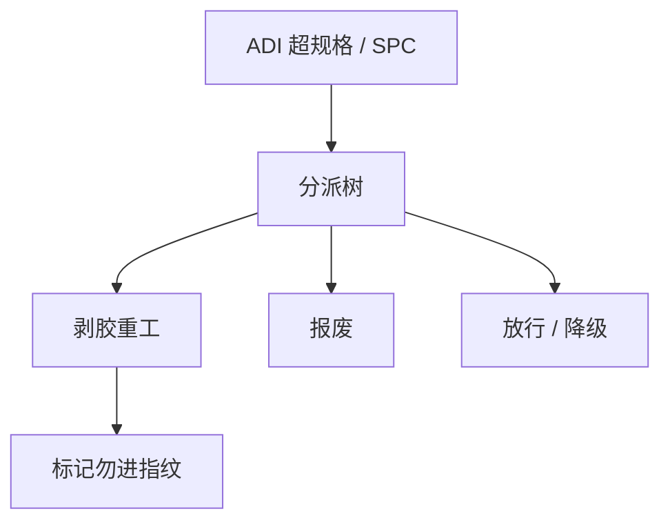

# 批次分派与重工

超规格的批要决定：放行、重工、降级还是报废。分派是良率与周期的交叉口，不是控制图上的一个红点。

<footer>—— 对照晶圆厂 lot disposition 与光刻重工（剥胶再曝）的产线通称</footer>

[上一课](/litho/high-order-field-correction)把能补的高阶用尽。缺口是决策：残差仍超、或 SPC 异常、或检测出缺陷，批次去哪。本课钉分派与重工。计量机台之间如何可比，留给[下一课](/litho/metrology-matching）。

## 问题

光刻重工通常是：显影后（或未刻蚀）剥胶、再涂、再曝。套刻或 CD 在 ADI 超规格时，重工可能划算；AEI 后重工变成刻蚀后，成本跳到报废或额外掩模。分派还含：扣留待加密计量、在替代机台重曝、降级到宽松产品。错误放行把风险送到测试；过度重工伤胶与衬底、吃产能、引入二次缺陷。

缺口是**决策树**，不是再讲 SPC。APC 限幅后的批默认扣留，而不是自动重工——可能是刻蚀问题。PWQ 场绝对不能当量产放行。

### 重工改变历史

重工片的热、应力、对准标记经历不同，套刻指纹可能变。R2R 应标记重工片，避免用它们更新机台指纹。胶剥离对 EUV 底层和疏水表面有损伤风险，次数要有上限。

边缘球与再涂均匀性往往比第一次差。重工后抽样应加密，而不是沿用标准计划。

## 方法

树：计量类型（CD/套刻/缺陷）× 轮廓（ADI/AEI）× 是否可剥 × 规格距离 × WIP 优先级。输出：放行、重工、报废、降级、工程分析。与轨道：剥胶路径、再涂食谱。与扫描机：是否换机重曝（匹配课）。记录：分派代码进追溯，供良率学习。

工程分析路径要有时限：扣留不是无限停车场。代码应能 join 到缺陷类和 APC 限幅事件，否则学习曲线看不到「因何重工」。SEMI 工厂系统对 lot 状态的接口，就是为了让这棵树可审计。

## 机制

期望损失 = P(测试失败)×成本 + 重工成本 + 周期惩罚。悬崖边的批，加密抽样降低误放行。系统缺陷（错版、错色）重工有效；随机缺陷重工可能只换一组光子，期望收益小——随机良率课再定量。

重工片必须打标，以免 APC 把再涂指纹当成机台稳态。随机缺陷重工只是换一组抽签，期望收益有限。

## 边界

本课不写测试程序。不规定某厂的重工次数上限数字。AEI 后「重工」往往不是光刻重工。

后课默认：ADI 超规格才谈剥胶；重工片不更新稳态指纹。下一课保证做分派用的计量在机台间可比。

## 小结

- 分派是放行/重工/报废树，按 ADI/AEI 与缺陷类型分支。
- 重工片要标记，以免污染 APC 指纹。
- 随机缺陷重工收益有限。
- 出处：晶圆厂 disposition 与 litho rework 通称；SEMI 工厂系统对 lot 状态的接口。
