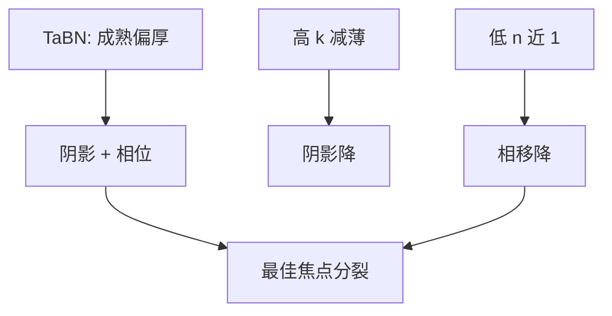

# 低 n 吸收体

吸收体的 n 若贴近真空，厚度带来的相移和三维电磁变弱。减薄不再只靠加 k，也可以靠把折射率拉回 1。

<footer>—— 对照 Philipsen、van Setten、imec 对 low-n EUV 吸收体的公开讨论</footer>

[上一课](/litho/reticle-backside-particles)收束掩模台背面。缺口转到版正面：挡住多层反射的那一层，其复折射率 $(n,k)$ 决定阴影、相位和最佳焦点。[吸收体材料](/litho/euv-absorber-materials) 已把 TaBN 与高 k（如 Ni）路线分开；本课专攻低 n——让 $n\to 1$，三维相位税下降。相移掩模作为主动利用相位的另一条路，留给[下一课](/litho/euv-phase-shift-mask）。

## 问题

钽基吸收体要足够厚才压住 13.5 nm，厚度 × CRA 给出几何阴影，n 偏离 1 又给出额外相移，空中像的最佳焦点随节距走。高 k 路线用更薄的膜换同样光学密度，阴影缩短，但刻蚀与缺陷链要重建。低 n 路线从相位端动手：即使厚度暂不能减到 Ni 那么薄，只要 n 接近真空，掩模作为相位物的权重下降，HV 偏置和焦面分裂减轻。

缺口是把 n 从材料表里单独提出来，而不是再列一次谁在量产。High-NA 角更大，同样的 n–厚度乘积更不可接受。

低 n 和高 k 不是互斥口号。理想吸收体是高 k 且 n≈1 且可刻、可检。公开讨论里往往只能先抓住一维。

## 方法

光学筛选：在 13.5 nm 查材料的 $n+ik$，目标 k 够大以减薄，n 靠近 1 以减相移。候选在会议文献中包括某些氮化物、合金和多层吸收体，资格以掩模厂能否沉积、干法出侧壁、在 DUV/电子束下有检测衬度为准。OPC 的 M3D 库必须用新 n、k 重校准；把 TaBN 的紧凑模型改个名字会系统性偏。

与变形倍率一起看：掩模侧角度被压回多层窗之后，剩余 CRA 仍要吸收体配合。低 n 是给剩余角的相位余量。

### 检测衬度是材料资格的第三轴

n、k 好看但在 DUV 检验或电子束下看不见，缺陷会漏到光化甚至硅片。低 n 材料往往衬度也低。掩模厂工具链接不住，光学优势落不到量产。材料表至少三列：13.5 nm 的 n/k、刻蚀选择比、检验衬度。缺一列就还是实验室膜。

## 机制

Kirchhoff 薄屏假设吸收体只有透过率 0/1。实际电磁里，膜内光程 $(n-1)t$ 和吸收 $kt$ 一起改复振幅，侧壁导波和顶部倒角再叠加。n→1 时，厚度主要当吸收长度用，相位物体变弱，通过焦点的 CD 曲线更接近「纯振幅掩模」。Finders、van Setten、Philipsen 等把焦面偏移和 PV-band 对吸收体光学常数的灵敏度写成 M3D 的核心图像。

不要把某张实验室低 n 膜的 n、k 写成量产规格。本课钉机制：n 管相位，k 管能薄多少。

## 边界

本课不把相移掩模的 180° 槽写完，下一课才主动用相位。不重写掩模厂钽刻蚀食谱。n、k 表换了，紧凑 M3D 库整库作废，不能只改 OPC 偏置常数。出处：Philipsen / imec low-n absorber；van Setten、Finders M3D；吸收体材料课。

## 小结

- 低 n 减轻吸收体作为相位物的权重，从而减轻焦面分裂与部分 3D 偏置。
- 与高 k 减薄是同一张材料预算的两个轴。
- 下一课：若相位不可避免，能否把它做成相移掩模。
- 出处：Philipsen、van Setten、Finders；imec / SPIE 公开讨论。
