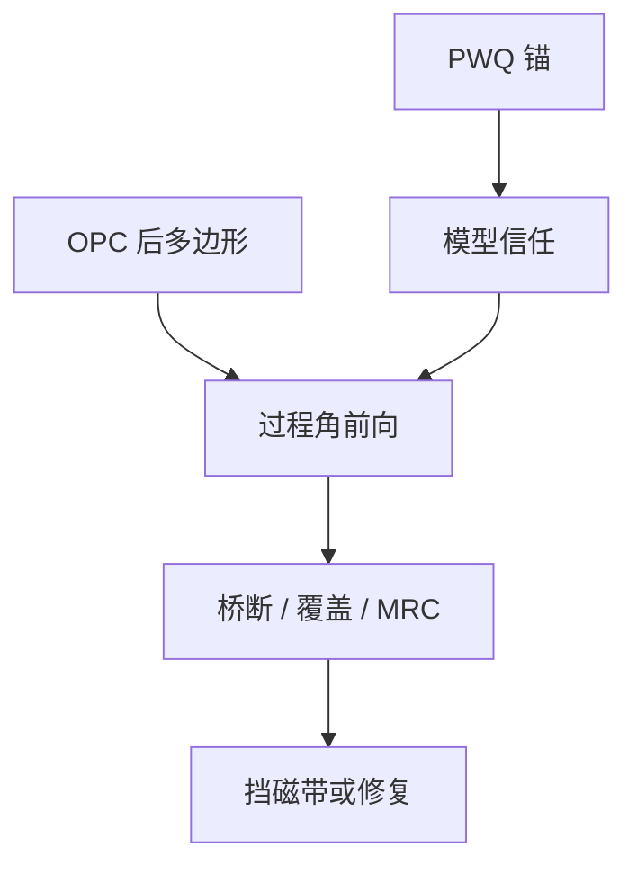

# LRC / ORC

OPC 负责把边推进目标；LRC 负责在交货前用同一套核再问一遍：过程角上还有没有桥、断、覆盖和 MRC 违约。

<footer>—— 对照 lithography rule check / optical rule check 在计算光刻签核链中的公开定位</footer>

[上一课](/litho/pwq)用硅上矩阵锚定缺陷窗。缺口是全芯片：不能对每块磁带都做 PWQ 矩阵。本课钉 LRC / ORC（lithography / optical rule check）——模型驱动的全场或准全场检查。哪些越界可以靠学习模型先排序，留给[下一课](/litho/ml-hotspot-prediction）。

## 问题

OPC 收敛不等于可印：名义点贴目标时，PV-band 仍可能桥连、via 覆盖见光、SRAF 违 MRC、颜色分解后间距不够。LRC 在 OPC 之后、掩模书写之前，用签核模型扫轮廓与规则，输出热点表。ORC 是同一家族的光学侧称呼；有的流程把 MRC、着色、覆盖分项并进同一检查甲板。

缺口是**签核门**，不是再跑一次 OPC 迭代。LRC 失败应挡磁带，而不是开一张「已知问题」的无限豁免。与 [MRC](/litho/mask-rule-check) 分工：MRC 问掩模厂能否写；LRC 问晶圆上过程角能否活。

### 检查点不是优化点

把 LRC 判据直接当 OPC 成本，循环会在规则与 EPE 之间振荡。实务是 OPC 用平滑目标，LRC 用硬阈值加人工/自动修复。PW-OPC 已经把窗带进优化；LRC 仍要独立跑，因为修复、fracture、MPC 之后几何会再变。

LRC 必须声明轮廓：ADI 还是 AEI、含不含套刻偏移、含不含随机判据。只报名义 CD 的 LRC 是空门。

## 方法

输入：OPC 后多边形、同一版本紧凑核、过程角集合（剂量、焦点、掩模偏置，有时套刻）。动作：仿真轮廓 → 量桥/断间距、CD、覆盖、PV-band 厚 → 对照规格。输出：按层、按单元、按密度分区的热点。与算力课衔接：过程角集合是账单旋钮；角太少，签核假绿。修复：局部重 OPC、改设计、或升格严格仿真确认误报。

与 PWQ 对照：LRC 是模型代理，PWQ 抽检代理是否撒谎。两者热点应可互译。

检查甲板按层定制谓词：孔层重打开与覆盖，金属层重桥/断与 tip，切线层重套刻角。全球一套「最小间距」会漏掉层的主失效。Mentor / Synopsys 公开检查流把光学、MRC、着色分模块，签核仍要一张总门。

## 机制

轮廓由卷积核产生，检查是几何谓词（最小间距、包围、面积）。谓词在过程角上取最坏情况，等价于对 PV-band 做布尔。着色冲突、SRAF 放置失败会在更早的分解/OPC 步出现，但 LRC 是最后一次全场几何+光学联合。漏检的主因是模型残差，不是检查器「不够严」——残差课已经要求看空间相关；本课只要求 LRC 规格与残差图一起读。

LRC 绿灯的含义是：在声明的过程角和核版本下，谓词未触发。换胶或换刻蚀核而不重跑，绿灯作废。这与模型残差课的「版本合同」是同一句话，写在磁带门上。

## 边界

LRC 不替代等离子体腔体签核，也不覆盖颗粒与随机光子。不把某 EDA 模块的「零热点」宣传当物理。曲线掩模的 LRC 谓词与曼哈顿不同，规格要重写。

后课默认：磁带前有模型全场门；下一课用学习模型给热点排序，不取代这扇门。

## 小结

- LRC/ORC 是 OPC 之后的过程角全场检查，挡的是磁带而不是再优化一圈。
- 轮廓定义（ADI/AEI、套刻、随机）必须写进门。
- 与 PWQ 互译；残差大则门不可信。
- 出处：计算光刻 LRC/ORC 签核通称；Mentor / Synopsys 公开检查流。
