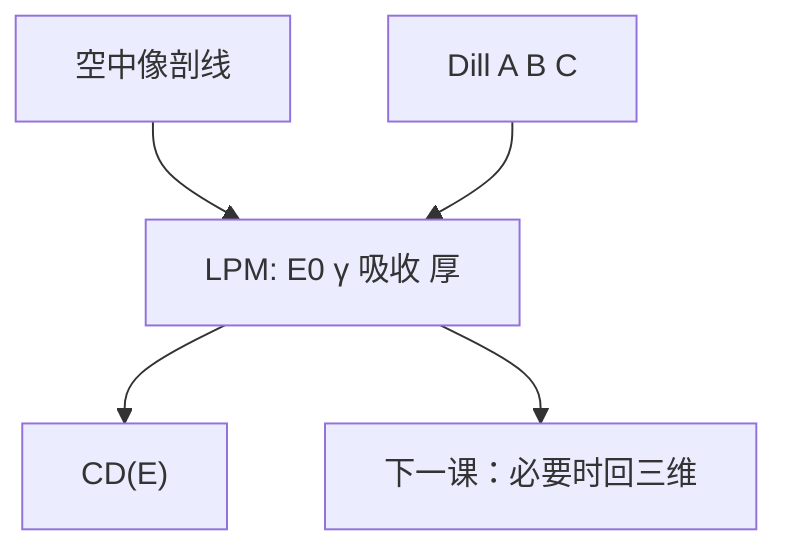

# 集总参数模型

不必每次都解三维反应–扩散加溶解前沿：把胶收成对比、清场剂量与有效厚度几个数，也能预言 CD 对剂量怎么走。

<footer>—— C. A. Mack，光刻集总参数模型（LPM）；亦见 *Fundamental Principles of Optical Lithography*</footer>

[上一课](/litho/development-rate-model)把浮雕写成 $R(m)$ 的三维积分。缺口是：曝光矩阵要扫的是 CD 对剂量（以及后课的焦），全 PDE 对手算和快速 OPC 过重。本课钉 Mack 的集总参数模型（lumped parameter model, LPM）。三维轮廓仿真何时必须回去，留给[下一课](/litho/resist-profile-simulation）。

## 问题

LPM 的想法：沿厚度把吸收、漂白、显影时间收成有效剂量与有效速率，再用胶衬度把空中像强度映射到边位置。典型输入包括 $E_0$ 一类清场锚点、衬度 $\gamma$、胶厚与吸收，输出是给定空中像剖线下的 CD。它不声称侧壁波纹、残胶形貌或倒塌。

缺口不是再定义 $\gamma$——主干[衬度曲线](/litho/resist-contrast-curve)已经定义——而是承认：产线大量「剂量–CD」预言走的是这条降阶链，不是每场解 RD。把 LPM 当成「没有物理的拟合直线」，会在换胶厚或换 $B$ 时不知道该动哪个集总量。

### 集总掉的是 $z$，不是光学

空中像 $I(x)$ 仍来自 Hopkins / TCC。LPM 集总的是胶对这条剖线的响应。离焦改的是 $I(x;z_\mathrm{focus})$，可以送进同一 LPM，于是 Bossung 能被近似画出来——精度止于「厚度方向已经被平均」。驻波很强时平均撒谎，必须回到上一课的分层 $R$。

LPM 与 OPC 的 CM1 可变阈值是亲戚：都把胶收成少参数。CM1 面向全芯片二维环境；LPM 面向一维剖线与工艺直觉。不要把两个商品名考据成互斥物理。

## 方法

标定：大垫测 $E_0$、$\gamma$、厚与 ABC；密线测一组 CD(E) 修有效参数。预言：取空中像阈值附近的 ILS，用集总衬度估计 $\Delta\mathrm{CD}/(\Delta E/E)$。这与 [NILS](/litho/nils-ils) 课的光学预言同构，差别是 $\gamma$ 与吸收已经折进有效斜率。

换 BARC、换胶厚，先改光学 $I(z)$ 的积分，再改 LPM 的有效 $E_0$。只拧「阈值强度百分比」而不改吸收项，是把薄膜课的 swing 藏进胶参数，换衬底就会炸。

## 机制

清底要求沿 $z$ 的剂量积分够把 $m$ 降到 $R$ 能在给定时间内挖穿。集总把这道积分换成「有效剂量 ≥ $E_0$」。边的位置由横向强度落到有效阈值之处决定；$\gamma$ 越大，有效阈值越接近开关，CD 对 ILS 越敏感。吸收 $B$ 大，底部有效剂量低，同一表面强度下 $E_0$ 抬高——薄膜高 $k$ 的 EUV 胶尤其如此，上一课程的薄膜效应在这里变成 LPM 的一个数。

酸扩散核可以再集总进「有效模糊后的空中像」，然后才进阈值。顺序不能反：先阈值再模糊，边会偏锐。

Mack 原文 LPM 针对 DNQ 正胶与接触/邻近印刷的剂量响应。CAR 仍可用同一骨架，但 $E_0$ 强烈依赖 PEB，集总参数必须与烘箱绑定。

## 边界

LPM 不预测 LWR、不预测缺孔尾、不预测三维 footing。下一课的轮廓仿真补几何；随机单元补计数。也不要把 LPM 的 $E_0$ 与扫描机剂量传感器读数混成一个校准——传感器在光学，LPM 在胶。

High-NA 胶厚预算已经很薄，沿 $z$ 可集总的东西变少，LPM 误差相对变大，更常要轮廓仿真。

## 小结

- LPM 把 ABC、厚度、$\gamma$、$E_0$ 收成剖线级 CD 预言。
- 集总的是胶的 $z$ 向积分，不是 TCC。
- 驻波强、要侧壁或残胶时，回到三维 $R$。
- CAR 的 LPM 必须与 PEB 绑定。
- 出处：Mack 集总参数模型；*Fundamental Principles of Optical Lithography*。
