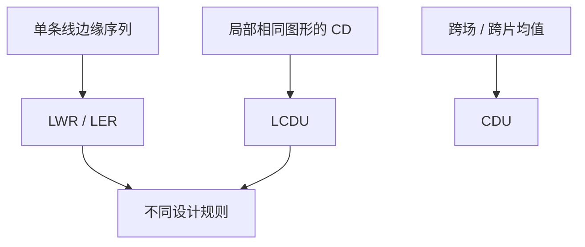

# LWR 与 LCDU

LWR 问一条线沿自身有多毛；LCDU 问一簇相同图形的局部线宽有多散。一个 $3\sigma$ 不能两用。

<footer>—— 据 ITRS / 计量通称对 LWR 与 local CDU 的区分，以及 Mack 对 LER 的讨论整理</footer>

[上一课](/litho/acid-diffusion-lwr)把酸扩散长度写成潜像的模糊核，并定义了 LER / LWR。缺口是：产线规格里还有一个常被混写的「局部均匀」——LCDU。平均 CD 的跨片均匀（CDU）是另一张图。本课把线宽粗糙与局部 CDU 拆开。显影怎样按剂量切厚度，留给[下一课](/litho/resist-contrast-curve)。

## 问题

上一课的 LWR 是**同一条线**沿线方向宽度的涨落；LER 是单侧边缘。计量要声明取样长度与滤波（ITRS 路线图常用数微米线长上的 $3\sigma$ 量级定义，具体窗随世代变）。缺口是：孔阵、短线段、局部一簇相同线的 CD 互不相同，并不是把 LWR 换一个名字。

LCDU（local CD uniformity）量的是短距离内、许多个名义相同图形的 CD 分布，孔层尤其常用。它含光子/化学随机、局部剂量、掩模局部 CD，也含 SEM 噪声。把孔的 LCDU 写成「孔的 LWR」，几何对象已经错了：孔没有「沿线的两条长边」这套取样。

### 频谱不同，拧的旋钮不同

LWR 的高频段更像酸核、聚合物与显影前沿的随机；低频段更像剂量、flare、掩模。LCDU 作为一簇图形的均值差，更重局部平均：掩模局部误差、光学局部对比、随机的低频分量。只报一个纳米数，不知道该拧 PEB、加剂量，还是去查掩模。

两侧不相关时 $\mathrm{LWR}\approx\sqrt{2}\,\mathrm{LER}$，上一课已经警告过长相关会打破它。LCDU 与 LWR 没有普适倍数。规格必须写量的是哪一个、线长或孔数、滤波。

## 方法

线：CD-SEM 沿边取样，按协议算 LER/LWR，必要时给功率谱。孔：在局部窗口内量许多个孔的 CD，取 $3\sigma$ 得 LCDU。取样窗口太小，统计不稳；太大，会把真正的跨场 CDU 偷运进来，「local」就名不副实。跨场、跨片的均值变化叫 CDU，不要与 LCDU 抢缩写——local 指空间尺度，不是「本厂内部」。

ITRS / IRDS 把这些量分列，是因为它们进不同的设计规则：线的高频毛边打漏电与击穿；孔的 LCDU 进接触电阻与随机失效尾。EUV 随机课会把 LCDU 与光子泊松绑紧；本课在 DUV CAR 上也要保留这个词，以免计量语言到 EUV 才突然出现。同一层上，线可以报 LWR、孔报 LCDU，禁止用其中一个签核另一个。

### 与酸核的关系

$\ell$ 压高频 LWR，也糊掉平均边缘，可能把 iso–dense 一起挪走。它对 LCDU 的帮助取决于 LCDU 的主导项：若是对比不足把随机放大，加 NILS 比加 $\ell$ 更对症；若是掩模局部 CD，OPC/掩模厂比 PEB 有用。本课要求报数时声明对象，而不是再给一条扩散公式。

## 机制

阈值切在缓坡上时，同一化学噪声既抬 LWR 也抬 LCDU：NILS 是公共放大器。酸扩散是低通：砍毛边的高频，也砍平均像的锐度。剂量低频让一簇孔的均值一起漂，LCDU 里会出现「看起来随机、其实是局部剂量」的成分，要用功率谱或与剂量图相关来拆。

刻蚀后 LWR 与 LCDU 都会变，转移函数与 [ADI/AEI](/litho/adi-aei) 平行：必须声明量的是胶上还是硅上。SEM 收缩对细线 LWR 尤其捣乱，协议要冻。

不要用跨片 CDU 的合格来宣布 LWR 合格，也不要用一条线的 LWR 去签核孔层。ITRS 把它们分开，就是为了禁止这种偷换。

## 边界

本课不写 EUV 92 eV 的泊松公式，不把某代 ITRS 表上的 3.0 nm 抄成今日规格。也不展开溶解噪声的第二套谱——下一课讲平均 $\gamma$，切得越陡，缓坡噪声越像台阶，LWR 权重会变。那是衔接，不是本课把显影模型写完。

掩模 LER 是固定图案，会混进「看起来像 LWR」的量；分析时要能对拍重复曝光。本课只要求承认有这项，细节在掩模课。

下一课的 $\gamma$ 会改变同一噪声在边缘上的权重：切得越陡，缓坡上的涨落越像台阶。报 LWR 时要声明显影条件，不能只报 PEB。

## 小结

- LWR/LER 是单线沿边的粗糙；LCDU 是局部一簇相同图形的 CD 散度；CDU 是大尺度均值均匀。
- 无普适换算；必须声明长度、孔数、滤波、ADI 还是 AEI。
- NILS 与 $\ell$ 对两者都有影响，但主导项可能完全不同。
- 刻蚀后要重报；SEM 协议（线长、滤波、收缩）必须冻。
- 下一课用衬度曲线切平均厚度，不再重定义这三项。
- 出处：ITRS/IRDS 计量通称；Mack 对 LER/抗蚀剂模糊的讨论。
