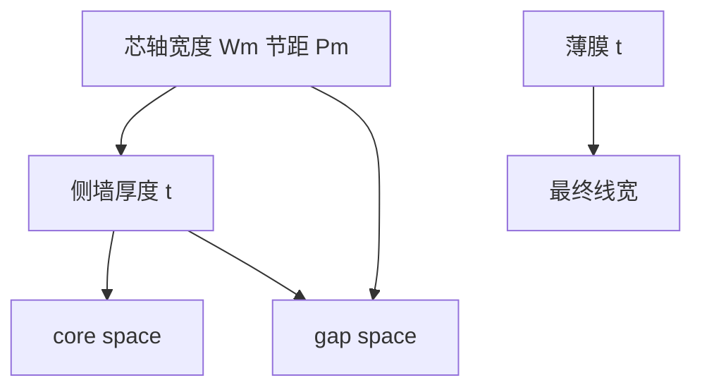

# 芯轴与侧墙

自对准双重的几何很具体：一次光刻做出疏的芯轴，保形膜在侧壁留下侧墙；线宽跟薄膜厚度走，不跟第二次线层曝光的套刻走。

<footer>—— 据 Bencher 等公开的 SADP / spacer 工艺几何，以及上一课 SADP–SAQP 的流程框架</footer>

[上一课](/litho/sadp-saqp)说明了为什么用 spacer 把节距劈开、以及切线如何把套刻请回来。缺口是芯轴（mandrel）与侧墙的几何定义：谁决定最终线宽、core space 与 gap space 各吃哪一项误差。节距漂移（奇数/偶数间距）留给[下一课](/litho/pitch-walking），本课先把理想几何钉死。

## 问题

上一课的流程图已经有「沉积 → 回刻 → 去芯轴」。产线还要把多边形对上薄膜：正侧墙方案里，留下的是芯轴两侧的 spacer，去掉芯轴后得到成对线；负侧墙 / 反相则改变谁当掩模往下刻。若把 SADP 只理解成「节距减半」而不画芯轴宽度 $W_m$ 与 spacer 厚度 $t$，就无法写出两种 space。

缺口因此是工艺几何，而不是再论证自对准对 LELE 的 $\delta$ 免疫。没有 $W_m$ 与 $t$，下一课的 pitch walking 没有变量可走。

### 两种间隔

理想一维：mandrel 节距 $P_m$，目标线节距约 $P_m/2$。芯轴侧间隔（core）由 $W_m$ 与内侧 spacer 位置决定；相邻芯轴之间的间隙侧（gap）由 $P_m-W_m$ 与外侧 spacer 决定。两根成对 spacer 的内间距不吃线层二次 overlay；gap 吃 mandrel 光刻的 CD 与节距均匀性。这就是「自对准」的边界，上一课已定性，本课把它写成几何。

Bencher 等在 SPIE 等公开场合把 CVD / ALD spacer 双重图形写成可转移到 20 nm 量级半节距的工艺模块。引用的是工艺几何与模块，不是某厂节点良率。

## 方法

正 spacer：光刻+刻蚀 mandrel → 保形沉积（常 ALD）厚度 $t$ → 各向异性回刻留侧墙 → 去 mandrel → spacer 当掩模转印。最终线宽首先跟 $t$ 与回刻偏置走，其次跟转印刻蚀选择比走。Mandrel CD 主要调 core space，而不是直接当最终线宽（除非用负方案把 mandrel 当留下的线）。

SAQP：第一轮 spacer 图形再充当下一轮的芯轴或再长一层侧墙，节距再近乎减半。每一轮 $t$ 都进入最终 CD。切线可以切 mandrel（先切后长）或切最终线（后切），几何不同，套刻对象不同，切断课再展开。

### 与 LELE 着色对照

LELE 靠[颜色分解](/litho/lele-color-decomposition)把相邻线分到两张版。SADP 的相邻成对线同一次薄膜定义，没有第二色线层。Mandrel 层自己仍是普通 DUV（或后来的 EUV）光刻，要满足芯轴节距的 $k_1$，OPC 按疏一倍的节距做。

## 机制

侧墙内边缘贴着芯轴侧壁，所以左右 spacer 不能被第二次线曝光相对滑开。Mandrel 宽度误差：芯轴变宽，core space 变（对正方案通常变窄或按定义变化），两根线作为一对仍贴在同一芯轴上。Gap 则对 mandrel 节距与相邻芯轴 CD 敏感。薄膜晶圆内均匀性直接变成线宽 CDU，这是 ALD 进鳍工艺的原因。

回刻必须各向异性且对顶面清除干净，否则顶上残留把 CD 放大，或侧墙脚不对称。选择比不足时，转印把几何优势吃成刻蚀偏置——上一课边界已点名，本课要求把它算进 $t$ 的有效值。

Mandrel 节距仍受单次 $k_1$ 限制，这是上一课已经写过的。本课补的只是：最终线数约两倍（SADP）或四倍（SAQP）于芯轴条数，线宽却不再等于芯轴 CD。把芯轴 OPC 的目标 CD 当成鳍宽，是读错几何。

「线宽由沉积厚度定义」是一阶。脚型、微负载、开口比会让有效 $t$ 随局部密度变。阵列边缘与芯片中心要分别标定。

## 边界

二维 T 型结、任意宽度金属，侧墙闭合环很难自然生成。本课对象是固定节距一维栅。不要把会议里的 SADP 演示层写成全芯片金属都已 spacer 化。SAQP 的「哪一轮定义哪条边」更绕，设计规则更长，仍不在本课展开四重的全部变体。

下一课专门处理 core 与 gap 统计上不相等——那就是节距漂移。本课理想几何允许两者按设计做成相等，但上线后通常不等。

芯轴光刻的 LER 会传到侧墙位置。薄膜不能抹掉线边粗糙度，只会把侧壁形状保形复制一截。

## 小结

- 芯轴提供侧壁；侧墙厚度定义一阶线宽；成对线自对准。
- Core 与 gap 两种 space 吃不同误差源。
- 正 / 负 spacer 改变谁留下，几何思想相同。
- 不重写 SADP 动机；不提前讲奇数偶数计量。
- 出处：Bencher 等公开 SADP；上一课 spacer DP 流程。
