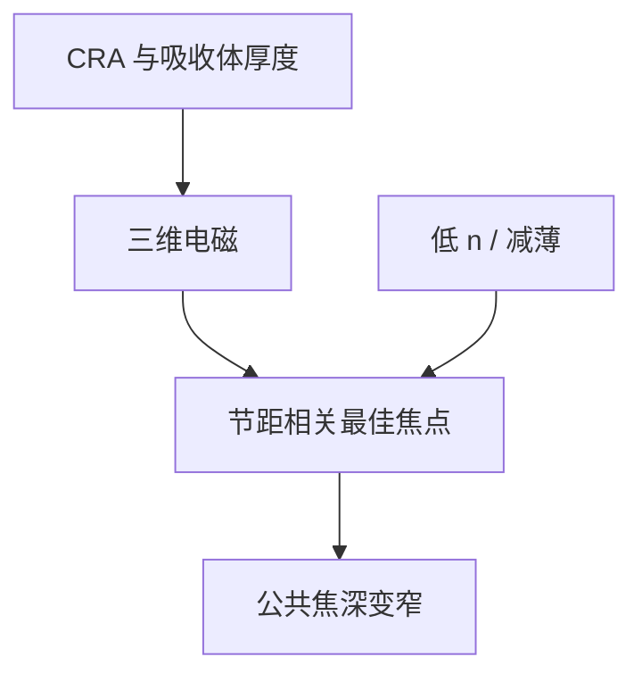

# 掩模 3D 与最佳焦面偏移

斜入射穿过有厚度的吸收体，等效光程随节距和方位变。最佳焦点不再是「镜头离焦零」，而是图形自己的函数。

<footer>—— 据 Finders、van Setten 对 EUV M3D 与 best-focus shift</footer>

[上一课](/litho/black-border)把场外弄黑。缺口回到场内图形：[斜入射阴影](/litho/euv-oblique-shadow) 已经给出 HV 偏置；本课专攻它在焦轴上的表现——不同节距、不同方位的最佳焦点（best focus, BF）彼此错开。掩模粗糙如何再给边沿加噪声，留给[下一课](/litho/mask-roughness)。

## 问题

阴影课把 CRA × 厚度写成横向有效开口。电磁上，膜内相位和侧壁导波还把波前的倾斜与离焦混在一起。结果是 Bossung 曲线的顶点随节距移动：密集线的 BF 和孤立线的 BF 可以差数十纳米量级（公开讨论的是量级与趋势，随材料与 NA 变）。镜头把焦面放在「平均零」，总有一类图形在窗外。低 n 吸收体减轻这项；厚 TaBN 加重；High-NA 更大角再加重。

缺口是把 BF 偏移从阴影的横向故事里拆出来，写成轴向预算。胶厚课已经警告 High-NA 焦深变薄；掩模 3D 把这张窗再切碎。

不要把 BF 偏移修进工件台的静态离焦。它随图形变，一层里同时存在多个「最佳焦」。能做的是减吸收体 3D、OPC 分图形补偿、以及照明设置协同。

## 方法

量测：通过焦点的 CD 矩阵，按节距/方位抽 Bossung 顶点。仿真：RCWA/FDTD 或校准过的 M3D 库，含偏振和沿弧 CRA。补偿：吸收体减薄或低 n/高 k；SMO 避免最坏角谱；OPC 对通过焦点的 PV-band 优化，而不是只修最佳焦 CD。掩模厂侧壁角和顶角倒圆必须进模型，否则 BF 预测是假的。

与 pellicle：膜的相位和热鼓包再加一层全场焦移，与 M3D 的图形相关项要能分开标定。

### 公共窗口是所有图形 Bossung 的交集

工程上要的不是某一节距的 BF，而是密集、孤立、孔、二维端点仍同时有 NILS 的那一段 $z$。交集宽度才是可跑的焦深。吸收体越厚、CRA 越大、照明越离轴，交集越窄。减薄或低 n 的价值要用这张交集来报，不能只报密集线的顶点挪了多少纳米。

## 机制

Finders、van Setten 把反射掩模看成厚光栅：衍射级的相位中心随入射角和槽深移动，等效于物面沿 z 的视在位置改变。密集光栅的有效深度与孤立边沿不同，于是 BF 分裂。这与镜头场曲不同：场曲跨场缓变，BF 分裂在同一场点的不同图形之间。OPC 加偏置修的是 CD，修不回焦轴上的顶点差，除非模型显式含 M3D。

相位掩模把 BF 偏移当成设计的一部分；二元掩模则尽量把它压进公共窗口。两者都要用同一套通过焦点计量说话。

## 边界

本课不写掩模 LER 频谱，下一课才把边沿粗糙从 3D 平均效应里分开。不重写变形光学如何减 CRA。BF 分裂是确定项，加剂量压不掉，只能改吸收体或照明。出处：Finders、van Setten；Philipsen 吸收体；High-NA 焦深讨论（van Schoot 等）。

## 小结

- 掩模 3D 让最佳焦点随节距和方位分裂，公共焦深比镜头 DOF 更窄。
- 减薄、低 n、SMO 和通过焦点 OPC 是同一张轴向预算。
- 下一课：平均 3D 之上，掩模边沿自身的粗糙。
- 出处：Finders、van Setten；相关 SPIE EUV M3D。
